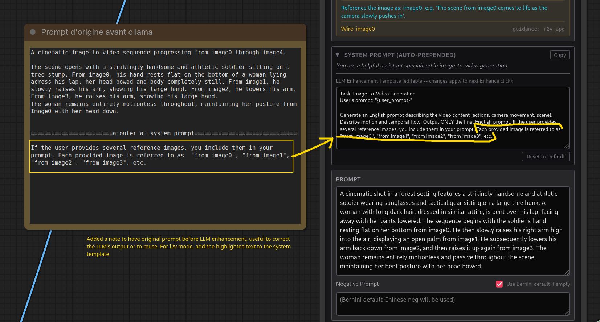

# Bernini

ByteDance released open weights for Bernini edit model based on Wan 2.2.
Has high and low noise weights exactly like Wan 2.2.

Original publications from ByteDance
- [bernini-ai.github.io](https://bernini-ai.github.io/)
- [HF:ByteDance/Bernini](https://huggingface.co/ByteDance/Bernini/tree/main)
- [HF:ByteDance/Bernini-Diffusers](https://huggingface.co/ByteDance/Bernini-Diffusers/tree/main) updated one published 2026.06.11 Relven: "+ 7b VL qwen"

- [HF:Comfy-Org/Bernini-R:diffusion_models](https://huggingface.co/Comfy-Org/Bernini-R/tree/main/diffusion_models) R for "renderer" e.g. no [MLLM](bernini.md#bernini-mllm); uses T5
- early wf: [bernini_testing_01](workflows/wan/kj-bernini_testing_01.json)
- wf: [lucifer-Bernini_testing_video_edit_with reference](workflows/bernini/lucifer-Bernini_testing_video_edit_with reference.json)
- wf in [PR#14216](https://github.com/Comfy-Org/ComfyUI/pull/14216)
- another wf: [djbfilmz-WanBernini-Native](workflows/bernini/djbfilmz-WanBernini-Native.json) djbfilmz: "Ignore the first lora, it's a character I made. But the second ones help speed up the generatio"

Change merged to main in ComfyUI.
Use `Bernini Conditioning` node.

> when you edit a video, the WHOLE video is added to the sequence the model processes
> that doubles the compute needed
> so it's 2x slower than normal Wan22

> Q: 4K?  
> A: it would be impossible anyway as this is trained at 720p

> if it wasn't so slowwwwwwwwwwww
> need to make mxfp8 and use my 5090

> 144 frames at 24fps

djbfilmz:
> I tested 400 frames with Bernini and it worked ... Resolution was half-HD (just below 720p) ... i2v

Recommended:

Re fps: "possibly it's better to run the model at 16 fps"

JohnDopamine: [GH:CCpt5/ComfyUI-BerniniStudio](https://github.com/CCpt5/ComfyUI-BerniniStudio)
> AIO Bernini + Ollama + Prompt preset node  
> "replace the X with the Y from image0, image1, and image2"

slmonker:
> multi-angle ref image is working  
> high noise+lightx2v(strength=1) +low noise +lightx2v(wan2.1 t2v version ),3steps+3steps,high noise part cfg=1.5  
> 4+4, `Patch Sage Attention KJ` wf: [slmonker-bernini-studio](workflows/bernini/slmonker-bernini-studio.json)

Apparently Bernini has pure I2V capabilities as well, up to 161 frames

> You are a helpful assistant specialized in image-to-video generation. Anime girl is dancing with a red panda, the camera zooms out displaying the dance floor. The panda jumps to the floor.

| task_type | system prompt (prepended to T5 text) |
|---|---|
| `default` | You are a helpful assistant. |
| `t2i` | You are a helpful assistant specialized in text-to-image generation. |
| `t2v` | You are a helpful assistant specialized in text-to-video generation. |
| `i2i` | You are a helpful assistant specialized in image editing. |
| `r2i` | You are a helpful assistant specialized in subject-to-image generation. |
| `i2v` | You are a helpful assistant specialized in image-to-video generation. |
| `v2v` | You are a helpful assistant specialized in video editing. |
| `r2v` | You are a helpful assistant specialized in subject-to-video generation. |
| `vi2v` | You are a helpful assistant specialized in video editing on content propagation. |
| `rv2v` | You are a helpful assistant specialized in video editing with reference. |
| `ads2v` | You are a helpful assistant specialized in ads insertion. |
| `vrc2v` | You are a helpful assistant for editing. You may need to adjust the subject's action or position. |
| `mv2v` | You are a helpful assistant for editing. You might need to adjust the video's style, lighting, colors, textures, and the subject's pose or action. |

> the reference can be larger than the gen even since it's added as tokens anyway

> their code only used 5 so wasn't sure how many it can take, I think I capped it at 8 but technically there wouldn't be any cap

LDWorks David:
> seems like with one sheet ref also works [several images on white background as one image]

Stef:
> Wan2.2 loras seem to work with Bernini  
> I use Bernini mostly for v2v + reference images  

> Bernini and first frame/last frame ... I could manage to do a FFLF by prompting.
> Describe the starting image and mention it is "image0", describe the action and
> how the final image looks like and mention it is "image1". Exemple of prompt:
> "A soldier looking at a woman in image0 walks backwards, keeping eyes locked with
> the woman and looking angry, and sits on the tree hunk behind him in image1.
> The woman keeps her face turned towards the soldier." And indeed, the first frame
> of the clip is my image0 and the last frame of the clip is my image1

> there are unexpected surprises with Bernini which is theoratically t2v: my i2v lora works, my t2v lora doesn't. Mystery

> It doesn't like having only one ref image in i2v, it works better if you feed it with 2-3 images or even more.
> And you have to mention them in the prompt as image0, image1, etc. Start your prompt with something like "the scene starts with image0 depicting..." or something like that

> you need to write "from image0", "from image1", "from image2", etc., John mentioned that on his github page as well. Saying "in image1" or "as shown in image2" won't work as well
                                             
Qwen3.6 35b was tested in ollama

slmonker: [GH:AIMixer/ComfyUI-Bernini](https://github.com/AIMixer/ComfyUI-Bernini/tree/main) - all in Chinese? based on kj's wanvideowarpper "but why? core is so much faster"

> is bernini lora possible or nah cause it has a new layer or something ?  
> it has no new layers

BNP4535353:

> to ensure the minimum quality requirement, the long side can be set to 1536  
> 536x1024 121f, took about 9 minutes, and the result, after upscaling optimization, is production-ready

> the main cause of problems for me is when the total frame count exceeds 121, which leads to issues like faded colors and jittery motion

> The most reliable way for me to use Bernini i2v right now is to first give Bernini’s official prompt guide to GPT/Grok,
> then give them the image to generate prompts; this is an analysis and self-improvement process,
> and I find it hard to achieve the same effect with local LLMs or even external APIs

John Dopamine:
> I find I2V is really dependant on length of prompt.....if your prompt is long it can drop the reference frame and use something similar but not the exact start frame

[Drozbay](hidden-knowledge.md#drozbay):
> Context windows always do better with strong control signals that are consistently strong throughout the whole video. eg. depth map + reference, source video + edit + reference, etc

vs SCAIL-2
> Bernini isn't trained to do pose control, it can work through the edit feature, but it's not pose control model

> what's suitable lightx for bernini?  
> djbfilmz: I used 1030 on high and 480 rank 64 on low and it worked fine for me

> devnullblackcat: Wondering about different samplers to try. I have been using dpmpp_sde_gpu and beta for quite a while, curious what others use.  
> djbfilmz: I ... did a couple tests. I think dpmpp-sde is good, alsso euler, and res-multi were good.  
> scf: isn't this i2v? In workflows I found they use t2v loras

> Q: in Bernini, can we use a latent mask to localize the edits?   
> A: You wouldn't use latent masking, at least alone, that's not how it's trained.
> Instead you could try masking the area in the input video already and tell the model to fill that area or something like that.
> It's not an inpaint model trained to understand masks specifically (like VACE is), but an edit model that tries to follow the instructions 

## Bernini MLLM

Apparently MLLM - multmodal.. was released alongside Bernini. However no work has been on it within the context of ComfyUI.

> it's [very] complicated  
> I had it running but it just makes outputs worse

> the full pipeline they use is so ... heavy APG with 3 model passes or something per step  
> so imagine Bernini with full steps and 3x slower than when using lightx2v

> the MLLM itself isn't too heavy, maybe ~10-20 secs each time you change prompt

## 190Gb Model

Funnily enough it seems fully over 190Gb FP32 Bernini weights have been made public on [HF:ByteDance/Bernini-Diffusers:bernini](https://huggingface.co/ByteDance/Bernini-Diffusers/tree/main/bernini).
"it's 7B qwen VL 2.5 + Wan 2.2 in fp32"

> hmm the planner is looking better;
> it is not prompt enchancer, there's projector that projects it's output to the T5 size
> so potentially it replaces/modifies T5 embeds

> the qwenVL seems finetuned a bit... not sure how important that is, could maybe just make a lora

## Bernini I2V, Keyframing

Stef suggested

 makes Bernini use keyframes

> With this prompt, I was able to force Bernini, in i2v mode (with 4 ref images in this particular case), into a sequential  output.
> The output definitely started at image0, transitioned to image1, then to image2 and closed on image3.
> If you use @JohnDopamine Bernini Studio node and apply the LLM prompt enhancement,
> you need to modify the system template for i2v to force the LLM to mention the images explicitly,
> otherwise the vision LLM (was qwen3.6 + ollama in my case) will describe your images but won't mention them.
> I did a few runs and if the images are not referred to in the prompt, Bernini tends not to use them all.
> Also, you need to write "from image0", "from image1", "from image2", etc., John mentioned that on his github page as well.
> Saying "in image1" or "as shown in image2" won't work as well for some strange reason probably tied to how they trained it. ...
> Last but not least, it worked pushing to 161 frames but degraded (inconsistencies) at 241 frames.

BNP4535353:
> The safest values are 81f or 121f; above that the chance of success or failure is 50/50, and given the generation time it's not worth pulling.
> At the same time, if you want the generated content to be free from the "industrial garbage" problem, a long-edge resolution of 1920 appears to be necessary,
> which in turn causes a substantial increase in generation time.
