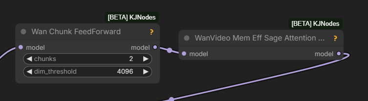
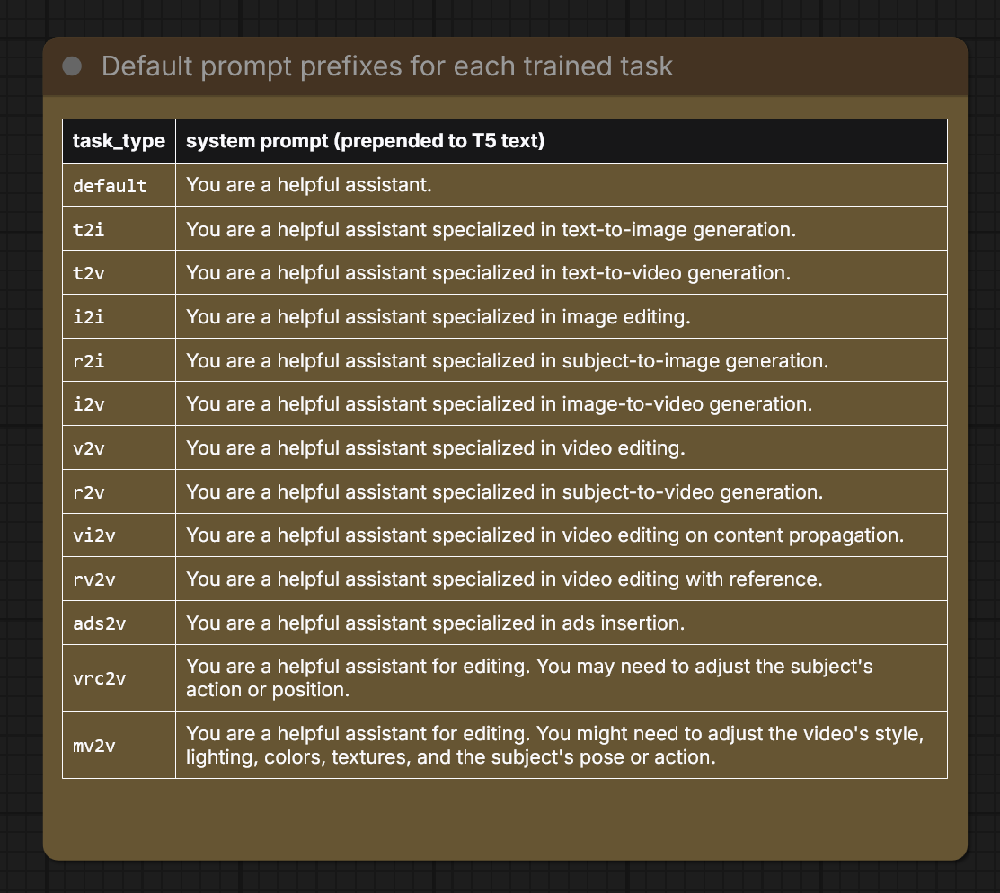
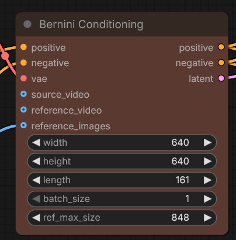

# Bernini

ByteDance released open weights for Bernini edit model based on Wan 2.2

Original sources [bernini-ai.github.io](https://bernini-ai.github.io/),
[HF:ByteDance/Bernini](https://huggingface.co/ByteDance/Bernini/tree/main)

[HF:Kijai/WanVideo_comfy_fp8_scaled/tree/main/Bernini](https://huggingface.co/Kijai/WanVideo_comfy_fp8_scaled/tree/main/Bernini);
early wf: [bernini_testing_01](workflows/wan/kj-bernini_testing_01.json);
draft PR for native support: [PR#14216](https://github.com/Comfy-Org/ComfyUI/pull/14216)
as of 2026.06.01 not merged yet. Use `Bernini Conditioning` node.

> when you edit a video, the WHOLE video is added to the sequence the model processes
> that doubles the compute needed
> so it's 2x slower than normal Wan22

> Q: 4K?  
> A: it would be impossible anyway as this is trained at 720p

> if it wasn't so slowwwwwwwwwwww
> need to make mxfp8 and use my 5090

> 144 frames at 24fps

mxfp8 Bernini:
[HF:Kijai/WanVideo_comfy_fp8_scaled:Bernini/Wan22_Bernini_HIGH_mxfp8](https://huggingface.co/Kijai/WanVideo_comfy_fp8_scaled/blob/main/Bernini/Wan22_Bernini_HIGH_mxfp8.safetensors)
[HF:Kijai/WanVideo_comfy_fp8_scaled/blob/main/Bernini/Wan22_Bernini_LOW_mxfp8](https://huggingface.co/Kijai/WanVideo_comfy_fp8_scaled/blob/main/Bernini/Wan22_Bernini_LOW_mxfp8.safetensors)

Recommended:

slmonker:
> multi-angle ref image is working

Apparently Bernini has pure I2V capabilities as well, up to 161 frames

> You are a helpful assistant specialized in image-to-video generation. Anime girl is dancing with a red panda, the camera zooms out displaying the dance floor. The panda jumps to the floor.

> the reference can be larger than the gen even since it's added as tokens anyway

> their code only used 5 so wasn't sure how many it can take, I think I capped it at 8 but technically there wouldn't be any cap

LDWorks David:
> seems like with one sheet ref also works [several images on white background as one image]