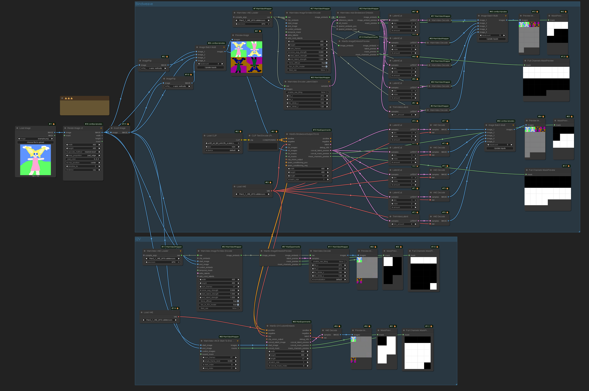

# Conditioning

Sampling in AI video generation is the process of converting noise to a sequence of images.
Visual data is stored in compressed form = latent space = as "latents".

For Wan family of AI video generation models latent represention of the 1st video frame is followed by "latents" each corresponding to 4 actual video frames.
This is why it is a good practice to always specify the number of frames produced as 4 * N + 1, e.g. 77, 81.

Latents that are changed during AI video sampling are known as "noise".
They are typically filled with noise e.g. pseudo-random data early in the process.
Once sampling is finished they represent the generated video and get encoded into images by VAE encoder.

Sampling processes makes use of additional data that is not changed.
This data is known as "conditioning".
"Conditioning" guides sampling.
Conditioning data that is images or videos (sequences of images) is encoded into latent space by VAE encoder.

A VAE encoder relies on its own .safetensors file to do conversion in both direction between latent and "pixel" (regular r,g,b) space.
"Tiny" (fast, lower quality) VAE encoders can be used to convert resulting noise latents to images/videos on the output side.
Only full (proper, highest quality) VAE encoders ought to be used on input side (when encoding conditioning).
It is completely normal to use the same (normal, full quality) .safetensors file to drive VAE on both input and output sides.

Conditionining can be passed into a ComfyUI node doing sampling in different ways,
depending on model and sometimes LoRa-s used.

For example if conditioning data includes a sequence of images they may need
to be encoded into latent space via a VAE encoder either individually or collectively.
In the latter case they follow typical Wan encoded video format
where 1st frame is encoded separately and subsequent latents reprent 4 actual frames each.

A common form of conditioning is masks.
Masks can delimit which portion of noise or conditioning data has been populated by meaningful data such as reference images and which parts are "blank".
Masks typically consist of either 0 or 1 values.

Sometimes 1 can designate the part of noise/conditioning which has been populated and 0 the part which is empty.
Sometimes it can be the opposite.
[Wrapper](https://github.com/kijai/ComfyUI-WanVideoWrapper) nodes can be using a convention opposite to ComfyUI native nodes.

Masks are part of conditionining data. They accompany noise and other conditioning data.
The part of noise or conditioning data that is designated by masks as blank usually needs to be set to a particular value.
Often this is middle gray, e.g. (127, 127, 127). In other cases it may need to be set to literal zero values.
Intentinally setting this part of noise or conditioning to other than prescribed value can sometimes be used as a creative tool.

Commonly masks cover whole frames. Sometimes mask can designate parts of frames.

## Details

- For T2V Wan models the model uses 16 channels, those are all used for the actual noise that is sampled
- For I2V models there are 20 additional channels, so you have a total of 36 channels
- Channels 1-16 are the standard noisy latents, same as in T2V
- Channels 17-20 are the the I2V mask
- Channels 21-36 are the I2V conditioning inputs

When you pass the conditioning through the WanImageToVideo node, for example, the conditioning lines get filled up with the I2V masks and I2V conditioning inputs.
For a single start image the I2V mask frames start with a single mask of zeros, and then the rest of the frame masks are ones,
and the I2V inputs will contain the start image in the first frame and then the rest of them will be gray values.
That is all generated automatically and applied to the conditioning line by the WanImageToVideo node.

For bindweave you need to have 4 more latents stuck on the front for the noise latents.
You need to expand the I2V masks and I2V conditioning inputs to match.
You can't do that with the standard WanImageToVideo node.
Those among these 4 additional latents which are not used are to be set to literal zero values.
This happens when less than 4 reference images are provided to BindWeave.

When working with I2V models all of the latents in channels 21-36 that overlap with the actual noise
latents should be set to gray values, not zeros.
Only the bindweave references that aren't used should be set to zeros.

Theoretically the masks should be 1 for the reference frames that you're using and 0s for the other reference frames. But there also is ComfyUI inversion, so maybe it should be the opposite.
Having all of the masks just be 1s and that doesn't seem worse either.

Phantom adds the reference image at the end of the regular noise latent, and the model just understands what that means.

Clip vision inputs are passed in to separate layers, they are not in I2V conditioning channels.

VACE conditioning is a completely parallel set of blocks.

## Drozbay's Study

[drozbay](hidden-knowledge.md#drozbay) has shared the following workflow

[drozbay_testembeds_wani2vmasks](screenshots/drozbay_testembeds_wani2vmasks.png)

This workflow is using nodes from his [GH:drozbay/WanExperiments](https://github.com/drozbay/WanExperiments).
It demonstrates a method for examining embeds created for I2V Wan models.
It also demonstrates some ways to prepare [conditioning](conditioning.md) data for [Bindweave](bindweave.md) and vanilla Wan 2.2 I2V
using the aforementioned node pack or, alternatively, the more traditional nodes.

Note: "polarity" of masks - e.g. if 1 means "keep these pixels" and 0 means "generate these pixes" versus the opposite differs between
[kijai/ComfyUI-WanVideoWrapper](https://github.com/kijai/ComfyUI-WanVideoWrapper) and ComfyUI native nodes.
The image above shows both ways to prepre the masks and how they look on the previews.
The difference is due to the fact that one of the implementations inverts the masks in code while the other doesn't.

TODO: a detailed write-up on what the previews on the above image actually mean and why the previews have the number of frames they have.
The number of frames actually make sense.

A key observation is that `start_image` can be not just one but several images.

Separately it is worth noting that masks don't have to be binary black or white and can contain shades of grey in between.

## See Also

- HuMo last-image to first-image [extensions](humo.md#drozbay)