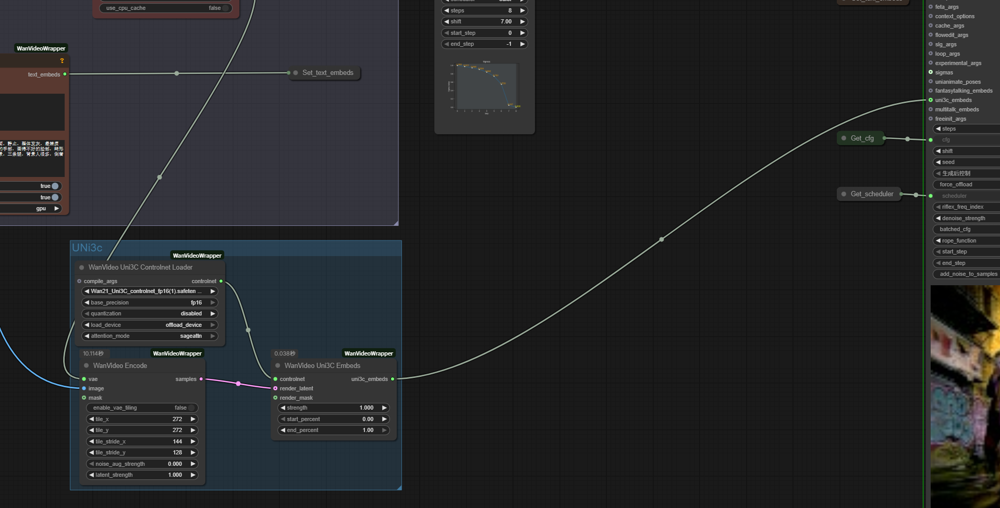
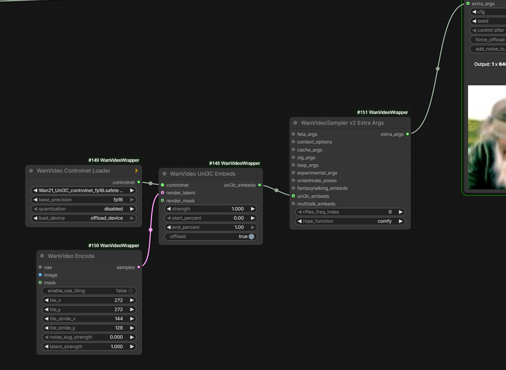
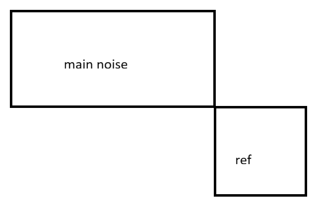

# Control Techniques

## I2V

### Unianimate

Kijai's adaptation of LoRa: [HF:Kijai/WanVideo_comfy:UniAnimate-Wan2.1-14B-Lora-12000-fp16.safetensors](https://huggingface.co/Kijai/WanVideo_comfy/blob/main/UniAnimate-Wan2.1-14B-Lora-12000-fp16.safetensors).
Reddit article on combining Unianimate with InfiniteTalk: [link](https://www.reddit.com/r/comfyui/comments/1lsb5a1/testing_wan_21_multitalk_unianimate_lora_kijai/).

Controls pose only

> note you have to load the unianimate lora on the model loader, not the set node because it patches the model too

> Unianimate was always too strong for 2.1

...which is why it was not possible to set strength above 1 in the node, however with 2.2 it seems not strong enough and it makes sense to try higher values

See also: [SVI-dance](svi.md#svi-dance)

### FantasyPortrait / FlashPortrait

For face animation only. Wan 2.1 era. Supported in wrapper. Kijai's sample [wf](https://github.com/kijai/ComfyUI-WanVideoWrapper/blob/main/example_workflows/wanvideo_2_1_I2V_FantasyPortrait_example_01.json).

Dec 2025 a FlashPortrait has been released which appears to be a further development of FantasyPortrait

### MTV crafter

Very different from usual

## Uni3C

Camera control for Wan 2.1 (hmm which one?..).
Works with [SCAIL](wan-animates.md#scail):

[uni3c](screenshots/uni3c.webp)

Works with V2 wrapper nodes: plug `WanVideo Uni3C Embeds` output into `uni3c_embeds` input on `WanVideoSampler v2 Extra Args`

[uni3c-v2](screenshots/uni3c-v2.png)

> [give it just the single] start frame encoded if you want the camera to not move at all;
> [it can] handle any kind of input, if it's single frame it expands it, and if it's too little or too many frames, it interpolates

Optional memory offloading added

> you can also run it in fp8 with the quantization option, it doesn't really suffer much from that;
> can work with T2V too

## Q/A

> Q: Is there anything that does the same thing as Uni3C but for WAN 2.2?
> A: [TTM](wan-i2v-advanced.md#time-to-move) kinda, uni3C works at higher strength to some extent, combination of both could be interesting... also there's the Fun control camera which works good

## Fun Control

- original: [HF:alibaba-pai/Wan2.2-Fun-A14B-Control](https://huggingface.co/alibaba-pai/Wan2.2-Fun-A14B-Control/tree/main)
- comfy adaptation: [HF:Kijai/WanVideo_comfy:Fun](https://huggingface.co/Comfy-Org/Wan_2.2_ComfyUI_Repackaged/tree/main/split_files/diffusion_models)

Comfy contains a template.

Idea: use black-white video with strong gradations as a mask to guide generation.

Possible combination: Fun Control 2.2 HN and regular Wan 2.2 LN

## Standin

This was a technique developed middle of 2025 (?) to provide identity preservation in Wan workflows (??? to be confirmed)
Reportedly works with T2V models.

- original weights: [HF:BowenXue/Stand-In](https://huggingface.co/BowenXue/Stand-In)
- weights adapted by Kijai: [HF:Kijai/WanVideo_comfy:LoRAs/Stand-In](https://huggingface.co/Kijai/WanVideo_comfy/tree/main/LoRAs/Stand-In).

Dec 2025 a version trained for Wan 2.2 was released, "doesn't seem to need any code changes".

> it needed at least part of the body ... white background

> how i can run stand-in lora ? 
> need to load it in the model loader lora input as it's different kind of a lora

> adding PUSA lora to Stand-In seems to improve consistency;
> ... testing Stand-In for WAN 2.1 ... the PUSA LoRA made for 2.2 actually seems to work better on WAN 2.1 than the PUSA 2.1 version;

> 2.2 LN wan is just 2.1+++, so you can use 2.2 LN loras pretty reliably in wan 2.1 based models.
> ... using ... loras from 2.2 in scail for example

> tried couple of images with stand-in, they use the 512x512 as reference

> outpout dim. if I change it to anything other that 832x480 it instantly loses likeness. where as 832x480 is basically a perfect clone

> did you try adjusting the rope shift? (freq_offset);
> basically the 512p image is placed outside the generation with the rope positions,
> so the relation of that to the base resolution might matter

> if I understood it correctly, it's shifted like this spatially

> yeah, and the freq offset pushes it further away

> okay, that seems to have helped, just changing to offset 2 for 1088x640 and it works better
