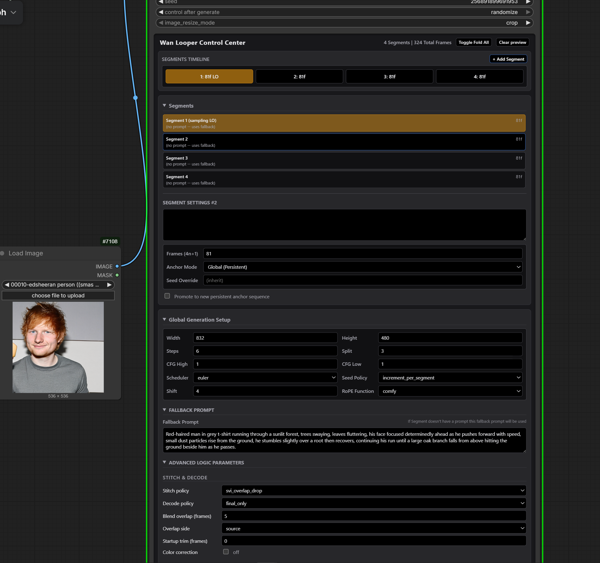

# Directors

This page collects info on "director"-style nodes - typically LLM-coded nodes
which combine a lot functionality into one node, typically performing multiple runs
of generation at once. Information on this page sometimes duplicates information
in pages for individual AI video generation models.

## LTX Director

- WhatDreamsCost's [GH:WhatDreamsCost/WhatDreamsCost-ComfyUI](https://github.com/WhatDreamsCost/WhatDreamsCost-ComfyUI) poweful node for audio and video loading and trimming (generated with help from Gemini),
  including the new `LTX Director` - I2V, T2V, FLFF, Prompt Relay, Custom Audio
- [v2 tutorial](https://youtu.be/o0l6Ikvn5Q0)
- [tutorial 1](https://www.youtube.com/watch?v=fZgtkRcu4_k)
- [tutorial 2](https://www.youtube.com/watch?v=vM60pJJqqEI)
- based on Prompt Relay; note [PR#60](https://github.com/WhatDreamsCost/WhatDreamsCost-ComfyUI/pull/60/changes)

Here is an article presenting a node based on WhatDreamsCosts's original: [R:just_released_ltx_director_motion_brush_nodes_for](https://www.reddit.com/r/comfyui/comments/1uf4441/just_released_ltx_director_motion_brush_nodes_for/)

## JohnDopamine

### WanLooperDesigner

[JohnDopamine-ComfyUI-WanLooperDesigner-v1250.zip](code/JohnDopamine-ComfyUI-WanLooperDesigner-v1250.zip)

SVI2.2 Pro extensions, it is possible Bernini can be used when extension is not required - as 1st shot or after a cut.

standard static, context length of 81, 32 overlap,  stride 1, closed loop off, no freenoise, pyramid, retain 1st on

### Bernini Studio

From JohnDopamine

[GH:CCpt5/ComfyUI-BerniniStudio](https://github.com/CCpt5/ComfyUI-BerniniStudio)
> AIO Bernini + Ollama + Prompt preset node  
> "replace the X with the Y from image0, image1, and image2"

### Scail2Looper Studio

[JohnDopamine-ComfyUI-Scail2LooperStudio](code/JohnDopamine-ComfyUI-Scail2LooperStudio.zip)