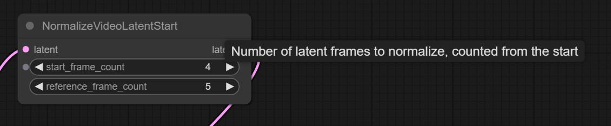

# Extra Tools

Image tools useful alongside video AI.
Sometimes autogenerated sound can be of use too.

## NormalizeVideoLatentStart

ComfyUI native now has `NormalizeVideoLatentStart` node which has been lifted out of [Kandinsky-5](k5.md) original implementation.
The node apparently homogenizes contrast and color balance inside the video.

> mean/std  normalization applied when using I2V

## Video Blending From Fragments

[kijai/ComfyUI-KJNodes](https://github.com/kijai/ComfyUI-KJNodes) contains `Image Batch Extend With Overlap`
which can be used to merge together original video with its extension done using I2V or VACE mask extension techniques.
Example of it being used in a LongCat wf: [extend-with-overlap](screenshots/extend-with-overlap.png).

`WanVideoBlender` from [GH:banodoco/steerable-motion](https://github.com/banodoco/steerable-motion) is an alternative.

See also the next section on `Trent Nodes`

## Trent Nodes

[TrentHunter82/TrentNodes](https://github.com/TrentHunter82/TrentNodes/tree/main) contains `Cross Dissolve with Overlap` node
as well as other nodes for examining videos, taking last N frames, creating latent masks and VACE keyframing.

## Hunyuan Video Foley

[github.com/phazei/ComfyUI-HunyuanVideo-Foley](https://github.com/phazei/ComfyUI-HunyuanVideo-Foley)

| HF Space | safetensors |
| --- | --- |
| ComfyUI-HunyuanVideo-Foley | hunyuanvideo_foley_xl |
| ComfyUI-HunyuanVideo-Foley | synchformer_state_dict_fp16 |
| ComfyUI-HunyuanVideo-Foley | vae_128d_48k_fp16 |

## More Foley-s

- [kijai/ComfyUI-MMAudio](https://github.com/kijai/ComfyUI-MMAudio)
- ACE Foley Generator

> Inside of Comfy you could Use Stable Audio or ACE... but tbh both are not that good

## Hiding In Plain Sight

- `Resize Image v2` from [kijai/ComfyUI-WanVideoWrapper](https://github.com/kijai/ComfyUI-WanVideoWrapper) new mode is `total_pixels` copies what `WanVideo Image Resize To Closest` from [kijai/ComfyUI-WanVideoWrapper](https://github.com/kijai/ComfyUI-WanVideoWrapper) does which is original Wan logic
- `Image Batch Extend With Overlap`from [kijai/ComfyUI-KJNodes](https://github.com/kijai/ComfyUI-KJNodes) to compose extensions created with VACE extend techniques
- `Video Info` from [Kosinkadink/ComfyUI-VideoHelperSuite](https://github.com/Kosinkadink/ComfyUI-VideoHelperSuite) + `Preview Any` to debug dimension errors in ComfyUI etc

## Ckinpdx

[Ckinpdx](https://github.com/ckinpdx) a passionate AI artist has shared [GH:ckinpdx/ComfyUI-WanKeyframeBuilder](https://github.com/ckinpdx/ComfyUI-WanKeyframeBuilder) repository.

### Ckinpdx Wan Keyframe Builder (Continuation)

which provides `Wan Keyframe Builder (Continuation)` node.
This node was originally intended to prepare images and masks for VACE workflows.
When [SVI 2.0](svi.md#2025.12.04) was released the node was updated to facilitate workflows combining VACE keyframing, extensions and SVI references.
The node has two distinct modes of operation: when `images` output is used and when `svi_reference_only` output is used.
The modes are toggled by a boolean switch on the node.

Sample [wf](screenshots/ck-magic-workflow.png).

### Ckinpdx Load Audtio And Split

Use this node to split audio between generation runs which produce various parts of the video with HuMo.
Use `Trim Audio Duration` as shown to remove duplicate part of audio before re-assembling the video.

### Ckinpdx WanSoundTrajectory

Build paths to feed into [Wan-Move](wan-move.md) based on music beats:
[GH:ckinpdx/ComfyUI-WanSoundTrajectory](https://github.com/ckinpdx/ComfyUI-WanSoundTrajectory).

## Misc

- IndexTTS2: "I had Chatterbox, IndexTTS, another IndexTTS node, Chatterboxt5, VibeVoice ... IndexTTS seems a lot better"
- VibeVoice TTS
- [GH:diodiogod/TTS-Audio-Suite](https://github.com/diodiogod/TTS-Audio-Suite): [tts-text](screenshots/tts-text.png), [prepare wf](workflows/gl_tts_voice_prepare.json), [wf](workflows/gl_tts_voice_prepare.json)  
  "done a lot of ... vibevoice ... problems ... tts 2 now ... much happier"
- `SuperPrompt` node from [kijai/ComfyUI-KJNodes](https://github.com/kijai/ComfyUI-KJNodes).
- `Merge Images` node from VideoHelperSuite (so called VHS)
- [GH:stavsap/comfyui-ollama](https://github.com/stavsap/comfyui-ollama) ComfyUI nodes to connect to local-running KoboldCpp executing Qwen3-VL on the CPU in order to tranlate images to descriptions.
- [Urabewe/OllamaVision](https://github.com/Urabewe/OllamaVision) a SwarmUI extension to generate prompts.
- [GH:chflame163/ComfyUI_LayerStyle](https://github.com/chflame163/ComfyUI_LayerStyle) can add film grain to images.

## Frame Interpolation

Moved [here](vfi.md).