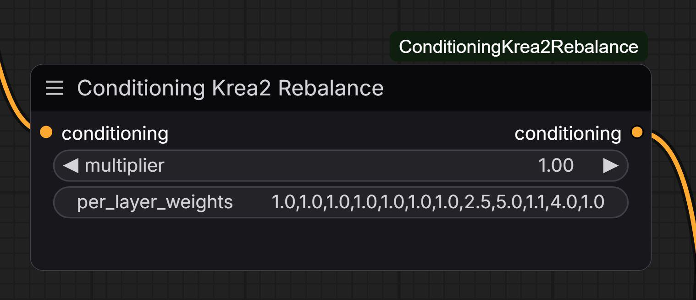

# Krea-2

Krea-2 weights have been released

- [HF:krea/Krea-2-Raw](https://huggingface.co/krea/Krea-2-Raw)
- [HF:krea/Krea-2-Turbo](https://huggingface.co/krea/Krea-2-Turbo)
- [HF:Winnougan/Krea-2-Base-Turbo-NVFP4-FP8-INT8](https://huggingface.co/Winnougan/Krea-2-Base-Turbo-NVFP4-FP8-INT8)
- [HF:Comfy-Org/Krea-2:loras/krea2_turbo_lora_rank_64_bf16](https://huggingface.co/Comfy-Org/Krea-2/blob/main/loras/krea2_turbo_lora_rank_64_bf16.safetensors)

License seems similar to LTX: free for commercial use until you reach revenue of $1M.

[R:this_custom_node_removes_the_builtin_krea_2/](https://www.reddit.com/r/StableDiffusion/comments/1udhaio/this_custom_node_removes_the_builtin_krea_2/),
[GH:nova452/ComfyUI-ConditioningKrea2Rebalance](https://github.com/nova452/ComfyUI-ConditioningKrea2Rebalance)

