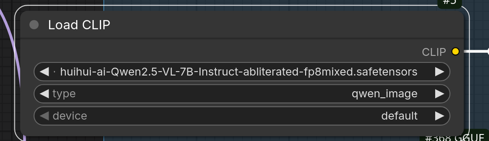
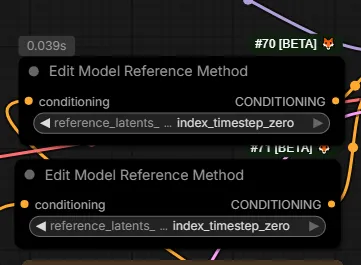

# Qwen

## Qwen LoRAs

| HF Space | LoRA |
| :--- | :--- |
| [HF:lilylilith/AnyPose](https://huggingface.co/lilylilith/AnyPose) | 2511 AnyPose - Person in image 1 do the exactly same pose as image 2 |
| [HF:lightx2v/Qwen-Image-2512-Lightning](https://huggingface.co/lightx2v/Qwen-Image-2512-Lightning/tree/main) ? | Qwen-Image-Lightning v1.1 Lora |
| - | Qwen-Image-Edit-2512 4-Steps Lora |
| - | Wuli Turbo 4 Steps Lora |

Note: 2512 is not an "edit" just "qwen image" but due to some sort of confusion we're seeing the incorrect "Edit-2512" designation sometimes.

## 2025.12.31

Qwen Image Edit 2512 released. bf16: [HF:Comfy-Org/Qwen-Image_ComfyUI:split_files/diffusion_models](https://huggingface.co/Comfy-Org/Qwen-Image_ComfyUI/tree/main/split_files/diffusion_models).

- 2512 [WF](../workflows/qwen/lucifer-qwen2512.json) from Lucifer.
- 2512 [WF](../workflows/qwen/asd-2512.json) from [ASD](https://github.com/gajjar4)

## 2025.12.28

> openpose with Qwen-Image-Edit-2509 ... but also the anypose lora

> Yeah the anypose lora is good and the most accurate, but with real people it changes their face and also body shape, which is the only problem.

> I trained using ai-toolkit [a QIE-2511 LoRA] and didn't like the results, and I tested a lot of things.
> Yesterday I was training with diffusion pipe, but there's still some incorrect code regarding resolution matching, so I paused and will try to change the code later.
> Now I'm training using musubi-tuner and it seems to be training very well, and even on my 5090 without much difficulty. 

## 2025.12.27 QIE Q4 + ZIT Low VRAM

[niji-qui-zit](../workflows/z-image/niji-qui-zit.json) by [MadevilBeats](https://www.instagram.com/madevilbeats/) aka "NiJi Dragon"; the shared a workflow
1st edits with a highly quantized version of QIE, like Q4 and then Z-Image-Turbo is used to clean up the artifacts
> Q4 of QIE is a bit blotchy looking, kinda blurry, plasticy, etc. but it can still edit at roughly the same
> level as Q8 so I'm cleaning it up with ZIT. Mainly I just wanted to see if they could fit together on one
> GPU and how fast it would be in one workflow: yes and it's less than 30 seconds typically [RTX5090];
> ZIT upscaleAny

## 2025.12.26

Face/Head Swap by [Alisson Pereira](https://civitai.com/user/NRDX): [civitai.com/models/2027766](https://civitai.com/models/2027766),
[patreon.com/posts/bfs-lora-qwen-140789769](https://www.patreon.com/posts/bfs-lora-qwen-140789769),
[youtube.com/watch?v=3CoK4pDl-TE](https://www.youtube.com/watch?v=3CoK4pDl-TE).

> If you get too much contrast / plastic skin using LightX2V Lightning, try steps = N/2 (e.g., 8 -> 4).
> Without Lightning -> lower steps (20 -> 16) and CFG ~ 1.2 - 1.5.
> If poses differ a lot -> increase LoRA strength (1.2 - 1.3).

> Samplers: er_sde+beta57, kl_optimal, ddim_uniform, res_2s+beta57;
> Precision: best = fp16 | recommended = fp8/q8

[Corza](https://www.instagram.com/_c0rza/) responded with face detailer [qwen2509_seedvr2](../workflows/qwen/corza-qwen2509_seedvr2.json)

## 2025.12.25

Phr00t's mix of 2509 and 2511: [HF:Phr00t/Qwen-Image-Edit-Rapid-AIO:v17](https://huggingface.co/Phr00t/Qwen-Image-Edit-Rapid-AIO/tree/main/v17)

> its a small mix handful of "realism" loras and "insubject" on the 2509 side of things, but just accelerators for 2511 side

> euler_a/beta seems to work best;
> 4 steps minimum, generally 6 steps is worth it;
> grid artifacts varied across versions but havent been noticing them in v17

[chat.qwen.ai](https://chat.qwen.ai/) for testing.

## 2025.12.24

Simple template workflow added to ComfyUI

> cfg 6 is great on 2511 so far

`EmptyQwenImageLayeredLatentImage` turns QIE into T2I - start from no input image. Alternative advice: "you can just take QI (not QIE) ComfyUI template and just load QIE2511 model"

Alternative text encoders:

- [GH:ethanfel/ComfyUI-Mamad8-QwenEdit-fix](https://github.com/ethanfel/ComfyUI-Mamad8-QwenEdit-fix) was suggested as an alternative text encoder, `TextEncodeQwenImageEditPlusMamad8`
- [HF:Phr00t/Qwen-Image-Edit-Rapid-AIO:fixed-textencode-node](https://huggingface.co/Phr00t/Qwen-Image-Edit-Rapid-AIO/tree/main/fixed-textencode-node)

> there's no issue when regenerating the whole image;
> it's editing in place, the elements that doesn't change from the original image are degraded [contrast, saturation etc]

Suggestion for better LLM serving as a CLIP: from [HF:silveroxides/Qwen2.5-VL-7B-MixedPrecision-ComfyUI](https://huggingface.co/silveroxides/Qwen2.5-VL-7B-MixedPrecision-ComfyUI/tree/main)

## 2025.12.23

Highly anticipated Qwen Image Edit 2511 is out

- official release is split .safetensors so probably not directly useable
- [HF:unsloth/Qwen-Image-Edit-2511-GGUF](https://huggingface.co/unsloth/Qwen-Image-Edit-2511-GGUF/tree/main) first repo to offer BF16, FP16, Q3-Q8 "city96 unet loader ofc"
- [GH:city96/ComfyUI-GGUF](https://github.com/city96/ComfyUI-GGUF) loader to load GGUF files
- [HF:Comfy-Org/Qwen-Image-Edit_ComfyUI:split_files/diffusion_models](https://huggingface.co/Comfy-Org/Qwen-Image-Edit_ComfyUI/tree/main/split_files/diffusion_models) Comfy-Org adaptation, BF16
- [HF:xms991/Qwen-Image-Edit-2511-fp8-e4m3fn](https://huggingface.co/xms991/Qwen-Image-Edit-2511-fp8-e4m3fn/tree/main) fp8_e4m3fn adaptation, works in Comfy
- [HF:silveroxides/Qwen-Image-fp8-scaled-quants/tree/main](https://huggingface.co/silveroxides/Qwen-Image-fp8-scaled-quants/tree/main) fp8 mixed adaptation; intended to be merged to Comfy-Org repo
- lightx2v LoRA-s: [HF:lightx2v/Qwen-Image-Edit-2511-Lightning](https://huggingface.co/lightx2v/Qwen-Image-Edit-2511-Lightning/tree/main)

Official workflow embedded in this image:

[qie2511](../workflows/qie2511.png)

> They seemed to have added a lot more color. The greens are popping and the color does not seem so washed out.

> [HF:dx8152/Qwen-Edit-2509-Multiple-angles](https://huggingface.co/dx8152/Qwen-Edit-2509-Multiple-angles/tree/main) camera angles LoRA works as before

Seems to improve realism of different angle LoRA [HF:lividtm/Qwen-Edit-Loras:external](https://huggingface.co/lividtm/Qwen-Edit-Loras/tree/main/external) by [GH:filliptm](https://github.com/filliptm).
Note the author apparently has also got a character sheet LoRA - somewhere :)

Helpful node:

[Ingi](https://x.com/ingi_erlingsson)'s suggestion for node/sampler

`QwenEncodeQwenImageEdit` is a simpler alternative from stock Comfy. reddit-published [workflow](https://www.reddit.com/r/StableDiffusion/comments/1pu5opp/this_is_the_new_comfyui_workflow_of_qwen_image).

Another artist:

> 1st k sampler with ddim beta57 and the second  dpmppsde beta cfg 1;
> paradoxically ... bypassing the lightning lora and 12 steps for each ksampler 

LoRA "apply diff between img1 and img2 to img3": [link](https://x.com/ModelScope2022/status/2003820336866058444)

## 2025.12.13

[GH:gajjar4/ComfyUI-Qwen-Image-i2L](https://github.com/gajjar4/ComfyUI-Qwen-Image-i2L) so called "I2L", "image to LoRA", a super-lightweight approach to extracting
a Qwen (Image Edit?) LoRA from an image; resulting LoRA is pretty weak

Qwen Edit Multiple angles LoRA good to create one image with views of the same character from different sides

## Qwen Image Edit

Supposedly has affinity to Wan models since both come from Alibaba.

| HF Space | Model |
| --- | --- |
| Comfy-Org/Qwen-Image-Edit_ComfyUI | split_files/diffusion_models/qwen_image_edit_2509_bf16 |
| Comfy-Org/Qwen-Image_ComfyUI | split_files/vae/qwen_image_vae |
| Comfy-Org/Qwen-Image_ComfyUI | split_files/text_encoders/qwen_2.5_vl_7b |
| lightx2v/Qwen-Image-Lightning | Qwen-Image-Edit-2509/Qwen-Image-Edit-2509-Lightning-8steps-V1.0-bf16 |
| lightx2v/Qwen-Image-Lightning | Qwen-Image-Edit-2509/Qwen-Image-Edit-2509-Lightning-4steps-V1.0-bf16 |

Interesting: an [attempt](https://www.reddit.com/r/QwenImageGen/comments/1p3c0r6/controlnet_openpose_qwen_image_edit_2509/) to rig a ControlNet on top of QIE 2509.

## Notable Loras And Wf-s For Qwen Image Edit

Generates 1st frame for next scene in same location with same character.
Sample workflow on HF next to LoRA.

| HF Space | LoRA |
| --- | --- |
| lovis93/next-scene-qwen-image-lora-2509 | next-scene_lora_v1-3000.safetensors |

Text editing similar to Nano Banana (dataset [visualizer](https://snazzy-selkie-ebdccf.netlify.app/), [dataset](https://github.com/apple/pico-banana-400k))

| HF Space | LoRA |
| --- | --- |
| [eigen-ai-labs/eigen-banana-qwen-image-edit](https://huggingface.co/eigen-ai-labs/eigen-banana-qwen-image-edit/tree/main) | eigen-banana-qwen-image-edit-2509-fp16-lora.safetensors |

https://civitai.com/articles/20190/headface-swap-workflow-qwen-image-edit-2509In 

https://www.patreon.com/posts/head-swap-qwen-140536096

## Qwen Piflow

[PiFlow](../hidden-knowledge.md#20251215-piflow)

## Face Consistency With Qwen?

[WithAnyone](https://doby-xu.github.io/WithAnyone/)

[PuLID](https://huggingface.co/guozinan/PuLID) ?

## LoRA-s

- [HF:dx8152/Qwen-Edit-2509-Light-Migration](https://huggingface.co/dx8152/Qwen-Edit-2509-Light-Migration) relight / light-migration for QIE 2509; [examples](https://x.com/dx8152/status/1997124533116141818?s=46)
- [HF:lividtm/Qwen-Edit-Loras:external](https://huggingface.co/lividtm/Qwen-Edit-Loras/tree/main/external) Qwen_MultiAngle_image_edit and WF by [GH:filliptm](https://github.com/filliptm)
- [CA:2260473?2544605](https://civitai.com/models/2260473?modelVersionId=2544605) blend images
