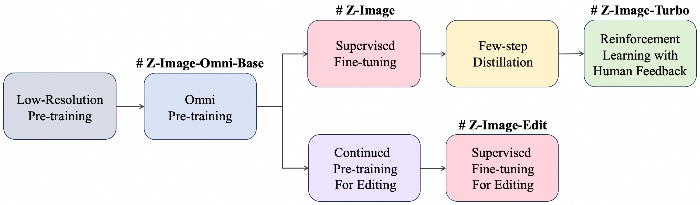

# Z-Image-Turbo

## See Also

[Upscalers](../upscalers-detailers-image.md#for-zit)

## 2025.12.26

Curated collection of images and prompts generated by z-image-turbo: [GH:camenduru/awesome-z-image-turbo](https://github.com/camenduru/awesome-z-image-turbo)

## 2025.12.25

[Luneva](https://civitai.com/user/luneva) on avoiding blurred background:

> avoiding certain words which WILL trigger depth of field, and also to have enough detailed material description of the background objects to make it in focus;
> words telling it to be in focus does absolutely nothing; I take whatever prompt I want, then feed it into this first

```
You are a precise Qwen/Z Image prompt engineer.
Expand ONLY the background elements with rich visual details while incorporating professional photography principles:
dramatic lighting (direction, contrast, shadows), strong composition (leading lines, framing, depth layers),
and background objects texture details for a realistic photo. Keep character description under 20% of total
word count. Use strictly concrete visual terms - no metaphors, emotions, or abstract concepts.
Preserve ALL original character details exactly, but add suitable mood and facial expression that befits
the image's environment and situation. Apply cinematic camera perspective (eye-level or slightly low angle),
do not mention blurry backgrounds, do not mention cinematic, do not mention depth of field or bokeh,
no atmospheric haze or fog, and use strategic negative space. Word limit: 150 words maximum.
Output ONLY the final image prompt with no commentary or formatting.
Original Prompt as follows:
```

> I run it through openrouter LLM node for pretty fast response with free models

## 2025.12.15

`Latent Hybrid Upscale` from `was_hybrid_latent_upscale`. "Using laplacian edge detection to create a mask for edges where the hard jankies will show up, and replacing it with a donar latent with smooth edges (normal Image Resize upscale and encoded)."

"9 steps are considered the optimum" ... "I use 8"

"res_2s/bong_tangent ... don't care about speed"

LeMiCa - a cache to skip steps, quality seems to be hit, [PR](https://github.com/UnicomAI/LeMiCa/pull/11) to add ZIT support to LeMiCa 

## 2025.12.13

[Z-Image-Turbo-Fun-Controlnet-Union-2.0](https://huggingface.co/alibaba-pai/Z-Image-Turbo-Fun-Controlnet-Union-2.0) released adding inpaint ability.

ControlNet Union support for Z-Image-Turbo is present in ComfyUI.

Despite "ControlNet" name technically this is closer to VACE than to ControlNet-s of the past.
The new `Controlnet-Union` supports Pose, Canny, Hed, and Depth guidance.

One more alternative CLIP for z-image-turbo: [BennyDaBall/qwen3-4b-Z-Image-Engineer](https://huggingface.co/BennyDaBall/qwen3-4b-Z-Image-Engineer)

[VRGameDevGirl](https://github.com/vrgamegirl19/comfyui-vrgamedevgirl) has shared
a powerful upscaling workflow using Z-Image-Turbo with Union Controlnet (`AnyImageZImageUpscaleWithCN.json`)
along with other workflows in [GH:vrgamegirl19/comfyui-vrgamedevgirl:Workflows/Z-ImageUpscale](https://github.com/vrgamegirl19/comfyui-vrgamedevgirl/tree/main/Workflows/Z-ImageUpscale).
Note: `ZImageUSD` there is an `Ultimate SD Upscaler` workflow with Z-Image-Turbo model plugged in.

> in my testing Z Image doesn't need a lot of upscaling, just gen at 1440 and looks quite good

> the reason behind doing it this way instead of doing just the normal latent upscale to 2K is because anything
> over 1024 looses details from the org image; doing it with USD does not because the tile size is at 1024
> a few days ago we found this out, anything over 1024 looses alot of detail

> the Hugging Face demos feature choosing between 1024, 1280 and 1536 so those are probably the best resolutions to shoot for

> ust 2 methods of getting to a 2MP image - 1) Via 1k + 2x Latent Upscale and 2) via native 1920 gen in the first place;
> 1920 might be stretching abilities of the model

> lower ETA to get more noise/texture,  and higher denoise will increase realism [in an upscaling wf]

Possible alternative VAE trained on 4k images and possibly delivering a bit more detail: [UltraFlux VAE](https://huggingface.co/Owen777/UltraFlux-v1/tree/main/vae); though reactions are not fantastic.

## 2025.12.10

[GH:RamonGuthrie/ComfyUI-RBG-SmartSeedVariance](https://github.com/RamonGuthrie/ComfyUI-RBG-SmartSeedVariance) ComfyUI node injecting varience into Z-Image-Turbo generations
by applying noise to text.

## 2025.12.06

>  found the biggest benefit to running z-image came from having qwen 8b instruct write the prompts;
> 4b instruct is a close second

> Can anyone suggest the best k-sampler settings for realistic outputs?
> Euler ancestral and bong tangent are a killer combo. Possibly er_sde & sgm_uniform

ZIT is said to have "ruts" - tendency for repetition: "ruts are medium shot, certain people, certain angles" - because it is distilled.

> using a model like Josie that isn't 'the same old', causes Zimage to hit 'less' ruts.  It's reintroducing triggering tokens finding remaining less used paths that aren't gone but are avoided in favor of the rut.

## 2025.12.05

Z-Image-Turbo consists of 3 parts

- variant of Qwen3 LLM - prompt is passed through most of LLM layers and results are taken out after meaning has been encoded but before they were used to guess the next word
- Z-Image-Turbo core - that's where image generation happens
- VAE - converts results from latent space to pixel space

[Scruffy](https://huggingface.co/scruffynerf) has suggested using alternative flavor of Qwen3 and an alternative VAE in order to improve Z-Image-Turbo results.
His currently preferred LLM is
[Josiefied-Qwen3-4B-Instruct-2507-gabliterated-v2](https://huggingface.co/Goekdeniz-Guelmez/Josiefied-Qwen3-4B-Instruct-2507-gabliterated-v2)
and his currently preferred VAE is
[G-REPA/Self-Attention-W2048-3B-Res256-VAEFLUX-Repa0.5-Depth8-Dinov2-B_100000 VAE](https://huggingface.co/AlekseyCalvin/Custom_VAE-Z-image-FLUX.1-by-G-REPA).

Apparently these can be downloaded separately.
Scruffy has also assembled all three components into a all-in-one 33 Gb `.safetensors` which he called [JoZiMagic](https://huggingface.co/scruffynerf/JoZiMagic).

Note: had we not been limited by VRAM on present generation of consumer video cards we could have used a bigger version of LLM, namely
`Goekdeniz-Guelmez/Josiefied-Qwen3-14B-abliterated-v3`. Note: Z-Image-Turbo uses Flux.1 style VAE. Flux.2 VAE meanwhile is apache licensed
and likely to get used for new models in the future.

Mysterious "shift" formula from Scruffy:
> (\<base_shift\> - \<max_shift\>) / (256 - ((\<image_width\> * \<image_height\>) / 256)) * 3840 + \<base_shift\>

Decrease in image quality and composition has been reported above 2048 resolution.

Getting images to as high resolution as possible is a popular endeavor withing the community. `Latent Upascale` node is being used normally after the sampler.

## 2025.11.26

6B `Z-Image-Turbo` is a distilled image generation model released under Apache license. Community is raving :) Model re-uses Flux VAE but appears not be based on Flux.
[Model page](https://huggingface.co/Tongyi-MAI/Z-Image-Turbo) promises non-distilled and edit versions to be released. "beats flux 2 .. at a fraction of the size ... less plastic than qwen image".

Limitation: only one LoRa can be successfully applied. Applying a combination leads to bad results, probably because Z-Image-Turbo is highly distilled.

The stock ComfyUI workflow for z-image is quite traditional: `Clip Encoder` users `qwen_3_4b` to encode user prompt and feed it to `KSampler`.
The surprise is that `Z-Image-Turbo` had been trained on conversation sequences which have then been encoded by `qwen_3_4b`.

A number of projects have emerged to help take advantage of this.
Most prominently there is [GH:fblissjr/ComfyUI-QwenImageWanBridge](https://github.com/fblissjr/ComfyUI-QwenImageWanBridge).
As the [explanation](https://github.com/fblissjr/ComfyUI-QwenImageWanBridge/blob/main/nodes/docs/z_image_intro.md) says:

> There's no LLM running here. Our nodes are text formatters - they assemble your input into the chat template format,
> wrap it with special tokens, and pass it to the text encoder. The "thinking" and "assistant" content is whatever text YOU provide.

If using an LLM the project recommends using "Qwen3-0.5B through Qwen3-235B" because they also use `qwen_3_4b` and tokens produced by them are passed without re-encoding.

Then there are other projects which do make use of LLM-s to help generate the prompt.
One is discussed [here](https://www.reddit.com/r/StableDiffusion/comments/1parzxf).

## Qwen-3B Layers

Qwen-3B has been described as passing the text through the following layers

```
Input tokens
      ↓
  [Embedding layer]
      ↓
  Layer 1  (-36)  ← earliest, closest to raw input
  Layer 2  (-35)
  ...
  Layer 18 (-19)  ← middle
  ...
  Layer 35 (-2)   ← Z-Image default
  Layer 36 (-1)   ← LAST, just before vocab projection
      ↓
  [LM Head → logits → token prediction]
```

By default z-image-turbo is getting Qwen-3B output from the line marked with -2.
However it is technically possible to modify ComfyUI code such that the image is produced based on Qwen3 output from any of the earlier layers.
Some of them result in gibberish but many will result in images, different from the one we get by default.
We probably should expect it to be implemented - some time soon?..

Node to select last layer by Scruffy: [CLIPSetLastLayer.py](../bobs/CLIPSetLastLayer.py)

## Older

`CRT-Nodes` added `LoRA Loader (Z-Image)(CRT)`. It can load `zit-ivy.safetensors`

## Notable LoRA-s And WF-s

- [detail-slider](https://civitai.com/models/2202638/detail-slider-for-z-image) note: strength can be -2 to +2, greater values mean more details
- [detaildeamonz](https://civitai.com/models/2209262/detaildeamonz-sliderlora-for-zimageturbo-and-redz15) note: strength can be -2 to +2, greater values mean less details
- [cinematic-shot](https://civitai.com/models/432586/cinematic-shot)
- "Mostly Civitai, but add in HF, especially MalcolmRey's LoRAs"

Luneva LoRAs

- [https://civitai.com/models/2185167/midjourney-luneva-cinematic-lora-and-workflow](https://civitai.com/models/2185167/midjourney-luneva-cinematic-lora-and-workflow) Cynamatic, a bit MJ-like
- [https://civitai.com/models/2215818/luneva-cyber-hd-enhancer](https://civitai.com/models/2215818/luneva-cyber-hd-enhancer) Cyber + HD Enhancer
- [https://civitai.com/models/2226355?modelVersionId=2506390](https://civitai.com/models/2226355?modelVersionId=2506390) "Infinite Detail" workflow and LoRAs, a bit gloomy

Litch

- [https://civitai.com/models/2235896?modelVersionId=2517015](- [https://civitai.com/models/2235896?modelVersionId=2517015) Smarktphone Snapshot Reality [STYLE] - wf included in sample img

Ultra-Realist Style from WAS

- [https://civitai.com/models/2192377?modelVersionId=2484891](https://civitai.com/models/2192377?modelVersionId=2484891)

## See Alos

- [LLM Nodes](llm-nodes.md)
- [GH:by-ae/ae-in-workflow](https://github.com/by-ae/ae-in-workflow) interactive pose editor (for images) - no hands though
- [GH:LAOGOU-666/ComfyUI-LG_SamplingUtils](https://github.com/LAOGOU-666/ComfyUI-LG_SamplingUtils) - untested, some sort of utilites to inject extra latent noise etc

## Hypothetical List of Resolutions To Go For

Composed by [Madevilbeats](https://www.instagram.com/madevilbeats/):

```
--1024--
1024x1024 ( 1:1 )
1152x896 ( 9:7 )
896x1152 ( 7:9 )
1152x864 ( 4:3 )
864x1152 ( 3:4 )
1248x832 ( 3:2 )
832x1248 ( 2:3 )
1280x720 ( 16:9 )
720x1280 ( 9:16 )
1344x576 ( 21:9 )
576x1344 ( 9:21 )

-- 1280 --
1280x1280 ( 1:1 )
1440x1120 ( 9:7 )
1120x1440 ( 7:9 )
1472x1104 ( 4:3 )
1104x1472 ( 3:4 )
1536x1024 ( 3:2 )
1024x1536 ( 2:3 )
1600x896 ( 16:9 )
896x1600 ( 9:16 )
1680x720 ( 21:9 )
720x1680 ( 9:21 )

--1536--
1536 × 1536 (1:1)
1728 × 1344 (9:7)
1344 × 1728 (7:9)
1728 × 1296 (4:3)
1296 × 1728 (3:4)
1728 × 1248 (3:2)
1248 × 1872 (2:3)
2048 × 1152 (16:9)
1152 × 2048 (9:16)
2016 × 864 (21:9)
864 × 2016 (9:21)
```

## Workflows

- [ZImage_CN_MOIRE](../workflows/z-image/dm-ZImage_CN_MOIRE.json) by [Dream Making](https://ko-fi.com/dreammaking) requires nodes to be released into [GH:scruffynerf/scromfyUI_Nodes](https://github.com/scruffynerf/scromfyUI_Nodes) in 2026

## Fun Infographics

2025.12.24


