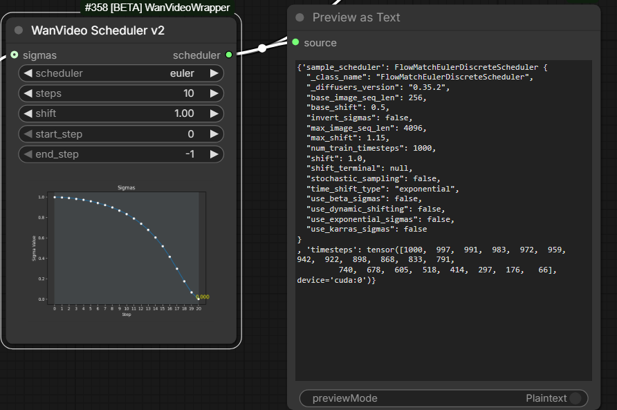
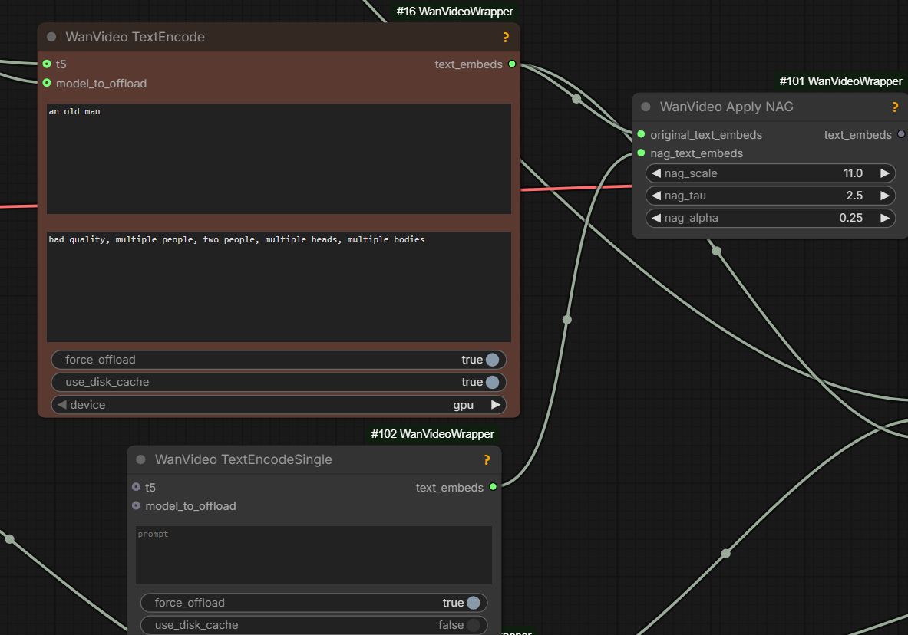
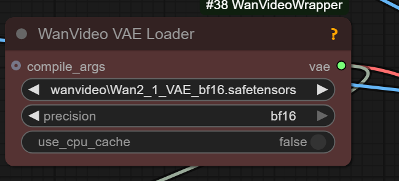

# Hidden Knowledge

## 2025.12.14

`fp8_fast` mode in `WanVideo Model Loader` is good.

> the wrapper doesn't handle [VRAM offloading] so well as native does;
> native calculates the amount that needs offloading;
> wrapper just offloads everything

`LoraExtractKJ` from `KJNodes` will not work on fp8.

## 2025.12.12

> Clowshark samplers carry additional information such as conditioning and model along with the LATENT.
> It only changes when you manually change it.

Great tool to help understand nodes and workflows:  

The following error may mean the model is returning NaN values; solution can be to try a less quantized model

> blck gens; RuntimeWarning: invalid value encountered in cast `return tensor_to_int(tensor, 8).astype(np.uint8)`

## 2025.12.11

> positive and negative [prompt] are two different model passes;
> NAG is additional attention in the positive pass;
> NAG is a lot less powerful than a true negative prompt because
> it doesn't take into account the MLP blocks in the same way,
> so it should probably be a more simple negative [prompt]

> In general when it comes to NAG, the NAG negative prompt should be much simpler and only have things you don't want to see, it shouldn't be the generic negative prompt word salad

> NAG is not used when cfg is used;
> For the steps that use cfg, the empty prompt would be used

KJNodes pack contains nodes for scaling strength of unmerged LoRA-s with step: [kj-lora-strengh-scaling](screenshots/kj-lora-strengh-scaling.webp).

## 2025.12.10

Any sampler with "SDE" in the name is adding its own noise on each step. SDE = stochastic differential equation.
> Pretty much in comfy sde means "add noise every step". There are other ways to solve an SDE but not in comfy.

`WanVideo TextEncoder Cached` from Wrapper is the smart and fast text encoder for repeated runs caching encoded prompt on disk.

> upscale first (seedvr) then rife or vice versa?
> upscale first. Rife is fast, or at least Fill's [implementation](vfi.md#rife) of it

## 2025.12.07

`quantization` which can be set to values like `fp8_e5m2_scaled` in `WanVideo Model Loader`
is there to downcasts the weights to a lower precision when possible.

`quantization` of `fp8_e5m2` without `scaled` is "the worst way to use the model".

`quantization` generally is "just a fallback", it is slower to load;
if VRAM is tight the advice is to "either use scaled fp8 or GGUF
or "disable quantization and use max block swap".

Mixing `fp8_e5m2_scaled` VACE with `fp8_e5m2` Wan 2.2 T2V can cause mysterious errors.

> resolution doesn't affect RAM usage, only the model size and loras do

## 2025.12.03

[Wrapper](https://github.com/kijai/ComfyUI-WanVideoWrapper) contains `Wan Video Prompt Extender` node; it uses [Qwen2.5](https://huggingface.co/Kijai/WanVideo_comfy/tree/main/Qwen) 3B or 7B from KJ HF.

`LoadLatent` node from ComfyUI native can be connected to `samples` input of `WanVideo Sampler` - latents can be saved to disc and loaded from disk.

Running high with CFG 3.5/3.5/3.5 improves prompt adherence compared to 3.5/1/1.

Comfy native contains `Empty Audio` node.

## 2025.12.01 - VRAM Saver

> Wan VAE can use way less VRAM in wrapper if you offload the cache to CPU, makes it also a lot slower, but still beats tiled VAE
> at 720p it's like ~5GB less VRAM used

To similarly save RAM in native use `WanVideo LatentsReScale` node and plug wrapper VAE node into a native WF.

## 2025.11.30 Chunked RoPE - VRAM Saver When Torch Compile Off

> Two of the highest peak VRAM hits on the model code are the RoPE appllication
> (rotary positional embeds) and ffn activation (feed forward),
> these happen separate from the attention, which is the 3rd highest.

> The chunked option splits both the rope and the ffn calculations, doing it in chunks and thus reducing the peak VRAM
> usage to below the attention (which cant really be split without affecting results or slowing it down);
> `torch.compile` also optimises it similarly, that's why it uses less VRAM when it works.

> pytorch now has the fused RMS norm built in, that was one of the biggest benefits of compile;
> you could just not use compile, use the pytorch RMS norm and the  chunked rope

## 2025.11.30 rms_norm_function - Time Saver When Torch Compile Off

`WanVideo Model Loader`: set `rms_norm_function` to `pytorch` not `default` for faster gens if torch is new enough and torch compilation is off.
No time saving if torch compilation is on.

## 2025.11.30 sageattn

`sageattn` and `sageattn_compiled` refer to Sage Attention 2; if you had Sage Attention 1 installed for some odd reason they'd refer to it instead.
Sage Attention 3 can be installed at the same time as Sage Attention 2, so there is a separate option for it `sage_attn3`.

> The only difference between `sage attention` and `sage attention compiled` _was_ that the latter ALLOWED for torch compile;
> normally compilation is disabled for sage as it wouldn't work anyway, and just causes unnecessary warnings and such;
> even with the new sage it still doesn't actually compile it, the code just handles it graciously so there's no graph breaks.

> *`sageattn_compiled` is sort of redundant now with latest version of the wrapper*
> *as the workaround to allow even the old version in the graph seems to work now*

> Difference now is that normal `sageattn` is wrapped in a custom op so nothing in it is compiled
> (but also doesn't cause graph break) and the `sageattn_compiled` doesn't wrap it at all,
> but expects you to have the very latest version of sageattn that has built-in similar workaround 

> fullgraph feature in torch compile is a debug feture; it will error if there's any graph break

## 2025.11.30

> this was even more relevant for Kandinsky5 because it has the 10 second model,
> and it's 24fps, so that's 241 frames to do at once but same applies to Wan

> xformers: No use for it with sageattn being so fast;
> been ages ... back then it was maybe 5% ahead of sdpa

> `Unload Modules` in ComfyUI manager can potentially fix weird VRAM issues

> Note cfg usage(>1.0) increases resources consumption

> disable smart memory in ComfyUI - then it always offloads [does not try to keep models in VRAM to avoid unnecessary RAM - VRAM transfers]

## Drozbay

[drozbay](https://github.com/drozbay) is continuing to push boundaries on what can be achieved aroud Wan models.
His nodes discussed on this website reside mainly in the following code repositories:

| Drozbay's Repo | Purpose |
| :-- | :-- |
| [GH:drozbay/ComfyUI-WanVaceAdvanced](https://github.com/drozbay/ComfyUI-WanVaceAdvanced) | Nodes for advanced Wan + VACE generation |
| [GH:drozbay/WanExperiments](https://github.com/drozbay/WanExperiments) aka `WanEx` | Nodes for preparing and examining embeds in new ways |

List of Drozbay's contributions discussed on this website:

- [Drozbay's Study](conditioning.md#drozbays-study): nodes in `WanEx` to compose/examine [Bindweave](bindweave.md) and advanced I2V embeds
- [HuMo - Drozbay](humo.md#drozbay-continuation): HuMo continuation workflow
- [SVI-shot](svi.md#svi-shot): `WanEx` contains `WanEx I2VCustomEmbeds` which works well with SVI-shot
- [Drozbay's Impact Pack SEGS Detailer For Wan Video And VACE](upscalers.md#drozbays-impact-pack-segs-detailer-for-wan-videoa-and-vace)
- [Painter I2V Modular Replacment](wan-i2v-advanced.md#painteri2v) `WanEx` contains `WanEx_PainterMotionAmplitude` node which replicates action of `Painter I2V` node in a modular manner
- [Wan I2V T2V / VACE Tricks](wan-t2v-advanced.md) hoists avdvanced workflows created by Drozbay
- [Wan 2.1 to Wan 2.2 LOW LoRA](loras/part-01.md#Special Use)

## 2025.11.29

Self-forcing can mean models that generate video portions progressively, small frame batch by small frame batch, thus enabling longer generations. Mainstream today's models are not SF however. Existing SF models offer lower quality of results generally.

## 2025.11.27

res_2s runs about 2x slower compared to Euler, the advantage is that with the same number of steps a better result is delivered;
2x steps on euler is a fair comparison for res_2s; the hope behind using res_2s is to get more mileage out of the same .safetensors file

## The Mystery of Denoise Control Knob

Denoise on sampler is a widely used but often misunderstood parameter.

In `WanVideo Sampler` e.g. in [wrapper](https://github.com/kijai/ComfyUI-WanVideoWrapper) workflows
its function is simply to override `start_step` - it doesn't do anything else.
It is less confusing to always set `start_step` and never touch `denoise`.

In native Sampler the code is more nuanced. One bit of advice we have is

> `denoise_strength` and steps are mutually exclusive and changing both at the same time leads to weirdness,
> especially with the usual schedulers and small step values.

## 2025.11.24

Full non-accelerated generation of AI videos delivers the greatest quality but takes a long time.
Faster generation is achieved by adjusting the model weights.
The process is known as "distillation" producing a "distilled" model.
In most cases the difference between distilled and non-distilled model can be extracted as a LoRa.
Distillation can proceed along two separate axes: cfg and steps.
A model can be distilled in on both at the same time.

> cfg distilled makes it work at cfg 1.0, meaning cfg is disabled and only the positive prompt model pass is done, meaning 2x faster inference

> step distillation just makes it work with less steps

## 2025.11.21

Wan latent space is compressed by factor of 8 spatially, 4 temporarily

## 2025.11.20

`res_multistep` in `Wan Video Sampler` (wrapper) is probably similar to `res_2s` in other samplers (Clownshark?)
> most people using res_2s and similar are not comparing it to other samplers at 2x the steps; not denying it can be better, just skeptical how much, at least with distill loras

## 2025.11.15

`umt-xxl-enc-bf16.safetensors` only works with the WanVideoWrapper;
native workflows need the model without the `enc`
like `umt5-xxl-fp16.safetensors`.

## 2025.11.14

noise mesh/grids/dithering problem with Wan models: originally believed to be

> wan video is only usable with qwen image inputs
> because those are so soft that they do not cross into the detail level where the vae will fail into noise grids

but it looks like the actual explanation is

> It's triggered by the mismatch between real (encoded) and generated latents.
> Generated latents are usually blurry, although adversarial distillation like lightx (dmd2) helps sharpen the generated latents.
> The decoder doesn't know how to handle blurry latents, they're out of distribution, so it generates speckle/grid artifacts as its failure mode.

> The generated latents are blurry. More steps, use lightx loras, disable sage attn if relevant.
> 2.2 low noise + lightning or lightx2v is pretty good at minimizing the artifacts 

another idea

> Doing a second pass with the T2V LOW model with a low denoise (around 0.2) can fix that

## 2025.11.11

When switching on tiling in VAE to save VRAM working with WAN models it is advisable to set `temporal_size` setting on VAE to more than the actual number of frames generated.
For example when generating 81 frames a setting of 84 is advised. Otherwise tiled VAE may introduce flickering.

Massively useful list of WAN-realted models, LoRa-s, controlnets: [link](https://docs.google.com/spreadsheets/d/1HvJ5_ZAzx0Dmw_mifdj1sx2nyIIXoUmqUYj30sMlJpI)

## 2025.11.10

Wan 2.2 vae is for the Wan 5b not the rest though

For wrapper implementations the "null" image is black. For native implementations the "null" image is gray. Also the masks are inverted.

## 2025.10.25

`WanVideo Set Block Swap` and similar nodes do not require re-loading `.safetensors` to make changes - that is why they're separate nodes.

## Earlier

By default `safetensors` files are loaded via `mmap`.

Kijai's nodes can convert between data types such as `bf16` at `safetensors` loading time.

`load_device` = `main_device` in `WanVideo Model Loader` means "keep model in VRAM".

| Kijai's Repo | Purpose |
| :-- | :-- |
| [kijai/ComfyUI-WanVideoWrapper](https://github.com/kijai/ComfyUI-WanVideoWrapper)| Alternative to Native KSampler, "wrapper" nodes |
| [kijai/ComfyUI-KJNodes](https://github.com/kijai/ComfyUI-KJNodes)| Supplementary, can be used with Native KSampler |
| [kijai/ComfyUI-WanAnimatePreprocess](https://github.com/kijai/ComfyUI-WanAnimatePreprocess) | Nodes for Kijai's WanAnimate workflow |
| [kijai/ComfyUI-MMAudio](https://github.com/kijai/ComfyUI-MMAudio) | Foley? |
| [kijai/ComfyUI-GIMM-VFI](https://github.com/kijai/ComfyUI-GIMM-VFI) | frame interpolator |
| [kijai/ComfyUI-SCAIL-Pose](https://github.com/kijai/ComfyUI-SCAIL-Pose) | pose detector for [SCAIL](wan-animates.md#scail) model |

Resolutions to try with WAN: 1536x864, 1280x768, 1200x960, 1/2 of that, 832x480, 1024x576, 1440x816  
Resolutions to try with Ovi v1.1: 1280x704, 704x1280

Colored inputs on ComfyUI node designate non-optional inptus, rather than inputs that have something connected to them.

> Q: why using block swap is hardly any slower than not using it?  
> Kijai: because it's async; it swaps the next block while current one is processing;
> so if your step takes longer than moving the block, you don't really notice;
> it's the prefetch option in the node and non-blocking;
> even without that on fast systems it's not a huge speed hit tbh

Too high CFG on low steps can cause "burns" and flashes.

`Resize Image v2` once reported that a 150 frame 480x832 video was taking slightly bellow 0.7Gb.

There is only one CLIP that works with a particular class of model like Wan. It can be in different precision however.

ViT means "vision transformer". h = huge, l = large.

## RoPE

When using going beyond trained model resolution with a wrapper workflow can try using `WanVideo RoPE Function`.
Particularly with Cinescale LoRA can try setting this node to `comfy` and `f/h/w`=1/20/20 or 1/25/25; Kijai:

> when you use cinescale.. you mean just the lora? or the rope scaling too?  
> really large resolutions should benefit from the rope scaling  
> well technically anything that goes past the trained resolutions should  
> I don't really remember the values but in the original they used something like [that](https://github.com/search?q=repo%3AEyeline-Labs%2FCineScale%20ntk&type=code)  
> basically it's scaling the spatial rope in attempt to make larger resolutions work without the repeat effect  
> possibly the lora is trained with the scale of 20

Defaults are 1/1/1.

## Skimmed CFG

Skimmed CFG from [Extraltodeus/Skimmed_CFG](https://github.com/Extraltodeus/Skimmed_CFG).
High CFG in the sampler helps to follow the prompt, skimming prevents the burn issue.

