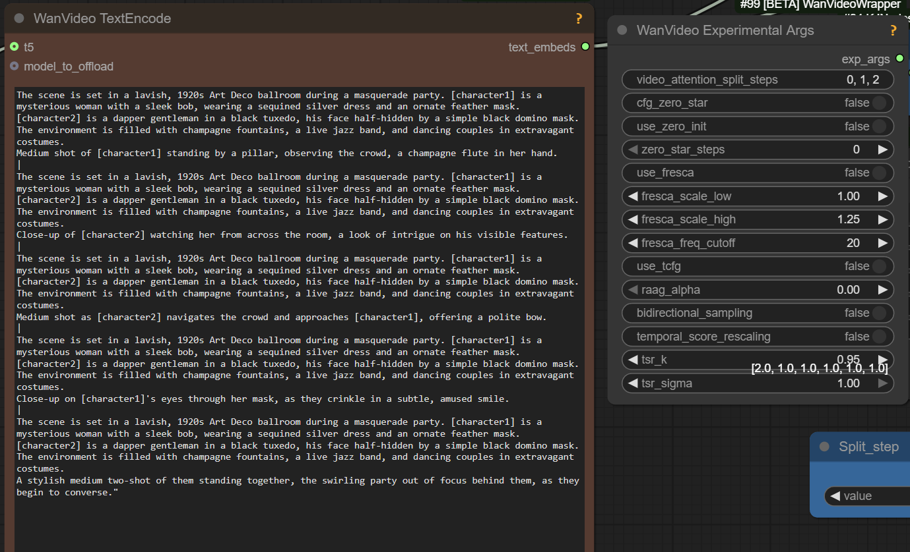

# HoloCine

[Holo Cine](https://holo-cine.github.io/) models have been uploaded to Huggingface, Kijai's provided fp8 [conversion](https://huggingface.co/Kijai/WanVideo_comfy_fp8_scaled/tree/main/T2V/HoloCine).

Warning: non-commercial license (though it is possible initial release was under ASF license, not certain).

Multi-scene videos generator trained on 15sec videos.

There is no special code yet in ComfyUI to use them properly even though ppl tried to drop the .safetensor files into T2V workflows to see what happens.
The hope/promise is to generate longer videos with consistent characters; in practice generated videos are still quite short but longer than 5 seconds.

One of the models in the family, 

> just using the weight at 253fr on low reso (480*480);
> disabling nag to use the | between each shot (no context windows);
> keep same formating than in paper /demo

> no idea for native [e.g. experiments are in wrapper workflows]

Apparently possible to drop .safetensors in pretty much any T2V Wan 2.2 workflow as High noise model, keeping original Wan 2.2 low noise and connect the following nodes:



Models are uploaded as "sparse" and "full", the article says:
> The sparse model is a computationally efficient approximation of the full model, maintaining
> almost the same visual and narrative quality while enabling long, coherent cinematic video generation.

30sec video on rtx 4090: swap block 40, 500 sec to generate

> believe it's just some sort of Wan T2V finetune  
> it's still based on the same Wan model, but the new tricks in their code need to be implemented for it to be able to do everything

## One More Explanation Of Prompting Holocine

```
[global caption] The scene features one character: [character1], a .... He is wearing ... The environment is ... The scene is lit by ... This scene contains 6 shots. [per shot caption] Extreme close-up of ... |
[shot cut] Medium shot of [character1] ... |
[shot cut] Extreme close-up of ... held by [character1]'s steady hand ... doing ... |
[shot cut] Close-up of [character1]'s eye... |
[shot cut] Medium close-up as he... |
[shot cut] Close-up of [character1]'s face as he...
```

## More Chat

> stronger strength of lightx high is needed, possibly 3 not 1.5

> another model using wan vae, another model with low quality outputs plagued by noise grids

Apparently HoloCine is able to generate 241 frames in ComfyUI workflows in one go. Examples seen online contain plenty of cuts.
It seems possible that while generating for 241 frames straight the model always inserts cuts.
Under this understanding the value of HoloCine is its ability to generate several scenes within 15sec limit
with considerable character consistency - rather than ability to produce uninterrupted 15sec shots.

Further full support for control over cuts requires additional code to be added to ComfyUI.
It appears uncertain how soon such support could arrive, given the busy release schedule of other competing models.

> make sure all cuts are 4t+1: 41,81,121,161,201
> orh 41,89,121,161,201

> which loras with holocine?
> distil 0.15 T2V