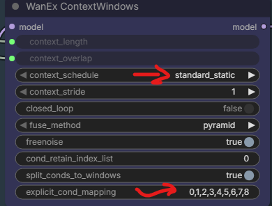
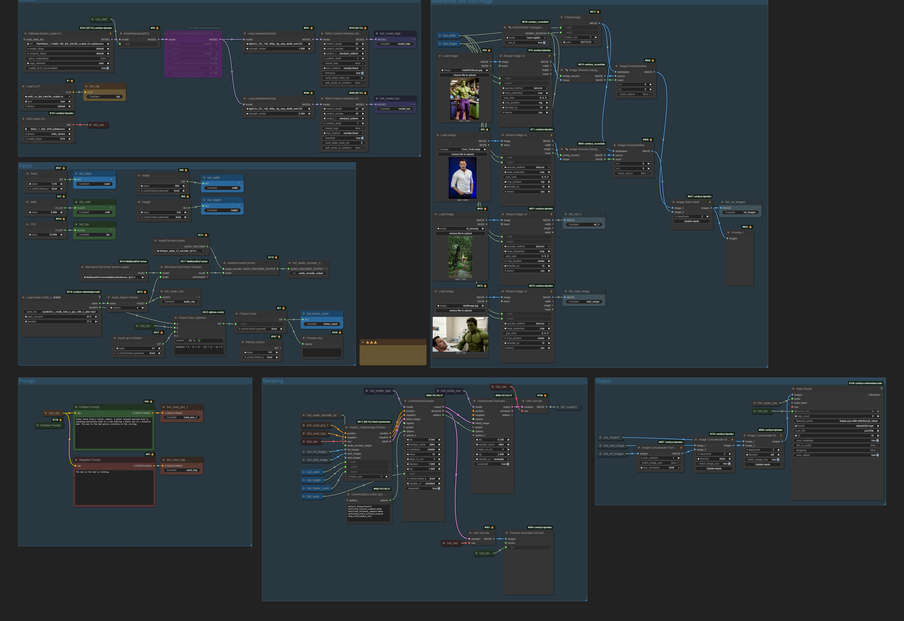
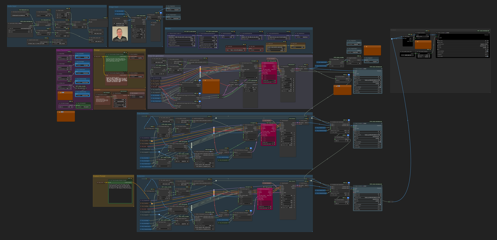

# HuMO

## 2025.12.26

Highly experimental HuMoveLora in action - difference between HuMo and WanMove: [HF:drozbay/HuMoveLora](https://huggingface.co/drozbay/HuMoveLora/tree/main).

## 2025.12.24

Simple ClownShark WF: [droz_HuMoImageToVideo_Simple_v1](workflows/droz_HuMoImageToVideo_Simple_v1.png)
from [Drozbay](https://github.com/drozbay).

## 2025.12.20

> Have you managed to fix the dreaded noisy first frame/flash on humo?
> Nope, not when using a start image

## 2025.12.07

Kijai added a change to Wrapper which allows HuMo embeds to be used together with `WanVideo ImageToVideo Encode` embeds.
HuMo references are appended to the end of `WanVideo ImageToVideo Encode` embeds.

## Drozbay Continuations

### Drozbay HuMo SVI 2.0 Pro Extensions

New WF from Drozbay utilizing both [SVI 2.0 Pro](svi.md#svi-20-pro), high noise Wan 2.2 I2V and low-noise HuMo has been shared embedded into the following image

[droz_WanHuMo_SVI2Pro_v6.1c](workflows/droz_WanHuMo_SVI2Pro_v6.1c.png)

Verison 5.1b: [droz_WanHuMo_SVI2Pro_v5.1b](workflows/droz_WanHuMo_SVI2Pro_v5.1b.png)

SageAttention is known to degrade the accuracy of lipsync.

> It's not terrible with sageattention, with older versions it was much worse.
> The audio can't really "drift", but the segments after the first one are probably
> more likely to have spurious mouth movements. Changing the step counts on the HN
> sampler can help so it doesn't bias the mouth movements too much

### Drozbay Continuations 2025.12.25

New experimental WF from Drozbay giving Humo morphs:

[droz_VaceHumo_ContextWinRefTransition_v1](workflows/droz_VaceHumo_ContextWinRefTransition_v1.png)

Apparently using [CA:2052865/flippinrad-motion-morph](https://civitai.com/models/2052865/flippinrad-motion-morph) at a strength of `0.3` over
[here](workflows/details/droz_VaceHumo_ContextWinRefTransition_v1_detail1.webp):

> You can definitely try without the lora, it's at pretty low strength but it does help with the morphing, so experiment with the strengths.
> If you set it too high you get a lot of abstract objects and cute faces floating in the center of the video.

Clarifications on `WanVaceReplace` from [wanvaceadvanced](https://github.com/drozbay/ComfyUI-WanVaceAdvanced) used in the WF like [this](workflows/details/droz_VaceHumo_ContextWinRefTransition_v1_detail2.png):

> I designed that node so it only changes the vace elements for that conditioning input for the elements that are connected.
> So it is ignoring the vace_strength values and replacing the "reference" vace input for that conditioning and using the reference_strength for that

> The `context_index` in `WanVaceReplace` node is not the context window, it's the Vace context.
> If you stack multiple Vace inputs together you will have multiple vace context.

> the values to play with are:
> - target_frames_per_window
> - target_overlap_frames
> - vace_ref_strength for each of the VaceReplace nodes
> - ref_strength for the HuMo nodes
> - number of steps and steps_to_run for the Vace sampler
> - MotionMorph lora strength

> Also you can try to remove the values in `explicit_cond_mapping`, which will revert back to using the ratio-based splitting of conditions for the windows.
If you do that you can also use standard_uniform for the context schedule, which may result in more blending as well

### Drozbay Continuations 2025.11.29

Drozbay has shared an additional HuMo continuation workflow:

[drozbay_HuMo_contextWindows](workflows/drozbay_HuMo_contextWindows.webp)

### Drozbay Continuations 2025.11.15

[Drozbay](https://github.com/drozbay) has shared `droz_wanexperiments_svishot_with_humo_v1.1` worflow:

[droz_wanexperiments_svishot_with_humo_v1.1](workflows/droz_wanexperiments_svishot_with_humo_v1.1.png)

This is a HuMo continuation workflow, it allows generating videos beyond the usual HuMo limit of about 4 seconds.
Continuation is made possible by the fact that
- among other types of [conditioning](conditioning.md) accepts Wan 2.1 I2V style 1st frame image -
  provided that ComfyUI implementation of HuMo model is "patched" not to erase it
- resulting slight flickering artifacts appear to become better by using [SVI](svi.md) shot LoRa

SVI-shot allows to supply an additional reference image as part of conditioning.
The manner in which it is supplied is unique to SVI-shot.

Both of these actions - patching HuMo model code and correct formatting of conditioning are
implemented in this workflow through the use of `WanEx I2VCustomEmbeds` node which 
[drozbay](hidden-knowledge.md#drozbay) has shared via the following new code repository:
[GH:drozbay/WanExperiments](https://github.com/drozbay/WanExperiments)

### Drozbay Continuations See Also

[Drozbay's Study](conditioning.md#drozbays-study) on composing and examining embeds.

## VRGameDevGirl

### 2025.12.08

Latest workflow is "Z-image / Wan 2.2 FMML / Humo automation workflow"

### Earlier

[VRGameDevGirl](https://github.com/vrgamegirl19/comfyui-vrgamedevgirl) is prominent artist in Video AI space known for her HuMo workflows for generating AI musical videos.
2025.11.20 she shared a work-in-progress workflow for `Wan 2.2 Humo I2V First Last Frame`, which is similar to the one above but doesn't offer continuation facility.
Here's a [copy](workflows/Wan2.2HumoI2VorFLF_WIP.webp), please beware of possible bugs.

## Notes

When using `HuMo` safetensors it may be possible to use `WanVideo Long I2V Multi/InfiniteTalk` in addition to or instead of `HuMo Embeds`.
If both are used at the same time the embeds need to do be mixed using `WanVideo Combine Embeds`.
In this case `HuMo Embeds` is plugged first and `WanVideo Long I2V Multi/InfiniteTalk` is plugged second.
`WanVideo Long I2V Multi/InfiniteTalk` in this scenario controls looping like for a regular `InfiniteTalk` generation.
It looks like `WanVideo Long I2V Multi/InfiniteTalk` additionally makes `HuMo` model respect the start frame more strongly.

`HuMo` might work with other I2V workflows as well.

It appears difficult to stop characters opening their mouth with `HuMO` (though one can try with silent audio).

Without `WanVideo Long I2V Multi/InifiniteTalk` node `HuMo` is limited to less than 4 seconds of generation.

It appears `HuMo` can use multiple reference images.

> Besides having great audio-dependent generation, even without that HuMo is the best one-shot subject-to-video model we have.
> It also works great in V2V with inpainting simply by using a latent noise mask, especially when combined with differential diffusion.

[GH:vrgamegirl19/comfyui-vrgamedevgirl](https://github.com/vrgamegirl19/comfyui-vrgamedevgirl) is a well-known workflow supporting generation of rather long music videos with HuMo.

Note: latent output from `WanHuMoImageToVideo` is simply empty just giving the sampler the right resolution and number of frames.

> The conditioning lines carry all of the references and embeddings and such.