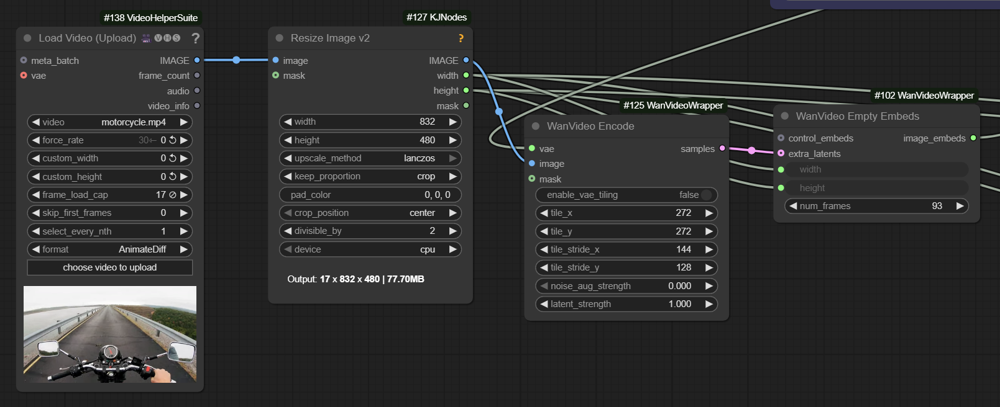
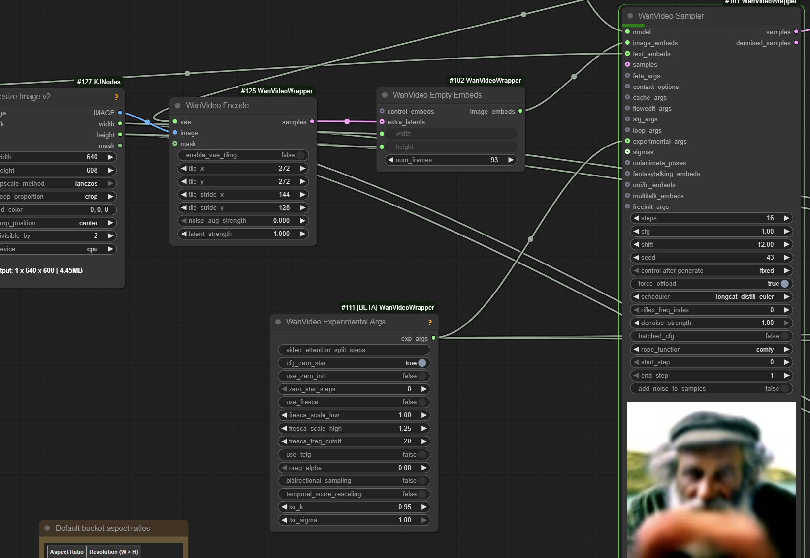
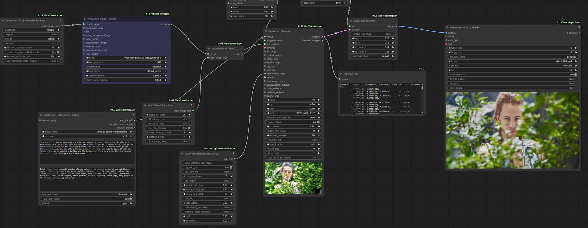

# LongCat

## 2025.10.26

Resolutions supported?

```
ASPECT_RATIO_627 = {
     '0.26': ([320, 1216], 1), '0.31': ([352, 1120], 1), '0.38': ([384, 1024], 1), '0.43': ([416, 960], 1), 
     '0.52': ([448, 864], 1), '0.58': ([480, 832], 1), '0.67': ([512, 768], 1), '0.74': ([544, 736], 1), 
     '0.86': ([576, 672], 1), '0.95': ([608, 640], 1), '1.05': ([640, 608], 1), '1.17': ([672, 576], 1), 
     '1.29': ([704, 544], 1), '1.35': ([736, 544], 1), '1.50': ([768, 512], 1), '1.67': ([800, 480], 1), 
     '1.73': ([832, 480], 1), '2.00': ([896, 448], 1), '2.31': ([960, 416], 1), '2.58': ([992, 384], 1), 
     '2.75': ([1056, 384], 1), '3.09': ([1088, 352], 1), '3.70': ([1184, 320], 1), '3.80': ([1216, 320], 1), 
     '3.90': ([1248, 320], 1), '4.00': ([1280, 320], 1)
}
```

> I2V like with 5B or Pusa/Wan 5B,
> any number of start_frames as extra latents
> and the code replaces that part of the noise
> with the image, and sets corresponding timestep to 0
> after expanding timesteps to be per frame



another WF screenshot



> the exp args don't do anything at cfg 1.0; left it there as the authors were using zero_star in their code when using cfg

> full 50 steps to me

> which sage version? use the 2.2.0 latest

Currently code in [GH:kijai/ComfyUI-WanVideoWrapper:longcat](https://github.com/kijai/ComfyUI-WanVideoWrapper/tree/longcat)

> have to offload about half to run the bf16 on 4090;
> full offload and it's under 10GB

> their code does schedule like this when using the distll lora:
> 1000.0000,  994.7090,  988.7640,  982.0360,  974.3589,  965.5172,  955.2239,  943.0895,  923.0769,  904.1096,  880.3089,  849.5575, 808.2901,  750.0000,  661.4174,  510.6383
> which is in the `longcat_distill_euler`

## Original News

Doordash released 14B parameters video AI model called LongCat,
[teaser](https://huggingface.co/meituan-longcat/LongCat-Video).

MIT license, hurrah!

Promise of long and fast generations, 6 sec fragements stitched with 11 frame overlap; when continuation is used 11 frames is the only context possible, reference images are not taken.

In its own right as a base video generation model LongCat looks pretty nice too. Futher unlike Wan 2.2 it is one model not separate high/low.

> example code does 832x480x93.


> model structure is similar to Wan, just everything named differently, and has fused qkv;
> 48 blocks, smaller dim (4096);
> text encoding, VAE etc. are same;
> it's not a Wan model

"First, the model generates a 480p, 15 fps video; second, this video is upscaled to 720p, 30f ps using trilinear interpolation and refined by a refinement expert"

> refinement expert = lora, by the looks of it...  
> Cinescale style

> And what's amazing is that this Meituan is a food delivery platform.

An attempt to run in ComfyUI in wrapper, does not yet follow the prompt:



> one model for T2V + I2V and continuations (similar to [SVI](svi.md)) seems really exciting

> everything would have to be trained, so not that easy to replace Wan: there's no VACE, audio models, controlnets etc. etc.

> it generates 6 second pieces in either t2v, i2v, or multi-frame i2v mode;
> I tried to generate a 12 second video in one go and it had the same repeating issue as wan

> the multi frame i2v allows extension with motion continuity;
> those 11 [or 13 ?] frames are the only context it has for the next segment;
> if your character isnt perfectly in the shot at the boundary, rip

Apparenlty the authors provided an optional distill LoRa too but it is not functioning perfectly.
