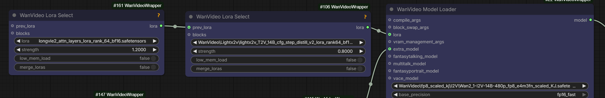

# LongVie

LongVie is a new depth/spatracker "controlnet" giving I2V capabilities similar to VACE.
[vchitect.github.io/LongVie2-project](https://vchitect.github.io/LongVie2-project/).

> The only depth controlnet we have for I2V;
> it's bit hit and miss when the start image isn't exact though

Test WF: [longvie2_testing](workflows/longvie/longvie2_testing.json)