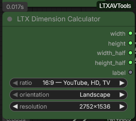
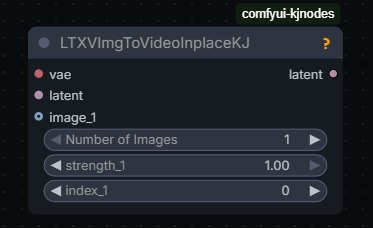
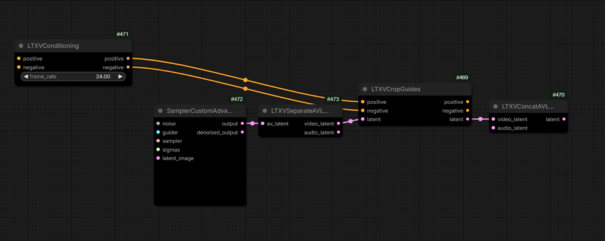
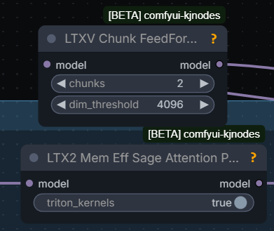
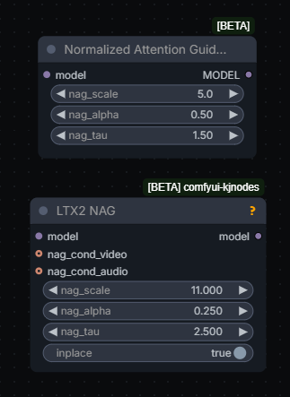

# LTX 2.3

LTX 2.3 uses Gemma 3 12B as multi-modal text encoder. Gemma is by Google.
It might be advisable to set width and height as multiples of 128 (or 32?).

## 2026.04.18

Huddadudd answering on how a good detailed 1536x832 3sec 25fps clip with a nice face in the distance:
> i've been cobbling and updating my clownshark wf for a while now, its a hodgepodge of outdated and new stuff that i just tinker with;
> currently its 4steps gauss legendre then euler 8 steps, 2nd pass is eulerancestralcfgpp
> just a basic sampler;
> run the dev model, .3 distill lora first stage .5 second stage;
> thats also without any of the uprez or refinement passes;
> zimage is the image, just standard sampling, clownshark is stage 1, which is the bulk of the sampling;
> i mostly just modify versions of able's workflows

Ablejone's aka [Drozbay](hidden-knowledge.md#drozbay)'s LTX 2.3 ClowShark workflow: [droz_LTX-2_SharkSampling_v7.1](workflows/ltx/droz_LTX-2_SharkSampling_v7.1.png)

[GH:kijai/ComfyUI-PromptRelay](https://github.com/kijai/ComfyUI-PromptRelay) to implement "Prompt relay" technique using prompts like:
> a does this..  
> |  
> then does that

Alternatively the time speach is uttered can be controlled via [ID-LoRa](ltx23.md#id-lora) which supports `[4-8s] ...` style of prompting.

The idea is that attention is masked so different prompts apply to different parts of the video.
[GH:vrgamegirl19](https://github.com/vrgamegirl19)'s wf: [vr-i2v_PromptRelay](workflows/ltx/vr-i2v_PromptRelay.json)

## 2026.04.16

Richard Servello:
> LTX union ic-lora was trained on a distilled sigma schedule. So you have to use their exact gradient for it to work

Zueuk on LTX audio latents:
> latent cut; y axis; which is unobvious;
> LTX Add Latents can combine them, but only if none -or- both of them have mask, otherwise it fails

[Ckinpdx](https://github.com/ckinpdx) on `LTX Audio Latent Trim` node:
> I added a strip mask to the audio latent trim to address that

## 2026.04.14

- LTX 2.3 distilled v1.1 released by LightBricks - model and LoRa - LoRa trained separately from model - LoRa allows to adjust strength - more flexible
- Motion Track & Union Control IC LoRas update

`LTXV Chunk FeedForward (for low VRAM)` - "don't touch the chunk size, it's mostly testing param and in practice 2 is enough"
"it chunks the feedforward layer (ffn) calculation, doing it in 2 chunks already puts it below other VRAM peaks
and default non-chunked is a huge spike that can be multiple GB of higher peak VRAM at larger inputs".

`res_multistep` might be better for sound generation than `euler` with distilled.

grimm1111: "The v1.1 distill is a noticeable improvement.  The details and coherence are improved.
I typically run the distill model with the distill lora at neg 0.2 or so. 15 steps, CFG 1; Also I only ever do single pass, that's just me.  And no temporal upscale or anything like that.
my favorite aesthetic is "movie shot in the 1990's" so I don't really go for the super HD stuff.  I like the softer analog camera look over the super-digitized look"

> distill 1.0. I feel the colours are a lot more natural. maybe just a saturation node will be enough.

mamad8: "Using split sigmas with the distill Lora (strength 0.5) to set cfg 2 for the first 2 steps and cfg 1 for the remaining 6 steps helps A LOT, especially audio but also overall coherence and motion"

> distill 1.1 as lora str 0.6 and just works

## From The Makers

[HF:Lightricks](https://huggingface.co/Lightricks) provide

- ltx-2.3-22b-dev, separate distilled model, alternatively a distillation LoRa
- ltx-2.3-spatial-upscaler-x2-1.1, ltx-2.3-spatial-upscaler-x1.5-1.0, ltx-2.3-temporal-upscaler-x2-1.0
- LTX-2.3-22b-IC-LoRA-Union-Control
- LTX-2.3-22b-IC-LoRA-Motion-Track-Control

They also provide under LTX-2 umbrella

- Lightricks/LTX-2-19b-IC-LoRA-Detailer "still usable with 2.3 , thought it was only available for 2"

## Alternative Weights Packagings

- [GH:Hippotes/LTX-2.3-various-formats](https://huggingface.co/Hippotes/LTX-2.3-various-formats/tree/main) including nvfp4;
  "I strongly recommended the 'mixed' ones, it's barely slower and doesn't hit the quality as hard as the whole transformers conversion"

## Nodes Of Interest

- `LTXVLatentUpsampler`

- `LTXVImgToVideoInplace` - seems to swap the initial frame? prob. useful in I2V workflows where a high-quality version of initial frame is available
- `LTXVImgToVideoConditioning`
- `LTXVAddGuide`

## Sampler Nodes

Hmm.. `LTXVLoopingSampler`... what is it?..

## Samplers

[Ckinpdx](https://github.com/ckinpdx):
> res2s is good for quality but also handles higher fps better ... i started out with eulers, then lcm, then settled on res2s;
> the manual sigmas describe 3 steps, which works for euler in the second stage but is too many for res2s.
> for the second stage to use res2s without overbaking i use basi scheduler beta 0.34 denoise 2 steps.
> i run dev with distill and drop the distill down to 0.5 from the standard 0.6 in the second pass

Hevi:
> lcm for first stage much faster than anything else imo

## IC LoRa-s

IC LoRa generally stands for "in-context LoRa" a _type_ of LoRa. In colloquial speak "IC LoRa" generally refers to one of the IC LoRa-s released alongside LTX 2.3:
[Union Control](https://huggingface.co/Lightricks/LTX-2.3-22b-IC-LoRA-Union-Control), Motion Track or Depth/Canny/Pose.
Additional Python code to use them: [GH:Lightricks/ComfyUI-LTXVideo](https://github.com/Lightricks/ComfyUI-LTXVideo/).

## Keyframing

Different ways to do FLF: LTXVAddGuide, LTXVImgToVideoInplaceKJ.

[YT:What Dreams Cost/Guide to Prompting and Keyframing I2V](https://www.youtube.com/watch?v=ZY4hsvTzbas) [GH:WhatDreamsCost/WhatDreamsCost-ComfyUI](https://github.com/WhatDreamsCost/WhatDreamsCost-ComfyUI);
an independent attempt to re-purpose the What Dreams Cost nodes to use a character sheet [YT:How to use Character sheets with LTX 2.3](https://www.youtube.com/watch?v=evFe_YLI56E)

Zueuk:
> as i understand, with guides you "never" get exactly the same frames even if you set the strength to 1,
> so for extending i'd probably keep masked "inplace" data
> but when we put frames anywhere except frame #0, guides are probably a better choice

### ImgToVideoInplace

Alternative to using guides. Kijai's version also allows to specify which frame to apply to: 

[Drozbay](hidden-knowledge.md#drozbay):
> The inplace nodes are very simple: they don't add any guide latents or anything they just replace the target latent frame with the encoded image and mask it so it doesn't change

### Guides

> guides are latent+mask but they exist at the end of the sequence, and are applied to the position through RoPE;
> so basically they are stored at the end, keyframe info is stored (through the conditioning in comfy) so it knows what frame it should affect;
> that's why using full guide video is so heavy, and that's why the newer guide method halves the guide resolution

`LTXVCropGuides` removes the guides from latents after generation: 

Tooltip on `LTXV Add Latent Guide` from `LTX Video` node pack suggests that one may be treating index of -1 to mean "before the 1st latent" e.g. before subject enters frame.

[YT:4TE-QbtkiGQ](https://www.youtube.com/watch?v=4TE-QbtkiGQ) for some advice on using guides to inject frames.

[YT:nekodificador](https://youtube.com/nekodificador) reported plugging the same guide image twice via both of the following nodes increases motion
[twoGuidesMoreMotion](screenshots/ltx/twoGuidesMoreMotion.webp); [twoGuidesMoreMotion2](screenshots/ltx/twoGuidesMoreMotion2.webp) - "just renamed, they are regular AddGuide";
[Drozbay](hidden-knowledge.md#drozbay) on the difference between these two similar nodes:
"Nothing should be special about the IC Lora guide version except that it allows you to control the latent downscale factor. and it also doesn't have the crf option".

## Controlling The Camera

N0NSense controls camera using a schematic video or a box/room everything happens in converted to a depth map + ic union control LoRa. His a2v videos created this way look great.

[Cseti](https://www.youtube.com/@ChetiArt)'s LoRa to replicate camera motion from one video to another [HF:Cseti/LTX2.3-22B_IC-LoRA-Cameraman_v1](https://huggingface.co/Cseti/LTX2.3-22B_IC-LoRA-Cameraman_v1);
README and workflow: [HFdatasets:Cseti/ComfyUI-Workflows:ltx/2.3/ic-lora-cameraman](https://huggingface.co/datasets/Cseti/ComfyUI-Workflows/blob/main/ltx/2.3/ic-lora-cameraman/README.md);
"This one took around 20-24 hours to train with 77 video pairs. And I also made two more runs one with 128 and another with around 40 pairs. But this one looks the best so far" "I used videos from pexels"

## I2V

Hevi:
> lowering guidance stregth to 0.3-0.4 for the ref image helps with the watercolor artifacts

## Motion

To fix motion arfiacts ppl often generate at 50fps. Sometimes 35.

## Inpainting

- inpaiting can be done with reference using Alisson's LoRa (see bellow).
- alternatively [YT:nekodificador](https://youtube.com/nekodificador) reported success has placing a large rectange over person's mouth in video and using "just straight inpainting with native nodes and distiled lora"
  additional details: [pcvideomask:PC Video Mask Smooth](screenshots/nodes/pcvideomask-pc-video-mask-smooth.webp) from [GH:pavelchezcin/pcvideomask](https://github.com/pavelchezcin/pcvideomask)
  + sampler=linear/euler + scheduler=exponential were reported to help with detailing part of the video - mouth in this case;
  audio then guided lip motion

## Multi-Pass Workflows

Ppl often use workflows which start with a sampler generating at a low resolution and then (sometimes a chain of) 1.5x or 2x upscalers, more often 2x.
This is said to improve motion but blur small objects with texture.

Zombiematrix:
> use the either of the default templates and change the starting pass to go to .25 of the starting resolution (instead of .5)  
> then add a second upscale pass. thats all it is. you can use either of the upscalers (1.5 or 2.0)

Jonathan (WhatDreamsCost):
> I've been testing a 3 stage workflow for the past month, mainly because I see better motion when the 1st stage is at a lower resolution.
> Also I like it for testing prompts. Since the 2nd stage is faster, you can get a clearer preview quicker when using the tiny vae
> compared to using just 1 or 2 stages. And when you use CacheDiT on top of that, you can test prompts even faster.

[Mark DK Berry](https://markdkberry.com):
> For LTX, I go 480 x 201 first pass so I can make structure quickly util I get what I want ...
> then upscale twice for 2nd pass from v2v in LTX and I am at 1080p in 10 mins,
> and final is polisher low denoise to fix eyes and whatnot, often with a WAN model denoise 0.2 using USDU;
> any higher [denoise] the tiling or weird speckldeing creeps in but you could do a full detailer method
> but the USDU is faster and works on low VRAM. I am using 1.3b for this atm. still testing it, but its half the time of the 14B for me.
> ... just tested Wan 2.1 self forcing DMD 1.3b and its good enough for most fixups at 0.2 denoise ...
> 241 frames at 24fps

> Q: 40 steps on base dev at 0.25 res, 3 with distill at x2 upscale, and 3 again with x2 upscale? Is this all linear quadratic schedule?  
> A by Garbus: That's it, and er_sde across all three. Distill LoRA on 2 and 3 set to about 0.6 usually is best.
> (I only use the preview node on the first sampler since it can cause an OOM on the upscale, and there's nothing new to see there anyway.)

> Q: When you run ... Wan step how well does it deal with identity preservation?  
> A by Mark: use phantom 1.3b or WAN 2.2 VACE self forcing 1.3b (which is i2v effectively).
> and keep denoise low but with phantom you cant go over 0.5 it gets weird but
> consistency is kept so far in tests both with phantom and VACE 1.3b. HuMO would be better
> but my rig cant wait for it. I wish MAGREF did a 1.3b I would have used that but.
> I tested 5b wan but it wasnt very good which was weird.  
> Q: Do you end up doing context windows for a long base LTX gen to not run out of RAM?
> A by Mark: no, I use USDU then you dont need all that. it handles it. its in the wf
> [links](https://markdkberry.com/workflows/research-2026/#video-pipeline-workflows)
> for my video pipeline. have a look.

> I am not sure if HuMO will work with USDU properly.
> I currently use either Phantom 1.3b or WAN 2.2 VACE 1.3b only because lowVRAM else I would use 14B and I use it in two stages, once to detail the 480x201 intiial video then again with USDU for the final polish at 1080p after its been through LTX upscalers.

> previously was two x2 upscalers in series but today added in a 2nd sampler to the first upscaler and its way better.
> I still have some tweaks to make though but also introduced the VBVR lora and the 1.1 distill came out so it might also be that helping improve thing...
> the guts of it is in my video pipeline `MBEDIT-v2v_LTX23_Upscaler_DevQ5KM-Audio-In_1080p_vrs7.json`
> [https://markdkberry.com/workflows/research-2026/#video-pipeline-workflows](https://markdkberry.com/workflows/research-2026/#video-pipeline-workflows)

> I was using phnatom 1.3b to detail my i2v first stage 480 x 201 that I did that size to get structure quick as I could changing prompt til I got there.
> it was fast relatively. but the phantom did a nice fixup. then into the upscaler wf with ref image. but it had its faults.
> today introducing x2 samplers to that upscaler stage instead of x1 sampler with x2 upscalers has meant I dont need the phantom stage, but I might keep it in anyway.

Mark's video: [YT:Video Workflow Pipeline (April 2026)](https://www.youtube.com/watch?v=7Lqt3pgGefA)

- [LTX-23-T2V-3PASS](workflows/ltx/garbus-LTX-23-T2V-3PASS.json) WF from Garbus: "This is the
  default LTX T2V wf with some things added and subgraphs unpacked. It's not pretty, but it works, or should give you an idea what modifications to make to a wf you prefer"
- [ai_hakase's wf](https://x.com/ai_hakase_/status/2040417832769585194?s=20)

N0NSens on flickering in three pass workflows:
> I think it's because of LTXVImgToVideoInplace at upscaler passes. At first frames it's combining lowres latent from prev
> pass and your input image. So far, the only way I found to reduce this effect is to cut off first 3 frames and lower Inplace str to 0.7

> just matching to ref helps in this case

"native SUPIR implementation PR" from Kijai includes a new color matching node

N0NSense
> In my experience, the higher the initial resolution, the better the result. Therefore, 2 passes produce a better result than 3 (especially noticeable on small patterned textures). 

David Show
> but the higher the first pass resolution

[audio] "generate ... once ... all subsequent upscale passes ... reuse the originally generated audio rather than reprocessing it"

> first pass with a modality scale of 2.5

It was reported an overly high sqare resolution (1920x1920) after upscaler can cause color shift issues. Wider or smaller resolution like 1536x1536 reportedly can help.

[official-video_ltx2_3_i2v.json](workflows/ltx/official-video_ltx2_3_i2v.json) demonstrates often used up/downscaling tricks in multi-pass pipelines.

[Wan-Various_Refine-Upscale](workflows/ltx/Wan-Various_Refine-Upscale.json) could potentially be used to enhance LTX videos with various WAN models.

> why ... 4 step sigmas like `1, 0.85, 0.7250, 0.4219, 0.0` on the last upscaler sampler when 6 steps is clearly superior in results?

Richard Servello
> Ltx is meant to be 2 stage but a lot of people insist on one pass and complain about artifacts

[Mark DK Berry](https://markdkberry.com):
> One thing I love about LTX that WAN is [bad] at, is I can shove the same video through it over again and no problems.
> WAN will blister the contrast to hell if you try that, VACE too.

## Hints

> As long as the video is relatively static, it's amazing. As soon as there's fast motion ... [things get mushy]

> The newer ic Loras like the union one are trained with half res. 
> Latent downscale factor?
> Yes.

Vertical format videos may still be more problematic than horizontal ones, even though it was claimed they were fixed in LTX 2.3.

Lower image compression (16) helped with a crazy-looking person (no eyes) where higher compression (22) failed.

N0NSense is generating cool videos using
- cinema4d playblast render
- AIO Aux Preprocessor
- depth map
- IC LoRa

Above is also possible with LTXVImgToVideoInplaceKJ node to also use FLF.
N0NSense: emptying a glass is a practically impossible task for the model in i2v mode. The only option is FLF.
Also tested with: `Draft animation + hard cuts. depth, IC str 0.4, clwn sampler, t2v`.
"Need more detailed prompt for camera movement but seems to work".
Can be used to lock camera static: [N0NSens-static-cam-ltx23](screenshots/ltx/N0NSens-static-cam-ltx23.webp).
"ic union lora. depth" "it's based on LTX-2.3_ICLoRA_Union_Control workflow from ltx"
It is sufficient to place cubes where characters need to be and they can be rotated to make characters look the right way etc. This also covers scene cuts.
"depth at str 0.2"; "i2v, using starting image"; Q: why not render depth? A: don't want to spend time for rendering from c4d; ... visible wireframe helps to detect some depth by depthAnything

Recommended ic guide strength: 0.1 - 0.4 for depth, 0.2-0.6 for canny, 0.5-1.0 for pose; lower strength allows ltx be more imaginative

[Making of "Gloomy Bukur"](https://vimeo.com/1183873769?share=copy&fl=sv&fe=ci) Vasily Bodnar, N0NSense

> ... a ... (left) does this ... a ... (right) does that. the camera abruptly changes angle: the ... is on the left in the background ... the is on the left in foreground ...

Change FPS from 24 to 25 to fix de-sync of audio

[Mark's Workflows](https://markdkberry.com/workflows/research-2026/#video-pipeline-workflows) "LTX 2.3, 10 seconds, 24 fps, 241 frames. I dont go over that, no real need. and I end on 24fps coz I like it"

[Mark DK Berry](https://markdkberry.com): I've been experimenting with Phantom 1.3B running through USDU to add the WAN back in to LTX results.
I am low VRAM so cant do 14B in under 30 mins, but 1.3B is surprisingly good and very fast even on low VRAM and manages 1080p 24fps,
241 frames in minutes fixing up some of that LTX detail issue like eyes quite well ... anyone with a decent card should be WAN 14B detailing
low denoise for polish and you'll have perfect results from LTX. Juan Gea: Yes, Wan 2.2 14B is the perfect "last pass" for LTX, or the HUMO version.

Reported as working (empty lines are extra empty lines in prompt):
> [fen] character description  
>  
> [scene] scene description  
>  
> [sound] ambience description  
>  
> [0-1s] [fen] does ... says ".."

> are these 2 still needed? Yeah they still help

Kijai's tensor loop node "is just a utility" "it works but somewhat awkward with the audio length calculations"

[GH:fblissjr/ComfyUI-AudioLoopHelper](https://github.com/fblissjr/ComfyUI-AudioLoopHelper)
"super rough around the edges but if anyone wants. its meant to handle all those timing calcs that i didnt wanna bother with"

> Q: when using a sampler for videos, what sampler would you suggest to use for clear and fluid animation?  
> A [GH:vrgamegirl19](https://github.com/vrgamegirl19): i found that these two seem to give good results. i would try them both euler_ancestral, euler_ancestral_cfg_pp

Hicho:
> i didnt know that flf nodes accept video frames; is this how we do extension?

Two NAGs exist which can be used with LTX 2.3, "very different", "whole different method of applying"

Can try `APG Guider` instead of `CFG Guider` to reduce color shift issues, [article](https://arxiv.org/pdf/2410.02416).

Do not put quotes around dialogue to avoid subtitles, also Kijai's NAG.

> [On AMD rdna2] ltxvideo works on fp16 even though it is not listed in comfy config file, and it is faster for me than fp32;
> nvfp4 also works for me but with that the quality is not that great

## Training

On character LoRa training: "just 30 images with 10 repeats and 10 epochs, so quick and dirty - AkaneTendo25 fork of musubi-tuner-ltx-2 - success"

10 videos from 2-8 seconds each ... if overfitted reduce strength of LoRa

Training IC LoRa requires twice the VRAM and twice the time compared to traditional LoRa-s. 5090 should generally be capable of.

[Oumoumad](https://gear-productions.com):
> I never needed to go beyond 5000 steps, in fact most of the time even in 1500 steps you already see your desired effect

mamad8:
> Using split sigmas with the distill Lora (strength 0.5) to set cfg 2 for the first 2 steps and cfg 1 for the remaining 6
> steps helps A LOT, especially audio but also overall coherence and motion

mamad8:
> If you have trained a character Lora but you're often using it with another (or multiple) loras you might have seen that the character is less accurate
> (it depends on how much the loras you use have been trained on specific faces) : select your best 4-6 close ups of your character and train a new Lora
> rank 4 on top of the models you use (and your previous trained Lora) for 500-1000 steps, the result will be absolutely night and day.
> Currently I don't think any trainer allows training loras on top of others (it's not finetuning, simply merging the provided loras to the base
> model before training a completely new one. This way the loras already trained do not lose anything they have learned and they overfit a lot less).
> I'll release the training code to train on top of loras soon (fork of aitoolkit)

[GH:richservo/rs-nodes](https://github.com/richservo/rs-nodes) LoRa training inside ComfyUI "adding ffn chunking fixed the OOM" "I'm ... training on 576x576x97 ... it's much more efficient ... no idea why"

[GH:vrgamegirl19](https://github.com/vrgamegirl19):
> so when training with images you end up loosing motion the higher the steps ...
> I took my 1000 step lora which keeps motion but does still add the style a bit and
> used that on the first pass then put my 5000 step lora on the 2nd pass ...
> add the that VBVR to the fist pass only 

first video has the 5000 step lora on both first and 2nd and the 2nd video has the 1000 step on first and 5000 step on 2nd pass.

## Sound

The role of a "solid mask" is not clear to the writer of this page but apparently it may be used before feeding Audio latent into sampler: [solidMask.webp](screenshots/ltx/solidMask.webp)

Some ambience noise on input audio may make ltx generatevlipsync better.

[Mark DK Berry](https://markdkberry.com):
> I use vibevoice multi speakers and then shove 10 second (about 3 lines of dialogue max) in to LTX ...
> LTX 2.3 ... "add subtle ambient noise" trick

## Manual Sigmas

David Show: `1.0, 0.995, 0.99, 0.9875, 0.975, 0.65, 0.28, 0.07, 0.0`, "it's a three stage workflow, but those new sigmas are just being used on the first pass."

Reddit [post](https://www.reddit.com/r/StableDiffusion/comments/1sk8vhq/ltx23_distilled_updated_sigmas_for_better_results/).

## V2V

V2V can be done either via IC Union LoRa-s or via latent denoise. Unmerged Context Windows PR to make V2V simpler: [GH:Comfy-Org/ComfyUI/pull/13325](https://github.com/Comfy-Org/ComfyUI/pull/13325).

## Basics

- [Mark DK Berry](https://markdkberry.com) on basic VRAM optimizations and NAG to remove subtitles: [nag-other-basic-setup](workflows/ltx/mdkb-nag-other-basic-setup.webp)
- Hicho's [ltx-2.3-simple-v2v](workflows/ltx/hicho-ltx-2.3-simple-v2v.json) prob. the simplest WF involving a depth map

## ID LoRa

ID-LoRa apparently provides both visual and audio character likeness. Additionally it seems to support timed prompting otherwise not available on vanilla LTX 2.3.
Because one of the checkpoints is called "talkvid" ID-LoRa is also referred to as "talkvid".

- Starting point especially for documentation is [GH:ID-LoRA/ID-LoRA/](https://github.com/ID-LoRA/ID-LoRA/)
  "One ID-LoRA per run. The two available checkpoints (`id-lora-celebvhq` and `id-lora-talkvid`) are alternatives trained on different datasets, not meant to be combined.  
  Stage 1: ID-LoRA + identity guidance + reference audio  
  Stage 2: Distilled LoRA only, no ID-LoRA. Audio from stage 1 is frozen - only video gets spatially upsampled/refined."  
  "Update — March 24, 2026: Native ComfyUI ID-LoRA support for LTX2 is now in upstream ComfyUI, merged
  in PR [#13111](https://github.com/Comfy-Org/ComfyUI/pull/13111). It adds the `LTXVReferenceAudio` node for reference-audio speaker identity transfer;
  original ID-LoRA weights work as-is with no conversion. Thank you to Kijai for implementing and contributing this integration."
- Earlier attempt to create ComfyUI nodes: [GH:pineambassador/ComfyUI-ID-Lora-Pine](https://github.com/pineambassador/ComfyUI-ID-Lora-Pine)
  "The original authors have it as roadmap to create a comfyui implementation. In the meantime, this was my attempt"
  "injecting reference images at specified frames in the timeline to increase likeness retention (frontal portrait, profile portrait, re-inject the first frame, etc), without clobbering the scene";
  "I noticed when using id lora then u got to prompt how you want voice tone be , calm , angry etc"
  "trained around 1 subject and very alpha
- [HF:AviadDahan/LTX-2.3-ID-LoRA-CelebVHQ-3K](https://huggingface.co/AviadDahan/LTX-2.3-ID-LoRA-CelebVHQ-3K)
  [HF:AviadDahan/LTX-2.3-ID-LoRA-TalkVid-3K](https://huggingface.co/AviadDahan/LTX-2.3-ID-LoRA-TalkVid-3K)

`TalkVid` flavor supports the following style of prompting

> [abc] A young  ...  
>   
> [scene] ...  
>  
> [sound] soft...  
>  
> [0-1s] [abc] raises ...  
> |  
> [1-6s] ... 

Gleb Tretyak:
> not 10/10 follow. timings should be sufficiently calculated by user, otherwise it's ignored by the model I believe; and prompt relay makes it worse

## LoRa-s, Alisson

- EditAnything IC LoRA: [CA:2553102/editanything?2869279](https://civitai.red/models/2553102/editanything?modelVersionId=2869279),
  [HF:Alissonerdx/LTX-LoRAs:ltx23_edit_anything_global_rank128_v1_6000steps_prodigy](https://huggingface.co/Alissonerdx/LTX-LoRAs/blob/main/ltx23_edit_anything_global_rank128_v1_6000steps_prodigy.safetensors); instructions in README next to it;
  [HF:Alissonerdx/LTX-LoRAs:ltx23_edit_anything_v1.json](https://huggingface.co/Alissonerdx/LTX-LoRAs/blob/main/workflows/ltx23_edit_anything_v1.json)
- Alisson Pereira's `animate2real`: [HF:Alissonerdx/LTX-LoRAs:ltx23_anime2real_rank64_v1_4500](https://huggingface.co/Alissonerdx/LTX-LoRAs/blob/main/ltx23_anime2real_rank64_v1_4500.safetensors);
  also [CA:2527511/anime2half-real](https://civitai.com/models/2527511/anime2half-real)
- Alisson Pereira's first experimental version of MR2V (Masked Reference-to-Video): [HF:Alissonerdx/LTX-LoRAs](https://huggingface.co/Alissonerdx/LTX-LoRAs)
  "It's a reference-based inpainting LoRA ... I trained several variants, and this rank 32 one was the one I liked the most"; use `ltx23_inpaint_masked_r2v_rank32_v1_3000steps.safetensors`;
  "If you want speed, take the first frame from the generated control video, drop it into ChatGPT, and say: 'Describe this video with the object in the green area placed where the magenta mask is.' Then you add more details to it."
  "This IC  LoRa was trained for objects in general, not people." Benji's [video](https://www.youtube.com/watch?v=E_XRBRykDwE) on it;
  "The saddest part is that he seems to have changed the size of the green part on the side of the video and didn't follow the prompt recommendations I left for masked r2v";
  [ap-ltx23_masked_ref_inpaint_v1.json](workflows/ltx/ap-ltx23_masked_ref_inpaint_v1.json);
- BFS LoRa "which does head swapping" [HF:Alissonerdx/BFS-Best-Face-Swap-Video](https://huggingface.co/Alissonerdx/BFS-Best-Face-Swap-Video)

## LoRa-s And WFs

- David Show
  - David Show shared  AnimeMix-@nim3mix-Final-LTX on [HF:davesnow1/Loras](https://huggingface.co/davesnow1/Loras/tree/main); note: his convention is that trigger word `@nim3mix` is part of model file name
  - Dave Snow1's animemix for LTX 2.3: [HF:davesnow1/Loras:Loras/tree](https://huggingface.co/davesnow1/Loras/tree/main) "I often crank it to 1.5"
- Crinklypaper
  - Crinklypaper presented [crinklypaper-LTX-EXWF-NEW-Taz.json](workflows/ltx/crinklypaper-LTX-EXWF-NEW-Taz.json) as "new workflow with Kijai's efficiency nodes" and praised its operation with distill LoRa v1.1:
    "This such great news, not having to run everything in 50fps, though I do see it still helps on fast motion to  run on 50 fps";
    one of his LoRa-s: [CA:2415727/seikon-no-qwaser-ecchi-anime-style-lora-ltxv2?2716034](https://civitai.com/models/2415727/seikon-no-qwaser-ecchi-anime-style-lora-ltxv2?modelVersionId=2716034)
    there should be other good LoRas next to it including a 3d LoRa and Gurren Laggan one
  - Crinklypaper's [LTX-23-change-voice](workflows/ltx/crinklypaper-LTX-23-change-voice.json)
- [Ckinpdx](https://github.com/ckinpdx) is sharing a collection of workflows absorbing latest and greatest from various sources: [GH:ckinpdx/ckinpdx_comfyui_workflows](https://github.com/ckinpdx/ckinpdx_comfyui_workflows)
  including a latent looping workflow;
  [ckinpdx-LTX23_TorI2V_Humo_API](workflows/ltx/ckinpdx-LTX23_TorI2V_Humo_API.json) using HuMo 1.7B as the last cleanup step is probably up there as well, or soon will be
- [GH:vrgamegirl19/comfyui-vrgamedevgirl:Workflows](https://github.com/vrgamegirl19/comfyui-vrgamedevgirl/tree/main/Workflows) workflows from one of the masters :) Somewhare out there there are "Claymation", "Puppet",
  [Golden Age Comic](https://civitai.com/models/2532516/ltx-23-golden-age-comic), [Enhancer](https://civitai.com/models/2535622?modelVersionId=2849716) LoRa-s by her as well;
  [CA:2540961?2855640](https://civitai.com/models/2540961?modelVersionId=2855640) dark fantasy?
  [CA:2535622](https://civitai.red/models/2535622) home of VRGamedevgirl on CA? place to get her 
  [crisp enhancer](https://civitai.red/models/2535622/ltx-23-enhancers) LoRa and other LoRa-s including Fantasy_Realism
- Sir_Axe
  - Sir_Axe's [HF:siraxe/TTM_IC-lora_ltx2.3](https://huggingface.co/siraxe/TTM_IC-lora_ltx2.3) cartoony time to move for LTX 2.3;
  - Sir_Axe's [HF:siraxe/MergeGreen_IC-lora_ltx2.3](https://huggingface.co/siraxe/MergeGreen_IC-lora_ltx2.3) merge one video with another; apparently some green frame is involved - as a separator?..;
    "takes couple of seed tries and description of what changes, but it's also not perfect but better than just inserting start/end frames imo"
- [HF:RuneXX/LTX-2.3-Workflows:Video-2-Video/LTX-2.3\_-\_V2V\_ReTake\_recreate\_any\_section\_of\_any\_video](https://huggingface.co/RuneXX/LTX-2.3-Workflows/blob/main/Video-2-Video/LTX-2.3_-_V2V_ReTake_recreate_any_section_of_any_video.json)
- VBVR
  - VBVR HF: [HF:LiconStudio/Ltx2.3-VBVR-lora-I2V](https://huggingface.co/LiconStudio/Ltx2.3-VBVR-lora-I2V) better VBVR LoRa for LTX 2.3; 100Mb smaller than the one on Civitai;
    the version on Civitai received rather cold reception; [YT:nekodificador](https://youtube.com/nekodificador): "I'm liking it for now tbh. All his cartoonish experiments im doing are way more coherent with the lora";
    seems to also make lip articulation stronger;
    "VBVR refers to a technique that enables video models such as Wan to operate in a more logical and structured way.
    Originally, it existed only for the Wan version";
    "official vbvr for wan is trained by the guys who worked it out; but they did provided all the training data"
  - VBVR Civitai: [Mark DK Berry](https://markdkberry.com): "I was having big problems with LTX morphing everything and that was largely fixed with V3 civitai ... VBVR version";
    maybe [this](https://civitai.com/models/2497207/ltx-23-i2v-t2v-video-reasoning-lora-vbvr) ?
  - VBVR Official [HF:Video-Reason/VBVR-LTX2.3-diffsynth](https://huggingface.co/Video-Reason/VBVR-LTX2.3-diffsynth);
    Sir_Axe converted it to be loadable into ComfyUI: [HF:siraxe/VBVR-LTX2.3-diffsynth_comfyui](https://huggingface.co/siraxe/VBVR-LTX2.3-diffsynth_comfyui/tree/main)
  - JohnDopamine re VBVR: "For Wan it actually added motion/creativity at -.5 to -1"
- "LoRa motion transfer" - but might be not that necessary
- [Oumoumad](https://gear-productions.com)'s outpaint LoRa: [HF:oumoumad/LTX-2.3-22b-IC-LoRA-Outpaint](https://huggingface.co/oumoumad/LTX-2.3-22b-IC-LoRA-Outpaint) - fills black bars/pillars with content
- LTX smoothmix: [CA:2524245](https://civitai.com/models/2524245/smoothmix-animations-ltx?modelVersionId=2837052) "ltx trained on smoothmix images from smoothmix sd1.5 model"
- example of what can be achived with grounded images - desaturation and lowered contrast [CA:2530917](https://civitai.com/models/2530917?modelVersionId=2844417) "AmateurHour"
- RuneXX has collected a number of workflows on HuggingFace, here's one: [HF:RuneXX/LTX-2.3-Workflows:Long-Video-Experimental](https://huggingface.co/RuneXX/LTX-2.3-Workflows/tree/main/Long-Video-Experimental)
- Quality_Control's [CA:2530917/amateur-hour-ltx-23](https://civitai.com/models/2530917/amateur-hour-ltx-23): "it works even for i2v, it makes the image more organic and less baked"
- [HF:o-8-o/LTX-2.3-skin-hair](https://huggingface.co/o-8-o/LTX-2.3-skin-hair/tree/main)
- Zueuk is experimenting on latent loops workflow not yet shared; "i'm basically only doing I2V; and not using 'inplace' nodes at all"
- WackyWindsurfer's [LTX-2.3 Synthwave style LoRa to civitai (red)](https://civitai.red/models/2551439/ltx-23-synthwave)

- huh a Wan LoRa used in conjunction with LTX wf-s?.. [HF:Evados/DiffSynth-Studio-Lora-Wan2.1-ComfyUI](https://huggingface.co/Evados/DiffSynth-Studio-Lora-Wan2.1-ComfyUI/blob/main/dg_wan2_1_v1_3b_lora_extra_noise_detail_motion.safetensors)
