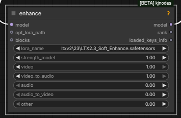
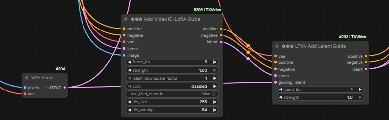
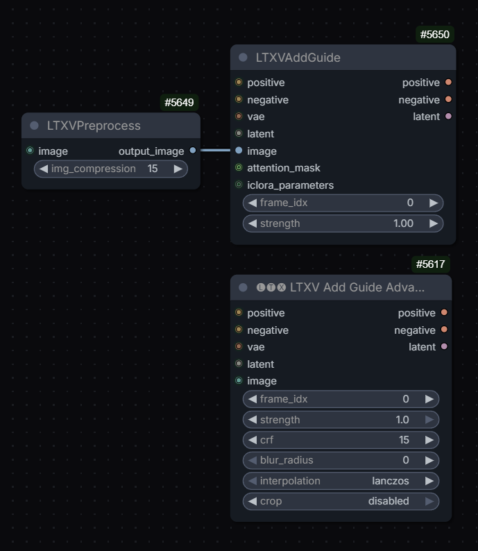

# LTX 2.3

LTX 2.3 uses Gemma 3 12B as multi-modal text encoder. Gemma is by Google.
It might be advisable to set width and height as multiples of 32 (128 was suggested to fix some sort of issues).
Frame count native to LTX 2.3 is `1 + 8 * N` since 1st frame is encoded separately and subsequent ones have
one latent span 8 frames in time dimension.

RuneX: "LTX was trained on 1536 1280 and 1024 as far as I remember. So using one of those values might give better results"; huddadad: "1536x832 is usually solid ... I boost to 1920 if i think it will help".

832 x 480, 241 frames works as well, possibly better than 960 x 540.

See also:
- [LTX 2.3 News](ltx23-news.md)
- [LTX 2.3 Hints](ltx23-hints.md)
- [Dialing In LTX 2.3 Workflow](ltx23-dialing-in.md)
- [LTX 2.3 Statements](ltx23-statements.md)
- [LTX-2 in ComfyUI Chattable KB](https://notebooklm.google.com/notebook/4f07f98c-75b6-4278-bde1-906f9899b60c?pli=1)

## Gemma

> refusal happens on the decoding, when encoding prompts the model has no choices to make, it's a single pass
> so the abliteration only helps when generating text, which doesn't happen when you encode a prompt ...
> and the potential downside of using abliterated model for prompt encoding is that the model wasn't trained with that, it may work, and change result, but overall technically it would be worse

> Q: abliterated lora?  
> A: the point of the lora was that you can load normal model and use it for prompt encoding, and apply the lora only for prompt enhancer
> on prompt enhancer it's almost mandatory considering how easily Gemma refuses even relatively safe prompts

[Mark DK Berry](https://markdkberry.com):
> abliterated text encoders always changed everything for me losing character consistency and stuff, I used the lora for it in the end when I needed it

## HDR LoRa

Lightbricks have released [HF:Lightricks/LTX-2.3-22b-IC-LoRA-HDR](https://huggingface.co/Lightricks/LTX-2.3-22b-IC-LoRA-HDR).
This IC LoRa takes a normal REC709 video as guide and produces a matching video encoded using Arri LogC3 tonal curve adding details in shadows and highlihts as needed.
The nature of diffusion models is that out put is always in floating point. The catch is that normally extracting more than 8bits of useful data from
it is not possible because that is the models were trained on. Not in this case. It is possible to extract more bits of data from a video generated with this LoRa.

`KJNodes` now have `HDR Preview KJ` node with an exposure slider.

Supported output formats for this kind of video are LogC3 EXR, LogC3 ProRes 4444 and linear Linear EXR.

`LTXVHDR Decode Postprocess` node is provided for saving such videos in LTXV custom nodes. `export OPENCV_IO_ENABLE_OPENEXR=1` environment variable may need to be set outside of Comfy.
Kijai: "I think my Marigold nodepack hijacks and sets the env var before other imports, or at least used to, I remember dealing with that issue".

> Q: If I just save the model output directly, which should be in LogC3,
> then import to Resolve, set the input to be ARRI C3 (or whatever it was called),
> it seems to work fine, is there a reason to convert it to linear before export?
> Didn't really see any visible differences doing it via EXR vs ProRes4444 myself either

[Nathan Shipley](http://www.nathanshipley.com/):
> A: Prores 4444 is 12 bits per channel, the linear EXR should be 16 bit float;
> you'll probably only notice the differences between 12 vs 16 bit in more extreme grading, or in potential banding that might show up

[Richard Servello](https://www.eastoflavfx.com/):
> the raw output is logC tho so even at 10-bit it will have a similar range;
> it seems to also fix noisy edges and clean up some blurry footage could be interesting.
> the curve is wrong for their linear conversion

[Nathan Shipley](http://www.nathanshipley.com/):
> LTX HDR IC-LoRA turned up to 1.5
> Distill Lora at 0.6
> euler, 8 steps, linear_quadratic
> CFG 1.5
> can definitely help to turn the lora strength up above 1 for shots like this..

> the VAE as it works right now can't generate values outside of `0...1`.
> this LoRA is working by generating values compressed into a LogC space - so, when it gets expanded out from LogC into a working HDR space, overbright values go above 1.
> (in Nuke, I set my Prores I've rendered to be `AlexaV3LogC` ... hovering over the bright sun areas shows values around 18

[Nathan Shipley](http://www.nathanshipley.com/)'s wf: [ns-LTX-2.3_ICLoRA_HDR_Distilled_Simple_NS_01](workflows/ltx/ns-LTX-2.3_ICLoRA_HDR_Distilled_Simple_NS_01.json);
"I included the LTX EXR write node in there, though Prores 4444 is probably fine most of the time!".

[Richard Servello](https://www.eastoflavfx.com/) has added his nodes `RS LogC3 HDR Decode` (hdr_linear, raw, sdr_preview) and `RS EXR Sequence Save` to 
[GH:richservo/rs-nodes](https://github.com/richservo/rs-nodes). "it uses proper baked ocio luts"
"now the hdr_linear will output proper color and the sdr preview is aces rec709 converted".

Alternative similar LoRa from T2/Greg: [gregt/lora_weights_step_07000](https://huggingface.co/gregt/lora_weights_step_07000.safetensors/tree/main)

Potentially useful:
- [GH:fxtdstudios/radiance](https://github.com/fxtdstudios/radiance) contains `Radiance VAE Decode`
- [GH:oumad/ComfyUI_Gear](https://github.com/oumad/ComfyUI_Gear) vibe-coded quick no-DaVinci grade for linear image in ComfyUI

Settings to view linear EXR created with this LoRa in AfterEffects with OCIO engine from [Oumoumad](https://gear-productions.com/):
[ltx23-hdr-view-ae-ocio](screenshots/ltx/ltx23-hdr-view-ae-ocio.webp); his advice for DaVinci is to use sRGB linear setting.

herpderpleton's model versions for 3090: [herpderpleton-model-versions](screenshots/ltx/herpderpleton-model-versions.webp) David Show:
"btw, running dev with the distill lora will produce better results at the same step count. it will take a little longer, but it will be in the region of 30-40 seconds. You're also using the older distill model."

## Prompt Relay

Prompt relay is a new technique which sub-prompts to specific parts of the video only though attention masking.

[GH:kijai/ComfyUI-PromptRelay](https://github.com/kijai/ComfyUI-PromptRelay) to implement "Prompt relay" technique using prompts like:
> a does this..  
> |  
> then does that

Alternatively people have been experimenting with `[4-8s] ...` style of prompting style of prompting and no prompt relay.
`[4-8s] ...` seems to sometimes work and sometimes not. At one point it seemed like using
[ID-LoRa](ltx23.md#id-lora) would make `[4-8s] ...` work better but that is far from certain.

> [NAG] just doesn't work with prompt relay because both patch cross attention

> prompt relay has to use sdpa for crossattn because sage doesn't support the masking

> [epsilon] controls how much the mask supresses the other local prompts;
> higher epsilon allows the prompts to bleed into each other more, depending on your prompts it may create better flow, with low eps the cuts are *hard*

> prompt relay only needs latent to know your input size, it can just be empty latent too  
> Q: ...does it need to be audio + video latent, or could it just be video?  
> A: iirc it should just be video

Wiring help: [prompt-relay](screenshots/nodes/ltx/prompt-relay.webp).

The Shadow (NYC)'s prompt relay setup: [the-shadow-prompt-relay](screenshots/nodes/ltx/the-shadow-prompt-relay.webp).

SirAxe's experimental nodes to apply LoRa-s to different parts of the video selectively, extending functionality of prompt relay:
[GH:kijai/ComfyUI-PromptRelay/pull/1](https://github.com/kijai/ComfyUI-PromptRelay/pull/1)

WhatDreamsCost's [GH:WhatDreamsCost/WhatDreamsCost-ComfyUI](https://github.com/WhatDreamsCost/WhatDreamsCost-ComfyUI) is a further development of PromptRelay idea.

## Context Windows With Ltx 2.3

[Drozbay](hidden-knowledge.md#drozbay) on context windows implementation for LTX 2.3:
> Getting dialogue to be split perfectly among context windows even using split conditionings is gonna be very hard to get right.
> I have gotten it to work by creating a gen at low resolution with no context windows and then upscaling by 3x or 4x to get to the
> final resolution, using a partially masked audio to get it to increase in quality without totally losing the content.
> No context sliding specifically. I'm injecting the first frame into each window as a pseudo-reference. It doesn't always end up looking that good.

## From The Makers

[HF:Lightricks](https://huggingface.co/Lightricks) provide

- ltx-2.3-22b-dev, separate distilled model, alternatively a distillation LoRa
- ltx-2.3-spatial-upscaler-x2-1.1, ltx-2.3-spatial-upscaler-x1.5-1.0, ltx-2.3-temporal-upscaler-x2-1.0
- LTX-2.3-22b-IC-LoRA-Union-Control
- LTX-2.3-22b-IC-LoRA-Motion-Track-Control

They also provide under LTX-2 umbrella

- Lightricks/LTX-2-19b-IC-LoRA-Detailer "still usable with 2.3 , thought it was only available for 2"

May 2026 saw addition of [HF:Lightricks/LTX-2.3-22b-IC-LoRA-LipDub](https://huggingface.co/Lightricks/LTX-2.3-22b-IC-LoRA-LipDub)
gated LoRa for re-dubbing vidoes - the intent was to keep the original voice; based on [GH:justdubit/just-dub-it](https://github.com/justdubit/just-dub-it) undetlying research.

## Alternative Weights Packagings

- [GH:Hippotes/LTX-2.3-various-formats](https://huggingface.co/Hippotes/LTX-2.3-various-formats/tree/main) including nvfp4;
  "I strongly recommended the 'mixed' ones, it's barely slower and doesn't hit the quality as hard as the whole transformers conversion"
- `LTX23_audio_vae_bf16.safetensors`
- Garbus: "I have used the int8 in the past, but it was a bit finicky and stopped loading after a certain update. I'm mostly on the transformer_only_fp8_scaled now, sometimes switching to nvfp4"  
  [Mark DK Berry](https://markdkberry.com): "you getting decent results out of the nvfp4?"  
  Garbus: "nvfp4 was more 'stable' image-wise, but less detailed and prone to prompt-following errors.
  But switching to the fp4_mixed text encoder was definitely a performance improvement for me, so you might want to try that"
  [garbus-fp4-text-encoder](screenshots/nodes/garbus-fp4-text-encoder.webp)
  ... [nvfp4 on 30xx cards] "You won't get the fp4 acceleration that 40 and 50 series cards give, but the models do run"

> Q: fp32 audio vae? My local is bf16  
> [Fredblis](https://fredbliss.com/): A: I thought the weights were fp32 in ltx. They're not. Use what you have. 
> I'm upcasting the audio vae to fp32 thougy. That's the important part. It wont break it if you don't upcast
> but ... better fidelity ... Although I think comfy auto does this 

## Nodes Of Interest

- `LTXVLatentUpsampler`

- `LTXVImgToVideoInplace` - seems to swap the initial frame? prob. useful in I2V workflows where a high-quality version of initial frame is available
- `LTXVImgToVideoConditioning`
- `LTXVAddGuide`
- `LTXV Audio Video Mask`
- `LTXAddVideoICLoRAGuide`
- `Add Video IC-LoRA Guide Advanced` from `LTXVideo` has got attention mask input

- native `VAE Encode Audio`, `VAE Decode Audio`, `Load VAE`, `Load Audio` [kj-native-vae-encode-audio](screenshots/nodes/ltx/kj-native-vae-encode-audio.webp)

- `LTXV Add Latent Guide` from `LTXVideo` set is the only way to associate a guide with position -1; all other similar nodes treat -1 as "after last frame";
  "it's the same thing as add guide, just takes latent instead of image, only difference besides that is how the positioning is done"
  AshmoTV: "0 might get flashing as that's applying it on the very first frame. But I've tried -1 to -8 and all work without flashes"
  N0NSens: "I founded it when I was testing Add Latent Guide node for additional ref img. -1 got me a few garbage frames at the beginning. -8 solve this issue"

- Kijai's `LTX2 NAG` [LTX-2_old_setup_for_nag_and_mem](screenshots/nodes/ltx/LTX-2_old_setup_for_nag_and_mem.webp) - by [Mark DK Berry](https://markdkberry.com);
  inagy: "Pushes away the generation from those conditions basically. It's like negative prompt but without need to run with cfg higher than 1. Not exactly the same, but similar.
  E.g. video: 'cartoon' to push it away from animation. Audio: 'music' to avoid background music, etc"

- `LTXAudioVideoMask` from `KJNodes` gaddit: "lets you pad and extend a clip"

> Q: do i have to intall the LTXComfy repo or is LTX native supported?  
> [Drozbay](hidden-knowledge.md#drozbay) A: Comfyui native nodes are still missing a few features so it's probably a good idea to have the LTXVideo nodes installed,
> although KJNodes also has nodes that cover most of those gaps

What is this?.. 

- `Model Preview Override` from `KJ Nodes`
- `Patch Sage Attention KJ` and `LTX2 Mem Eff Sage Attention Patch` from `comfyui-kjnodes` to enable Sage attention on LTX wf-s but not Qwen Edit wf-s.

## IC LoRa-s

IC LoRa generally stands for "in-context LoRa" a _type_ of LoRa. In colloquial speak "IC LoRa" generally refers to one of the IC LoRa-s released alongside LTX 2.3:
[Union Control](https://huggingface.co/Lightricks/LTX-2.3-22b-IC-LoRA-Union-Control), Motion Track or Depth/Canny/Pose.
Additional Python code to use them: [GH:Lightricks/ComfyUI-LTXVideo](https://github.com/Lightricks/ComfyUI-LTXVideo/).

[Alisson Pereira](https://huggingface.co/Alissonerdx):
> You can use ic lora union with pose map, but it will only use the first/last frame to guide the content

One way to use IC LoRa along with a reference image: 

[Drozbay](hidden-knowledge.md#drozbay):
> the guide latents are all just stacked together at the end of the noise latent and assigned rope indices to indicate where they belong.

On why the above method works better than alternative of supplying the reference image as an image not directly as a latent:

> I think there might be something else going on here, like the ordering of how they are placed if you use the different nodes,
> or maybe some default settings getting applied for one and not the other

> Q: Shouldn't providing the latent at index -1 be the same as providing an image guide at -1?  
> A: there's no node to do that with image, only the latent guide node currently actually places it at negative index, the other nodes use python indexing and start from the end instead

> what I've now been doing with LTX is putting ref latent as the extra cond AND as I2V first frame
> it has minimal effect in the cond (guide), but enough to kick start it so the I2V cond takes over;  
> Yeah, I've been doing similar, sometimes with lower strength on the inplace latent frame

[Alisson Pereira](https://huggingface.co/Alissonerdx)'s custom node which adds both reference image guides and guiding video for IC LoRa-s to altents, license unclear:
[LTXVAddGuideWithRefs.py](bobs/LTXVAddGuideWithRefs.py)

## Keyframing

Different ways to do FLF: LTXVAddGuide, LTXVImgToVideoInplaceKJ.

[YT:What Dreams Cost/Guide to Prompting and Keyframing I2V](https://www.youtube.com/watch?v=ZY4hsvTzbas) [GH:WhatDreamsCost/WhatDreamsCost-ComfyUI](https://github.com/WhatDreamsCost/WhatDreamsCost-ComfyUI);
an independent attempt to re-purpose the What Dreams Cost nodes to use a character sheet [YT:How to use Character sheets with LTX 2.3](https://www.youtube.com/watch?v=evFe_YLI56E)

Zueuk:
> as i understand, with guides you "never" get exactly the same frames even if you set the strength to 1,
> so for extending i'd probably keep masked "inplace" data
> but when we put frames anywhere except frame #0, guides are probably a better choice

Re RuneX's workflows
> herpderpleton Q: What are "guider" and "..." workflows for the FFLF workflows?  
> RuneX A: just go for guider. It lets the model do its magic
> (instead of the "frame injection" inplace variants).
> The guider is most natural and better. 
> (one uses LTX Guide node, other LTX ImgInPlace.. same goal, just a little different output) 
> If you mean the First (middle) Last frame workflows..

[Mark DK Berry](https://markdkberry.com) finds that `LTXVImgToVideoInpalceKJ` nodes are good for 1st and last frames not middle frames when doing upscaling.
"for middle frames where I would go to add guide nodes".
"I use ref Iimage any size but correct aspect ratio as we discussed and put them straight into those nodes, no compression, no size changing. I believe his [KJ's] nodes do all that is needed"

RuneX:
> stopped using  ImageInPlace so much, and rather use the guider node ...
> for first last frame it [ImageInPlace] can be ok.
> But its a bit "brutal".. color shift, and what not (but 0.7 helps).
> Guider nodes are much more forgiving

### ImgToVideoInplace

Alternative to using guides. Kijai's version also allows to specify which frame to apply to: 

[Drozbay](hidden-knowledge.md#drozbay):
> The inplace nodes are very simple: they don't add any guide latents or anything they just replace the target latent frame with the encoded image and mask it so it doesn't change

### Guides

> Q: so these 2 are the same?  
> [Drozbay](hidden-knowledge.md#drozbay) A: Only one tiny difference: the LTXVAddGuide node uses crop=center by default

> guides are latent+mask but they exist at the end of the sequence, and are applied to the position through RoPE;
> so basically they are stored at the end, keyframe info is stored (through the conditioning in comfy) so it knows what frame it should affect;
> that's why using full guide video is so heavy, and that's why the newer guide method halves the guide resolution

`LTXVCropGuides` removes the guides from latents after generation: 

Tooltip on `LTXV Add Latent Guide` from `LTX Video` node pack suggests that one may be treating index of -1 to mean "before the 1st latent" e.g. before subject enters frame.

[YT:4TE-QbtkiGQ](https://www.youtube.com/watch?v=4TE-QbtkiGQ) for some advice on using guides to inject frames.

[YT:nekodificador](https://youtube.com/nekodificador) reported plugging the same guide image twice via both of the following nodes increases motion
[twoGuidesMoreMotion](screenshots/ltx/twoGuidesMoreMotion.webp); [twoGuidesMoreMotion2](screenshots/ltx/twoGuidesMoreMotion2.webp) - "just renamed, they are regular AddGuide";
[Drozbay](hidden-knowledge.md#drozbay) on the difference between these two similar nodes:
"Nothing should be special about the IC Lora guide version except that it allows you to control the latent downscale factor. and it also doesn't have the crf option".

If multiple guides are used multiple `LTXVCropGuides` nodes may be needed: [ltx23-multiple-guides](workflows/ltx/ltx23-multiple-guides.png)

Hashu [not entirely confident]:
> If you have guides for 'different' frames then you need only 1 crop guide.
> So in your example if you change the frame idx and have one at frame 0,
> the other at frame 5 and the other at -1 you only need 1 crop guide node.
> But the moment you have an overlap in frame idx then you need 2 crop guide nodes.
> So if you are using an ic lora + a first frame guide then u technically have 2 guides at the first frame so you need 2 crop guides.
> [ltx23-multiple-guides-2](workflows/ltx/ltx23-multiple-guides-2.png)

## Character Replacement

Different approaches were tried.

> RuneX: you also using black mask and outpaint lora?  
> Lucifer shared [bj-ltx23_inpaint_masked_Reference2Video](workflows/ltx/bj-ltx23_inpaint_masked_Reference2Video.json)  
> Alisson: yes my lora ... using a black mask instead of a magenta one ...  LTXV Looping Sampler, This allows you to create longer videos. 

## Controlling The Camera

N0NSense controls camera using a schematic video or a box/room everything happens in converted to a depth map + ic union control LoRa. His a2v videos created this way look great.

[Cseti](https://www.youtube.com/@ChetiArt)'s LoRa to replicate camera motion from one video to another [HF:Cseti/LTX2.3-22B_IC-LoRA-Cameraman_v1](https://huggingface.co/Cseti/LTX2.3-22B_IC-LoRA-Cameraman_v1);
README and workflow: [HFdatasets:Cseti/ComfyUI-Workflows:ltx/2.3/ic-lora-cameraman](https://huggingface.co/datasets/Cseti/ComfyUI-Workflows/blob/main/ltx/2.3/ic-lora-cameraman/README.md);
"This one took around 20-24 hours to train with 77 video pairs. And I also made two more runs one with 128 and another with around 40 pairs. But this one looks the best so far" "I used videos from pexels"
WF: [LTX-2.3-Cameraman](workflows/ltx/LTX-2.3-Cameraman.json)

## I2V

Hevi:
> lowering guidance stregth to 0.3-0.4 for the ref image helps with the watercolor artifacts

## Motion

To fix motion arfiacts ppl often generate at 50fps. Sometimes 35

N0NSens:
> 50fps is the only solution to reduce garbage in motion, I found. Initial higher resolution/res_2s/more steps/diff models/distill loras str... nothing helps..
[and then pick every other frame via VHS nodes and clean up with Wan]

It seems addition of VBVR LoRa might be helping make motion less smudged.

See also: [Guides](ltx23.md#guides) section for [YT:nekodificador](https://youtube.com/nekodificador)'s trick to increase amount of motion.

## Inpainting

- inpaiting can be done with reference using Alisson's LoRa (see bellow).
- alternatively [YT:nekodificador](https://youtube.com/nekodificador) reported success has placing a large rectange over person's mouth in video and using "just straight inpainting with native nodes and distiled lora"
  additional details: [pcvideomask:PC Video Mask Smooth](screenshots/nodes/pcvideomask-pc-video-mask-smooth.webp) from [GH:pavelchezcin/pcvideomask](https://github.com/pavelchezcin/pcvideomask)
  + sampler=linear/euler + scheduler=exponential were reported to help with detailing part of the video - mouth in this case;
  audio then guided lip motion
- ucren shared how he is re-combining inpainted video with original video to avoid quality degradation via vae: [ucren-recombining](workflows/ucren-recombining.webp)

## Extensions

It has been reported that LTX 2.3 extends videos quite well forward but a method of extending backwards without a LoRa hasn't been worked out yet.
[YT:LTX2.3 | How to Extend](https://www.youtube.com/watch?v=kY3MoyLUWXw) presents the latent extension method using `LTXV Audio Video Mask` from `KJNodes`.
[GH:ckinpdx/ckinpdx_comfyui_workflows](https://github.com/ckinpdx/ckinpdx_comfyui_workflows) contains a latent looping workflow which again apparently uses the same technique.

Note that Sir_Axe's [HF:siraxe/MergeGreen_IC-lora_ltx2.3](https://huggingface.co/siraxe/MergeGreen_IC-lora_ltx2.3) can be a useful alternative.

RuneX: [RuneXX/LTX-2.3-Workflows](https://huggingface.co/RuneXX/LTX-2.3-Workflows/tree/main/Video-2-Video/Extend-Any-Video)
> Basically using LTX "Re-Take" feature... where you can add new frames to any scene...
> using the KJNodes LTX masking node where you pad length on end of input video

Garbus on the above wf:
> In terms of LTX, you're going to get an audio glitch at the 20 second mark if you go over that,
> and could be degrading much sooner depending on your resolution. You're better off extending in segments, which is essentially seamless.
> The wf lets you load your existing video. It then uses 3-5 seconds of that as reference to transition into the extension video, and stitches them both together when it's done.

## Multi-Pass Workflows

Ppl often use workflows which start with a sampler generating at a low resolution and then (sometimes a chain of) 1.5x or 2x upscalers, more often 2x.
This is said to improve motion but blur small objects with texture.

Zombiematrix:
> use the either of the default templates and change the starting pass to go to .25 of the starting resolution (instead of .5)  
> then add a second upscale pass. thats all it is. you can use either of the upscalers (1.5 or 2.0)

Jonathan (WhatDreamsCost):
> I've been testing a 3 stage workflow for the past month, mainly because I see better motion when the 1st stage is at a lower resolution.
> Also I like it for testing prompts. Since the 2nd stage is faster, you can get a clearer preview quicker when using the tiny vae
> compared to using just 1 or 2 stages. And when you use CacheDiT on top of that, you can test prompts even faster.

[Mark DK Berry](https://markdkberry.com):
> For LTX, I go 480 x 201 first pass so I can make structure quickly util I get what I want ...
> then upscale twice for 2nd pass from v2v in LTX and I am at 1080p in 10 mins,
> and final is polisher low denoise to fix eyes and whatnot, often with a WAN model denoise 0.2 using USDU;
> any higher [denoise] the tiling or weird speckldeing creeps in but you could do a full detailer method
> but the USDU is faster and works on low VRAM. I am using 1.3b for this atm. still testing it, but its half the time of the 14B for me.
> ... just tested Wan 2.1 self forcing DMD 1.3b and its good enough for most fixups at 0.2 denoise ...
> 241 frames at 24fps

> Q: 40 steps on base dev at 0.25 res, 3 with distill at x2 upscale, and 3 again with x2 upscale? Is this all linear quadratic schedule?  
> A by Garbus: That's it, and er_sde across all three. Distill LoRA on 2 and 3 set to about 0.6 usually is best.
> (I only use the preview node on the first sampler since it can cause an OOM on the upscale, and there's nothing new to see there anyway.)

> Q: When you run ... Wan step how well does it deal with identity preservation?  
> A by Mark: use phantom 1.3b or WAN 2.2 VACE self forcing 1.3b (which is i2v effectively).
> and keep denoise low but with phantom you cant go over 0.5 it gets weird but
> consistency is kept so far in tests both with phantom and VACE 1.3b. HuMO would be better
> but my rig cant wait for it. I wish MAGREF did a 1.3b I would have used that but.
> I tested 5b wan but it wasnt very good which was weird.  
> Q: Do you end up doing context windows for a long base LTX gen to not run out of RAM?
> A by Mark: no, I use USDU then you dont need all that. it handles it. its in the wf
> [links](https://markdkberry.com/workflows/research-2026/#video-pipeline-workflows)
> for my video pipeline. have a look.

> I am not sure if HuMO will work with USDU properly.
> I currently use either Phantom 1.3b or WAN 2.2 VACE 1.3b only because lowVRAM else I would use 14B and I use it in two stages, once to detail the 480x201 intiial video then again with USDU for the final polish at 1080p after its been through LTX upscalers.

> previously was two x2 upscalers in series but today added in a 2nd sampler to the first upscaler and its way better.
> I still have some tweaks to make though but also introduced the VBVR lora and the 1.1 distill came out so it might also be that helping improve thing...
> the guts of it is in my video pipeline `MBEDIT-v2v_LTX23_Upscaler_DevQ5KM-Audio-In_1080p_vrs7.json`
> [https://markdkberry.com/workflows/research-2026/#video-pipeline-workflows](https://markdkberry.com/workflows/research-2026/#video-pipeline-workflows)

> I was using phnatom 1.3b to detail my i2v first stage 480 x 201 that I did that size to get structure quick as I could changing prompt til I got there.
> it was fast relatively. but the phantom did a nice fixup. then into the upscaler wf with ref image. but it had its faults.
> today introducing x2 samplers to that upscaler stage instead of x1 sampler with x2 upscalers has meant I dont need the phantom stage, but I might keep it in anyway.

> when using WAN models with a sampler as a detailer anything over 0.78 I think completely changes the shot to the prompt. polishing was always down around 0.1 and stronger
> fixes up around 0.2 to 0.4.  (USDU it goes more to 0.5 or even higher in some cases ...)

Mark's video: [YT:Video Workflow Pipeline (April 2026)](https://www.youtube.com/watch?v=7Lqt3pgGefA)

BNP4535353:
> I tried Humo Refiner WF today, and it saved 90% of my unusable LTX works.
> 501fps, 1920 res, 25fps, it took 35 minutes, but the results were totally worth it.
> You've fixed 99% of the artifacts, and I don't even need to bother adjusting LTX anymore.
> /this was apparently about [Drozbay](hidden-knowledge.md#drozbay)'s LTX 2.3 ClowShark workflow: [droz_LTX-2_SharkSampling_v7.1](workflows/ltx/droz_LTX-2_SharkSampling_v7.1.png) which contains HuMO refiner stage/
> /wan detailer wf separately: [droz_WanHuMoDetailer_v3.1](workflows/ltx/droz_WanHuMoDetailer_v3.1.png)

huddadudd:
> wan humo also works best at a lower res I think
> 1280 is what [Drozbay] suggested
> wan isn't res hungry like ltx is as much

- [LTX-23-T2V-3PASS](workflows/ltx/garbus-LTX-23-T2V-3PASS.json) WF from Garbus: "This is the
  default LTX T2V wf with some things added and subgraphs unpacked. It's not pretty, but it works, or should give you an idea what modifications to make to a wf you prefer"
- [ai_hakase's wf](https://x.com/ai_hakase_/status/2040417832769585194?s=20)

N0NSens on flickering in three pass workflows:
> I think it's because of LTXVImgToVideoInplace at upscaler passes. At first frames it's combining lowres latent from prev
> pass and your input image. So far, the only way I found to reduce this effect is to cut off first 3 frames and lower Inplace str to 0.7

> just matching to ref helps in this case

"native SUPIR implementation PR" from Kijai includes a new color matching node

N0NSense
> In my experience, the higher the initial resolution, the better the result. Therefore, 2 passes produce a better result than 3 (especially noticeable on small patterned textures). 

David Show
> but the higher the first pass resolution

[audio] "generate ... once ... all subsequent upscale passes ... reuse the originally generated audio rather than reprocessing it"

> first pass with a modality scale of 2.5

It was reported an overly high sqare resolution (1920x1920) after upscaler can cause color shift issues. Wider or smaller resolution like 1536x1536 reportedly can help.

[official-video_ltx2_3_i2v](workflows/ltx/official-video_ltx2_3_i2v.json) demonstrates often used up/downscaling tricks in multi-pass pipelines.

[Wan-Various_Refine-Upscale](workflows/ltx/Wan-Various_Refine-Upscale.json) could potentially be used to enhance LTX videos with various WAN models.

> why ... 4 step sigmas like `1, 0.85, 0.7250, 0.4219, 0.0` on the last upscaler sampler when 6 steps is clearly superior in results?

[Richard Servello](https://www.eastoflavfx.com/)
> Ltx is meant to be 2 stage but a lot of people insist on one pass and complain about artifacts

[Mark DK Berry](https://markdkberry.com):
> One thing I love about LTX that WAN is [bad] at, is I can shove the same video through it over again and no problems.
> WAN will blister the contrast to hell if you try that, VACE too.

## Training

On character LoRa training: "just 30 images with 10 repeats and 10 epochs, so quick and dirty - AkaneTendo25 fork of musubi-tuner-ltx-2 - success"

10 videos from 2-8 seconds each ... if overfitted reduce strength of LoRa

Training IC LoRa requires twice the VRAM and twice the time compared to traditional LoRa-s. 5090 should generally be capable of.

[Oumoumad](https://gear-productions.com):
> I never needed to go beyond 5000 steps, in fact most of the time even in 1500 steps you already see your desired effect

mamad8:
> Using split sigmas with the distill Lora (strength 0.5) to set cfg 2 for the first 2 steps and cfg 1 for the remaining 6
> steps helps A LOT, especially audio but also overall coherence and motion

mamad8:
> If you have trained a character Lora but you're often using it with another (or multiple) loras you might have seen that the character is less accurate
> (it depends on how much the loras you use have been trained on specific faces) : select your best 4-6 close ups of your character and train a new Lora
> rank 4 on top of the models you use (and your previous trained Lora) for 500-1000 steps, the result will be absolutely night and day.
> Currently I don't think any trainer allows training loras on top of others (it's not finetuning, simply merging the provided loras to the base
> model before training a completely new one. This way the loras already trained do not lose anything they have learned and they overfit a lot less).
> I'll release the training code to train on top of loras soon (fork of aitoolkit)

[GH:richservo/rs-nodes](https://github.com/richservo/rs-nodes) LoRa training inside ComfyUI "adding ffn chunking fixed the OOM" "I'm ... training on 576x576x97 ... it's much more efficient ... no idea why"
"uses ollama server"

> it's only 2 nodes. Data Prepper and LTX train;
> if you have less than 32GB VRAM you want to plug in to the model vae and clip;
> vision is if you want to target non-human objects;
> if you want to always include people in your output then select face detection;
> if you have specific people you can plug on into the pin, or specify a folder of named images;
> if you are doing audio, provide voice samples of 15-30 seconds for captioning;
> you can even have it name locations if you add items to a folder and point it to it

[GH:vrgamegirl19](https://github.com/vrgamegirl19):
> so when training with images you end up loosing motion the higher the steps ...
> I took my 1000 step lora which keeps motion but does still add the style a bit and
> used that on the first pass then put my 5000 step lora on the 2nd pass ...
> add the that VBVR to the fist pass only 

first video has the 5000 step lora on both first and 2nd and the 2nd video has the 1000 step on first and 5000 step on 2nd pass.

burgstall 2026.04.22
> AFAIK the LTX official trainer still is the only method for IC-LoRA training. At least thats what everybody I know uses 

crinklypaper
> I think musubi fork can do ic-lora training, I havent tried it yet though
> [GH:AkaneTendo25/musubi-tuner:ltx-2/docs/ltx_2.md#ic-lora--video-to-video-training](https://github.com/AkaneTendo25/musubi-tuner/blob/ltx-2/docs/ltx_2.md#ic-lora--video-to-video-training)

Ada:
> Yea. Most importantly that has CREPA. Which is super important for video training and nothing else has it yet [crepavideo.github.io](https://crepavideo.github.io/)
> Never train video without it. Actually simple tuner also has it and does a better "similarity" threshold to shut it off which works better. I ported that over in my own fork

> I use a similarity threshold of 0.9 the same way simple tuner does
> and shut it off after that

burgstall on training bodypositive LoRa:
> 140 video pairs

> [Alisson Pereira] Q: So you created the first frame and then used a control union to assemble the dataset with the first frame following the original video.
> A: yep, exactly

[Oumoumad](https://gear-productions.com/):
> personally I'd take it in reverse, ie just find fat people videos, and turn them skinny with image model,
> the gen the rest with control. And use the original fat ppl.videos as target. Always ensure target is as natural/original as possible

burgstall:
> I just started 512x384x25f pairs and its at over 31Gb

> had to lower rank to 32 to fit

[Ingi](https://x.com/ingi_erlingsson) on his experience training:
[X:ingi_erlingsson?2057566331235627100](https://x.com/ingi_erlingsson/status/2057566331235627100)

[Fredblis](https://fredbliss.com/): 
> ltx trainer code... its got audio set to None for v2v but it does have the code for t2v...
> but i dont see why architecturally you cant make it work for image+audio input and video with audio output

> David Show: How many pairs are there in the anime2real dataset?  
> Alisson Pereira: minimum 200

## Sound

The role of a "solid mask" is not clear to the writer of this page but apparently it may be used before feeding Audio latent into sampler: [solidMask.webp](screenshots/ltx/solidMask.webp)

Some ambience noise on input audio may make ltx generatevlipsync better.

[Mark DK Berry](https://markdkberry.com):
> I use vibevoice multi speakers and then shove 10 second (about 3 lines of dialogue max) in to LTX ...
> LTX 2.3 ... "add subtle ambient noise" trick

It would be natural when using an IC LoRa to supply reference image via `LTX Add Latent Guide` with `index=-1` completely separate from the the guide video.
However it looks like existing LoRa trainers don't yet support this.
This forces training of IC LoRa-s that take reference creatively - as 1st frame of guide video, on the side of guide video etc.

[GH:vrgamegirl19](https://github.com/vrgamegirl19)'s training node for quick training of LTX 2.3 single character LoRa-s: [YT:9Z_glyAHE1k](https://www.youtube.com/watch?v=9Z_glyAHE1k).

## V2V

V2V can be done either via IC Union LoRa-s or via latent denoise. Unmerged Context Windows PR to make V2V simpler: [GH:Comfy-Org/ComfyUI/pull/13325](https://github.com/Comfy-Org/ComfyUI/pull/13325).

Hicho:
> t2v latent low denoise from another video

## ID LoRa

ID-LoRa apparently provides both visual and audio character likeness. Additionally it seems to support timed prompting otherwise not available on vanilla LTX 2.3.
Because one of the checkpoints is called "talkvid" ID-LoRa is also referred to as "talkvid".

- Starting point especially for documentation is [GH:ID-LoRA/ID-LoRA/](https://github.com/ID-LoRA/ID-LoRA/)
  "One ID-LoRA per run. The two available checkpoints (`id-lora-celebvhq` and `id-lora-talkvid`) are alternatives trained on different datasets, not meant to be combined.  
  Stage 1: ID-LoRA + identity guidance + reference audio  
  Stage 2: Distilled LoRA only, no ID-LoRA. Audio from stage 1 is frozen - only video gets spatially upsampled/refined."  
  "Update — March 24, 2026: Native ComfyUI ID-LoRA support for LTX2 is now in upstream ComfyUI, merged
  in PR [#13111](https://github.com/Comfy-Org/ComfyUI/pull/13111). It adds the `LTXVReferenceAudio` node for reference-audio speaker identity transfer;
  original ID-LoRA weights work as-is with no conversion. Thank you to Kijai for implementing and contributing this integration."
- Earlier attempt to create ComfyUI nodes: [GH:pineambassador/ComfyUI-ID-Lora-Pine](https://github.com/pineambassador/ComfyUI-ID-Lora-Pine)
  "The original authors have it as roadmap to create a comfyui implementation. In the meantime, this was my attempt"
  "injecting reference images at specified frames in the timeline to increase likeness retention (frontal portrait, profile portrait, re-inject the first frame, etc), without clobbering the scene";
  "I noticed when using id lora then u got to prompt how you want voice tone be , calm , angry etc"
  "trained around 1 subject and very alpha
- [HF:AviadDahan/LTX-2.3-ID-LoRA-CelebVHQ-3K](https://huggingface.co/AviadDahan/LTX-2.3-ID-LoRA-CelebVHQ-3K)
  [HF:AviadDahan/LTX-2.3-ID-LoRA-TalkVid-3K](https://huggingface.co/AviadDahan/LTX-2.3-ID-LoRA-TalkVid-3K)

`TalkVid` flavor possibly supports the following style of prompting - though it remains uncertain

> [abc] A young  ...  
>   
> [scene] ...  
>  
> [sound] soft...  
>  
> [0-1s] [abc] raises ...  
> |  
> [1-6s] ... 

Gleb Tretyak:
> not 10/10 follow. timings should be sufficiently calculated by user, otherwise it's ignored by the model I believe; and prompt relay makes it worse

Draken:
> id lora is just for audio really;
> it helps in the sense that the lora itself might do better at perversing the ID in i2v mode though

[HF:Lightricks/LTX-2.3-22b-IC-LoRA-LipDub](Additionally [HF:https://huggingface.co/Lightricks/LTX-2.3-22b-IC-LoRA-LipDub) is related IC LoRa.

## Basics

- [Mark DK Berry](https://markdkberry.com) on basic VRAM optimizations and NAG to remove subtitles: [nag-other-basic-setup](workflows/ltx/mdkb-nag-other-basic-setup.webp)
- Hicho's [ltx-2.3-simple-v2v](workflows/ltx/hicho-ltx-2.3-simple-v2v.json) prob. the simplest WF involving a depth map
- Ablejone's aka [Drozbay](hidden-knowledge.md#drozbay)'s LTX 2.3 ClowShark workflow: [droz_LTX-2_SharkSampling_v7.1](workflows/ltx/droz_LTX-2_SharkSampling_v7.1.png)
- [Ckinpdx](https://github.com/ckinpdx)'s [LoopingSamper WF](workflows/ltx/ckinpdx-looping-sampler.png)

## Node Packs

- [GH:sumitchatterjee13/nuke-nodes-comfyui](https://github.com/sumitchatterjee13/nuke-nodes-comfyui)
- [Richard Servello](https://www.eastoflavfx.com/)'s [GH:richservo/rs-nodes](https://github.com/richservo/rs-nodes):
  - `RS LogC3 HDR Decode` (hdr_linear, raw, sdr_preview), `RS EXR Sequence Save`
  - `RS Sigma Schduler` computes sigmas based on total token count in the video - depends on width, height, number of frames
  - [workflow-in-a-node](workflows/ltx/RS-workflow-in-a-node.png) "It does everything.
    FLF, audio driven, you can plug a video in and select what frames to use as guidance
    it has masking which I haven't gotten to completely work, BUT it does work for rediffusion
    can be completely customized by plugging in any node you want
    does spatial and temporal upscale"
- [Ckinpdx](https://github.com/ckinpdx)'s
  `LTXVAVLoopingSampler` from [GH:ckinpdx/ComfyUI-LTXAVTools](https://github.com/ckinpdx/ComfyUI-LTXAVTools), a derivative of Lightricks' `LTXVLoopingSampler`;
  "optional conditioning images allows you to input batches images as keyframes whose index you specify.
  Optional guiding latents allows ic lora use.
  Optional positive conditioning allows use of the multi prompt provider, allowing indexed text conditioning";
  "All modalities, t2v, i2v, i+a2v, v2v"; tested up to 90 seconds;
  "for v2v lora application, outpainting for example, the limit is how many video frames you can load from your source ... 2 minutes"
  work is ongoing on enhacing native context window nodes too, to which this is similar
- [Fredbliss](https://fredbliss.com/)
  - created his own audio looping node + lots of automation: "audio + image input + initial prompt + prompt schedule timestamps",
    looping workflow, automated prompt generation and timing:
    - [HF:fbjr/LTX-2.3-22b-IC-LoRA-Audio-Only-Context](https://huggingface.co/fbjr/LTX-2.3-22b-IC-LoRA-Audio-Only-Context) Audio-Only IC LoRA;
      nodes to use ic-lora audio only: [GH:fblissjr/ComfyUI-AudioLoopHelper](https://github.com/fblissjr/ComfyUI-AudioLoopHelper),
      trainer fork: [GH:fblissjr/LTX-2:audio-guidance-iclora-vtv](https://github.com/fblissjr/LTX-2/tree/audio-guidance-iclora-vtv);
      "goal was: transfer identity/vibes of audio to scene solely through audio";
      e.g. sound sample is supplied + text prompt; the text prompt contains different text to say;
      yet original sound sample impacts all of voice, delivery ("vibe") and the look of the character
    - [GH:fblissjr/ComfyUI-AudioLoopHelper](https://github.com/fblissjr/ComfyUI-AudioLoopHelper);
      sample [WF](https://github.com/fblissjr/ComfyUI-AudioLoopHelper/blob/main/example_workflows/audio-loop-music-video_latent.json);
    - [audio_driven_single_shot](https://github.com/fblissjr/ComfyUI-AudioLoopHelper/blob/main/example_workflows/experimental/audio_driven_single_shot.json) experimental wf to make heart beat to musing; same but looping:
      [GH:fblissjr/ComfyUI-AudioLoopHelper:example_workflows/audio_reactive_loop.json](https://github.com/fblissjr/ComfyUI-AudioLoopHelper/blob/main/example_workflows/audio_reactive_loop.json)
    - experiments with freezing audio or video selectively and generating the other:
      - [GH:fblissjr/ComfyUI-AudioLoopHelper:.../audio-loop-music-video_latent_av_extension.json](https://github.com/fblissjr/ComfyUI-AudioLoopHelper/blob/main/example_workflows/experimental/audio-loop-music-video_latent_av_extension.json)
      - [GH:fblissjr/ComfyUI-AudioLoopHelper:example_workflows/audio-loop-music-video_latent_av_inversion](https://github.com/fblissjr/ComfyUI-AudioLoopHelper/blob/main/example_workflows/audio-loop-music-video_latent_av_inversion.json)
      - keyframe auto extract workflow here: [fblissjr/ComfyUI-AudioLoopHelper:example_workflows/experimental/audio-loop-music-video_latent_keyframe_autoextract](https://github.com/fblissjr/ComfyUI-AudioLoopHelper/blob/main/example_workflows/experimental/audio-loop-music-video_latent_keyframe_autoextract.json)
      - [dialogue_replacement_guide.md](https://github.com/fblissjr/ComfyUI-AudioLoopHelper/blob/main/docs/guides/dialogue_replacement_guide.md)
        heres the claude written docs written from all my context and code over the last few days working on this
      - [dialogue_replacement_guide](https://github.com/fblissjr/ComfyUI-AudioLoopHelper/blob/main/docs/guides/dialogue_replacement_guide.md)
    - old
      - [GH:fblissjr/ComfyUI-AudioLoopHelper:experimental/audio-loop-music-video_latent_av_inversion](https://github.com/fblissjr/ComfyUI-AudioLoopHelper/blob/main/example_workflows/experimental/audio-loop-music-video_latent_av_inversion.json) /
      - extension (frozen video, 2s audio): [GH:fblissjr/ComfyUI-AudioLoopHelper:example_workflows/experimental/audio-loop-music-video_latent_av_extension](https://github.com/fblissjr/ComfyUI-AudioLoopHelper/blob/main/example_workflows/experimental/audio-loop-music-video_latent_av_extension.json) (untested)
      - keyframe (frozen audio, keyframe images): [GH:fblissjr/ComfyUI-AudioLoopHelper:example_workflows/audio-loop-music-video_latent_keyframe](https://github.com/fblissjr/ComfyUI-AudioLoopHelper/blob/main/example_workflows/audio-loop-music-video_latent_keyframe.json )
      - docs / generic test cases:
        - inversion (generate the audio from 2s of frozen audio + the full video w/o audio): [av_inversion_test_examples.md](https://github.com/fblissjr/ComfyUI-AudioLoopHelper/blob/main/example_workflows/working_docs/av_inversion_test_examples.md)
        - keyframe: [keyframe_iter_anchor_design](https://github.com/fblissjr/ComfyUI-AudioLoopHelper/blob/main/example_workflows/working_docs/keyframe_iter_anchor_design.md)
        - audioreactive: [audio_reactive_loop_design](https://github.com/fblissjr/ComfyUI-AudioLoopHelper/blob/main/example_workflows/working_docs/audio_reactive_loop_design.md)
        - uses nodes in the repo + my sm89/rtx 4090 sage fork but that can be replaced with kjnodes sage attn or bypassed [GH:fblissjr/SageAttention-ada](https://github.com/fblissjr/SageAttention-ada)
        - "step 1. 20 sec of the real video + 2s of frozen first two seconds of real video's audio... generate the audio with ltx and overlay on frozen video clip.
          step 2: pass the audio generated from step 1 as frozen audio, using 3 keyframes as init + "two men talking" (just randomly picked 3 from the 20s video above here),
          and generate the new video with audio from step 1."
  - created an extensive suite of Claude skills and other tooling to work both on code and workflows
    - general skills and my philosophy for working with these tools:
      [GH:fblissjr/fb-claude-skills:VISION.md](https://github.com/fblissjr/fb-claude-skills/blob/main/VISION.md)
    - harness for building everything above for these nodes/workflows:
      [GH:fblissjr/ComfyUI-AudioLoopHelper:.claude](https://github.com/fblissjr/ComfyUI-AudioLoopHelper/tree/main/.claude)
      (including a crude inbox/email system i set up for audio loop claude and sageattn claude to communicate
      with each other using fresh contexts)
    - then most of this is for automating and eval'ing comfyui workflows because i hate creating and maintaining them:
      [GH:fblissjr/ComfyUI-AudioLoopHelper:scripts](https://github.com/fblissjr/ComfyUI-AudioLoopHelper/tree/main/scripts)
    - "testing / validating they do what they should be doing from a 'business rules' standpoint and a hard
      'is this workflow wired correctly' standpoint:
      [GH:fblissjr/ComfyUI-AudioLoopHelper:tests](https://github.com/fblissjr/ComfyUI-AudioLoopHelper/tree/main/tests)
    - [GH:fblissjr/fb-claude-skills:skills/path-privacy](https://github.com/fblissjr/fb-claude-skills/tree/main/skills/path-privacy) privacy scrubber for LLM written code

- WhatDreamsCost's [GH:WhatDreamsCost/WhatDreamsCost-ComfyUI](https://github.com/WhatDreamsCost/WhatDreamsCost-ComfyUI) poweful node for audio and video loading and trimming (generated with help from Gemini),
  including the new `LTX Director` - I2V, T2V, FLFF, Prompt Relay, Custom Audio - [tutorial 1](https://www.youtube.com/watch?v=fZgtkRcu4_k), [tutorial 2](https://www.youtube.com/watch?v=vM60pJJqqEI)
  based on Prompt Relay; note [PR#60](https://github.com/WhatDreamsCost/WhatDreamsCost-ComfyUI/pull/60/changes)
- [GH:dorpxam/ComfyUI-LTX2-Microscope](https://github.com/dorpxam/ComfyUI-LTX2-Microscope) tool to view what exactly LTX 2.3 is doing during sampling
- [GH:kijai/ComfyUI-NativeLooping_testing](https://github.com/kijai/ComfyUI-NativeLooping_testing) experimental nodes for latent looping including `TensorForLoopOpen`
- `LTXRetakeDesigner` is in the making

## LoRa-s

### LoRa-s, Alisson

- ref v2v (about to be) released: IC LoRa, initial frame contains reference image on white in green, subsequent frames source video
- EditAnything IC LoRA: [CA:2553102/editanything?2869279](https://civitai.red/models/2553102/editanything?modelVersionId=2869279),
  [HF:Alissonerdx/LTX-LoRAs:ltx23_edit_anything_global_rank128_v1_6000steps_prodigy](https://huggingface.co/Alissonerdx/LTX-LoRAs/blob/main/ltx23_edit_anything_global_rank128_v1_6000steps_prodigy.safetensors); instructions in README next to it;
  [HF:Alissonerdx/LTX-LoRAs:ltx23_edit_anything_v1](https://huggingface.co/Alissonerdx/LTX-LoRAs/blob/main/workflows/ltx23_edit_anything_v1.json)
  2026.05: [HF:Alissonerdx/EditAnything](https://huggingface.co/Alissonerdx/EditAnything/tree/main) "I think the one with the largest module would be the most interesting"
  "prompt for one change at a time"; replying to [Ingi](https://x.com/ingi_erlingsson): "in your case you are using first frame conditioning_p, I am using a negative latent for this, I don't use the first frame";
  [Ingi](https://x.com/ingi_erlingsson): "Yeah same here - I’m using a ref latent at -8" [about coming soon character replace LoRa]
  "So you are using add latent guide node at -8.  Any specific reason for using -8?" "not sure why it's 8 specifically, it works at -4 too, but if you put it at 0 then you get the flashing frame at the start as it's competing with the video ref"
- [HF:Alissonerdx/EditAnything:edit_anything_v1.1_r256](https://huggingface.co/Alissonerdx/EditAnything/blob/main/edit_anything_v1.1_r256.safetensors) "that's model for editing without using references"
- "I think the module can bring some improvements, but it has to be used with the looping sampler,
  [a custom node I made called EditAnything Sampler Looping]
  because those were extra modules trained to try to maintain the reference over time"
  "You can try using it without the module, just the standard one. I only separated them to avoid errors when loading LoRa in ComfyUI due to mismatch blocks, etc.
  But I tried to train with the module to improve the use of the reference; you can even use the module with your LoRa without needing to use mine since it's separate"
  [alisson-loras-modules](screenshots/ltx/alisson-loras-modules.webp);
  "You can enable and disable modules or adjust the strength of, for example, adaln scale"
  [alisson-modules](screenshots/ltx/alisson-modules.png)
  [alisson-modules-parameters-explained](screenshots/ltx/alisson-modules-parameters-explained.webp)
- Alisson Pereira's `animate2real`: [HF:Alissonerdx/LTX-LoRAs:ltx23_anime2real_rank64_v1_4500](https://huggingface.co/Alissonerdx/LTX-LoRAs/blob/main/ltx23_anime2real_rank64_v1_4500.safetensors);
  is reportedly useable for fixing defects, e.g. running anime2real on non-anime inputs; doesn't fix motion issues however (wan polishing does fix them);
  also [CA:2527511/anime2half-real](https://civitai.com/models/2527511/anime2half-real)
  RuneX's wf: [HF:RuneXX/LTX-2.3-Workflows:Video-2-Video/LTX-2.3_-_V2V_Video-Edit_remove_add_replace_restyle_EditAnything-Lora](https://huggingface.co/RuneXX/LTX-2.3-Workflows/blob/main/Video-2-Video/LTX-2.3_-_V2V_Video-Edit_remove_add_replace_restyle_EditAnything-Lora.json)
- Alisson Pereira's `real2anime` [HF:Alissonerdx/LTX-LoRAs:ltx23_real2anime_rank64_v1_5000](https://huggingface.co/Alissonerdx/LTX-LoRAs/blob/main/ltx23_real2anime_rank64_v1_5000.safetensors)
- Alisson Pereira's first experimental version of MR2V (Masked Reference-to-Video): [HF:Alissonerdx/LTX-LoRAs](https://huggingface.co/Alissonerdx/LTX-LoRAs)
  "It's a reference-based inpainting LoRA ... I trained several variants, and this rank 32 one was the one I liked the most"; use `ltx23_inpaint_masked_r2v_rank32_v1_3000steps.safetensors`;
  "If you want speed, take the first frame from the generated control video, drop it into ChatGPT, and say: 'Describe this video with the object in the green area placed where the magenta mask is.' Then you add more details to it."
  "This IC  LoRa was trained for objects in general, not people." Benji's [video](https://www.youtube.com/watch?v=E_XRBRykDwE) on it;
  "The saddest part is that he seems to have changed the size of the green part on the side of the video and didn't follow the prompt recommendations I left for masked r2v";
  [ap-ltx23_masked_ref_inpaint_v1](workflows/ltx/ap-ltx23_masked_ref_inpaint_v1.json);
- BFS LoRa "which does head swapping" [HF:Alissonerdx/BFS-Best-Face-Swap-Video](https://huggingface.co/Alissonerdx/BFS-Best-Face-Swap-Video)
- "There's also a motion transfer LoRa that I trained, it works well for slow-motion videos but is bad for fast-motion videos"

### LoRa-s and WF-s

- [HF:SyFeee/ltx2.3-chinese-drama-iclora-depth](https://huggingface.co/SyFeee/ltx2.3-chinese-drama-iclora-depth/tree/main) conditions video generation on a ... depth video; allowed rather crazy camera flying
- [HF:Zlikwid/LTX_2.3_Upscale_IC_Lora](https://huggingface.co/Zlikwid/LTX_2.3_Upscale_IC_Lora/tree/main)
  trained on 1280x704 videos; "That workflow is the official hdr ic lora workflow with a few tweeks"
  wf: [LTX-2.3_Upscale_IC-LoRA](workflows/ltx/Zlikwid-LTX-2.3_Upscale_IC-LoRA.json)
- Cseti's [HF:Cseti/LTX2.3-22B_ReStyle_IC-LoRA](https://huggingface.co/Cseti/LTX2.3-22B_ReStyle_IC-LoRA)
- Defu-Shaun's [LTX 2.3 ICL: Obscura Remova](https://civitai.com/models/2590144?modelVersionId=2909707)
- LTX 2.3 Fight LoRa [CA:2489766/ltx-23-fight](https://civitai.com/models/2489766/ltx-23-fight) - Torny advices to combine with VBVR V3 at 0.75 strength to further help with motion, also middle frames via guides
- Defu-Shaun working on ltx23_obscura_remova LoRa, apparently not shared as of now
- David Show
  - David Show shared  AnimeMix-@nim3mix-Final-LTX on [HF:davesnow1/Loras](https://huggingface.co/davesnow1/Loras/tree/main); note: his convention is that trigger word `@nim3mix` is part of model file name
  - Dave Snow1's animemix for LTX 2.3: [HF:davesnow1/Loras:Loras/tree](https://huggingface.co/davesnow1/Loras/tree/main) "I often crank it to 1.5"
- Crinklypaper
  - Crinklypaper presented [crinklypaper-LTX-EXWF-NEW-Taz](workflows/ltx/crinklypaper-LTX-EXWF-NEW-Taz.json) as "new workflow with Kijai's efficiency nodes" and praised its operation with distill LoRa v1.1:
    "This such great news, not having to run everything in 50fps, though I do see it still helps on fast motion to  run on 50 fps";
  - Crinklypaper's [LTX-23-change-voice](workflows/ltx/crinklypaper-LTX-23-change-voice.json)
  - LoRa-s:
    - [CA:2415727/seikon-no-qwaser-ecchi-anime-style-lora-ltxv2?2716034](https://civitai.com/models/2415727/seikon-no-qwaser-ecchi-anime-style-lora-ltxv2?modelVersionId=2716034)
    - [CA:2334302/golden-boy-retro-90s-anime-style-lora-ltx23](https://civitai.red/models/2334302/golden-boy-retro-90s-anime-style-lora-ltx23?modelVersionId=2988682) Golden Boy ...
    - there should be other good LoRas next to it including a 3d LoRa and Gurren Laggan one
- [GH:vrgamegirl19/comfyui-vrgamedevgirl](https://github.com/vrgamegirl19) created a number of LoRa-s including "Claymation", "Puppet", "Felt",
  [Golden Age Comic](https://civitai.com/models/2532516/ltx-23-golden-age-comic), [Enhancer](https://civitai.com/models/2535622?modelVersionId=2849716) LoRa-s by her as well;
  [CA:2540961?2855640](https://civitai.com/models/2540961?modelVersionId=2855640) dark fantasy?
  [CA:2535622](https://civitai.red/models/2535622) home of VRGamedevgirl on CA? place to get her 
  [crisp enhancer](https://civitai.red/models/2535622/ltx-23-enhancers) LoRa and other LoRa-s including Fantasy_Realism, retro anime, post-apocalyptic, painterly, wild west
- transition LoRa-s
  - Sir_Axe's [HF:siraxe/MergeGreen_IC-lora_ltx2.3](https://huggingface.co/siraxe/MergeGreen_IC-lora_ltx2.3) merge one video with another; apparently some green frame is involved - as a separator?..;
    "takes couple of seed tries and description of what changes, but it's also not perfect but better than just inserting start/end frames imo"
  - [HF:joyfox/LTX-2.3-Transition-LORA](https://huggingface.co/joyfox/LTX-2.3-Transition-LORA) suggested by RuneX
  - LTX-2.3-22b_RL_Lora_Merge?? used by avataraim
- Oumoumad [HF:oumoumad/models](https://huggingface.co/oumoumad/models)
  - Refocus LoRa: [HF:oumoumad/LTX-2.3-22b-IC-LoRA-ReFocus](https://huggingface.co/oumoumad/LTX-2.3-22b-IC-LoRA-ReFocus) - undoes shallow depth of field; only works as detailer if source video has been blurred first
  - [HF:oumoumad/LTX-2.3-22b-IC-LoRA-Uncompress](https://huggingface.co/oumoumad/LTX-2.3-22b-IC-LoRA-Uncompress)
  - [HF:oumoumad/LTX-2.3-22b-IC-LoRA-Ungrade](https://huggingface.co/oumoumad/LTX-2.3-22b-IC-LoRA-Ungrade) removes color-grading
- [HF:RuneXX/LTX-2.3-Workflows:Video-2-Video/LTX-2.3\_-\_V2V\_ReTake\_recreate\_any\_section\_of\_any\_video](https://huggingface.co/RuneXX/LTX-2.3-Workflows/blob/main/Video-2-Video/LTX-2.3_-_V2V_ReTake_recreate_any_section_of_any_video.json)
- VBVR
  - Zabo 2026.05.10: "the newest vbvr lora really does magic on prompt understanding"; "You need to use the comfyui one [VBVR-official-comfyui.safetensors] the other doesn't do anything for me either"
    VBVR HF: [HF:LiconStudio/Ltx2.3-VBVR-lora-I2V](https://huggingface.co/LiconStudio/Ltx2.3-VBVR-lora-I2V) better VBVR LoRa for LTX 2.3; 100Mb smaller than the one on Civitai;
    the version on Civitai received rather cold reception; [YT:nekodificador](https://youtube.com/nekodificador): "I'm liking it for now tbh. All his cartoonish experiments im doing are way more coherent with the lora";
    seems to also make lip articulation stronger;
    "VBVR refers to a technique that enables video models such as Wan to operate in a more logical and structured way.
    Originally, it existed only for the Wan version";
    "official vbvr for wan is trained by the guys who worked it out; but they did provided all the training data"
  - VBVR Civitai: [Mark DK Berry](https://markdkberry.com): "I was having big problems with LTX morphing everything and that was largely fixed with V3 civitai ... VBVR version";
    maybe [this](https://civitai.com/models/2497207/ltx-23-i2v-t2v-video-reasoning-lora-vbvr) ?
  - VBVR Official [HF:Video-Reason/VBVR-LTX2.3-diffsynth](https://huggingface.co/Video-Reason/VBVR-LTX2.3-diffsynth);
    Sir_Axe converted it to be loadable into ComfyUI: [HF:siraxe/VBVR-LTX2.3-diffsynth_comfyui](https://huggingface.co/siraxe/VBVR-LTX2.3-diffsynth_comfyui/tree/main)
  - JohnDopamine re VBVR: "For Wan it actually added motion/creativity at -.5 to -1"
  - [Mark DK Berry](https://markdkberry.com): "I keep switching between V3 [civitai] ... and Licon latest, can't decide which is better"
- "LoRa motion transfer" - but might be not that necessary
- [Oumoumad](https://gear-productions.com)'s outpaint LoRa: [HF:oumoumad/LTX-2.3-22b-IC-LoRA-Outpaint](https://huggingface.co/oumoumad/LTX-2.3-22b-IC-LoRA-Outpaint) - fills black bars/pillars with content
- LTX smoothmix: [CA:2524245](https://civitai.com/models/2524245/smoothmix-animations-ltx?modelVersionId=2837052) "ltx trained on smoothmix images from smoothmix sd1.5 model"
- example of what can be achived with grounded images - desaturation and lowered contrast [CA:2530917](https://civitai.com/models/2530917?modelVersionId=2844417) "AmateurHour"
- Quality_Control's [CA:2530917/amateur-hour-ltx-23](https://civitai.com/models/2530917/amateur-hour-ltx-23): "it works even for i2v, it makes the image more organic and less baked"
- [HF:o-8-o/LTX-2.3-skin-hair](https://huggingface.co/o-8-o/LTX-2.3-skin-hair/tree/main)
- WackyWindsurfer's [LTX-2.3 Synthwave style LoRa to civitai (red)](https://civitai.red/models/2551439/ltx-23-synthwave)
- [HF:lovis93/crt-animation-terminal-ltx-2.3-lora](https://huggingface.co/lovis93/crt-animation-terminal-ltx-2.3-lora)
- [S4f3ty_Marc](https://www.youtube.com/channel/UCxVjHxKIDNSGniyqDsQ9hTg)'s LTX-2 Deforum Evolution LoRA [HF:s4f3tymarc/LTX-2_Deforum_Evolution_v1](https://huggingface.co/s4f3tymarc/LTX-2_Deforum_Evolution_v1)
  [CA:2332398?2623644](https://civitai.com/models/2332398?modelVersionId=2623644); `[deforumorph]` trigger; "hypnotic, ever-changing animations reminiscent of classic Deforum journeys but infused with Flux-level detail and coherence";
  new version is being worked on
- [HF:Nebsh](https://huggingface.co/Nebsh) shares a collection of interesting LoRa-s including "cutout satire", "handheld run", ...
- OmniNFT
  - OmniNFT for LTX 2.3 [HF:Kijai/LTX2.3_comfy:loras/README.md](https://huggingface.co/Kijai/LTX2.3_comfy/blob/main/loras/README.md), use strength 2,
    [HF:Kijai/LTX2.3_comfy:loras/LTX-2.3-OmniNFT-RL-Lora_bf16](https://huggingface.co/Kijai/LTX2.3_comfy/blob/main/loras/LTX-2.3-OmniNFT-RL-Lora_bf16.safetensors);
    BNP4535353: setting OmniRL Lora to 2 seems to have become standard practice, as it increases LTX's intelligence. (Upgrading from a middle school student to a high school student level)
  - OmniNFT for LTX 2.0 (still works with 2.3) converstion 1 [HF:VasiliyWeb/OmniNFT_ComfyUI](https://huggingface.co/VasiliyWeb/OmniNFT_ComfyUI);
    conversion 2: [HF:silveroxides/LTX-2.3-Quants:loras/OmniNFT-comfyui](https://huggingface.co/silveroxides/LTX-2.3-Quants/blob/main/loras/OmniNFT-comfyui.safetensors);
    originals: [GH:zghhui.github.io/OmniNFT](https://zghhui.github.io/OmniNFT/) [HF:zghhui/OmniNFT](https://huggingface.co/zghhui/OmniNFT);
    built for LTX 2 t2v but seems to help with LTX 2.3 as well even in i2v case;
    DavidShow: "T2V with LTX has a very strong colour hue by default, and if nothing else, this lora improves that greatly."
- [HF:WarmBloodAban/Singularity_LTX-2.3_OmniCine_Preview0.1](https://huggingface.co/WarmBloodAban/Singularity_LTX-2.3_OmniCine_Preview0.1) the singularity LoRa
- N0NSense's combo: OmniNFS + Singularity + VBVR (`VBVR-official-comfyui.safetensors` from `LiconStudio` on HF) - links for all LoRa-s see above
- [HF:yuvraj108c/LTX-2.3-22b-IC-LoRA-Any-Trajectory-Instruction](https://huggingface.co/yuvraj108c/LTX-2.3-22b-IC-LoRA-Any-Trajectory-Instruction) porting Any Trajectory Instruction (ATI) to LTX 2.3
- [HF:Lightricks/LTX-2.3-22b-IC-LoRA-LipDub](https://huggingface.co/Lightricks/LTX-2.3-22b-IC-LoRA-LipDub) from Lightricks to re-dub videos;
  [Drozbay](hidden-knowledge.md#drozbay) found it works much better combined with ID-Lora
- [LiconStudio/LTX2.3-Mutiple-Subject-Reference](https://huggingface.co/LiconStudio/LTX2.3-Mutiple-Subject-Reference) comes with a comfy node [liconstudio/ComfyUI-Licon-MSR](https://github.com/liconstudio/ComfyUI-Licon-MSR)
- animation LoRa-s
  - [CA:2634377/cyberpunk-edgerunners-style-lora-ltx-23?2957805 ](https://civitai.red/models/2634377/cyberpunk-edgerunners-style-lora-ltx-23?modelVersionId=2957805) by crinklypaper
    "I just put out an anime style lora for ltx, I trained it using my 90s style anime lora as a base. So it was 53K steps on the base-lora, then load from save state and 19.5k steps trained on top with a completely different style. its t2v"
  - Sir_Axe's [HF:siraxe/TTM_IC-lora_ltx2.3](https://huggingface.co/siraxe/TTM_IC-lora_ltx2.3) cartoony time to move for LTX 2.3;
  - Crinklypaper's [CA:2650155/environmental-anime-style-mix-makoto-shinkai-ltx-23?2975759](https://civitai.red/models/2650155/environmental-anime-style-mix-makoto-shinkai-ltx-23?modelVersionId=2975759)
    "focuses on environmental shots" "just t2v"
- RuneX recommended
  - [HF:100percentrobot/LTX-2.3-Audio-Reactive-LORA](https://huggingface.co/100percentrobot/LTX-2.3-Audio-Reactive-LORA)
  - RealisDance - similar to wan animate? charcter replacment?..
  - "video restoration", aritfiact fixing?
    - [HF:Zlikwid/LTX_2.3_Upscale_IC_Lora](https://huggingface.co/Zlikwid/LTX_2.3_Upscale_IC_Lora)
    - [HF:joyfox/LTX2.3-ICEdit-Insight](https://huggingface.co/joyfox/LTX2.3-ICEdit-Insight) 

### Less Verified LoRa-s

- [HF:vinokrish001/ltx2.3-sora-lora](https://huggingface.co/vinokrish001/ltx2.3-sora-lora/tree/main)
- [HF:joyfox/LTX2.3-ICEdit-Insight](https://huggingface.co/joyfox/LTX2.3-ICEdit-Insight) a family of LoRa-s for video restoration and cleanup - deblur, remove subtitles etc;
  extra details: [GH:Valiant-Cat/LTX2-ICEdit-Insight](https://github.com/Valiant-Cat/LTX2-ICEdit-Insight); edit-insight which comes as a full model merge - might be a re-use of a pre-existing LoRa
- Luxe Sensual
- Sulphur, 10euros

### Non LTX 2.3 LoRa-s Relevant to LTX 2.3

- [HF:MachineDelusions/LTX-2_Image2Video_Adapter_LoRa](https://huggingface.co/MachineDelusions/LTX-2_Image2Video_Adapter_LoRa) LoRa for LTX 2 which aimed to improve I2V generations and which has been shown to be useful with LTX 2.3
- huh a Wan LoRa used in conjunction with LTX wf-s?.. [HF:Evados/DiffSynth-Studio-Lora-Wan2.1-ComfyUI](https://huggingface.co/Evados/DiffSynth-Studio-Lora-Wan2.1-ComfyUI/blob/main/dg_wan2_1_v1_3b_lora_extra_noise_detail_motion.safetensors)

## Workflows and Workflow Collections

- RuneXX has collected a number of workflows on HuggingFace [HF:RuneXX/LTX-2.3-Workflows](https://huggingface.co/RuneXX/LTX-2.3-Workflows/tree/main)
  - here's one: [HF:RuneXX/LTX-2.3-Workflows:Long-Video-Experimental](https://huggingface.co/RuneXX/LTX-2.3-Workflows/tree/main/Long-Video-Experimental)
- [Mark DK Berry](https://markdkberry.com)'s [workflows](https://markdkberry.com/workflows/research-2026/#video-pipeline-workflows)
- [Ckinpdx](https://github.com/ckinpdx) is sharing a collection of workflows absorbing latest and greatest from various sources: [GH:ckinpdx/ckinpdx_comfyui_workflows](https://github.com/ckinpdx/ckinpdx_comfyui_workflows)
  including a latent looping workflow;
  [ckinpdx-LTX23_TorI2V_Humo_API](workflows/ltx/ckinpdx-LTX23_TorI2V_Humo_API.json) using HuMo 1.7B as the last cleanup step is probably up there as well, or soon will be;
  some of them using [GH:ckinpdx/ComfyUI-LTXAVTools](https://github.com/ckinpdx/ComfyUI-LTXAVTools) nodes
- [GH:vrgamegirl19/comfyui-vrgamedevgirl:Workflows](https://github.com/vrgamegirl19/comfyui-vrgamedevgirl/tree/main/Workflows) workflows from one of the masters;
  - [YT:LwG-zxY684M](https://www.youtube.com/watch?v=LwG-zxY684M) a walkthrough of the famous music video workflow
  - [GH:vrgamegirl19/comfyui-vrgamedevgirl:dev/music-video-builder-ui-test-v3](https://github.com/vrgamegirl19/comfyui-vrgamedevgirl/tree/dev/music-video-builder-ui-test-v3)

- N0NSense's "Boeing Cockpit" WF [LTX_2.3_IC_N0N](workflows/ltx/LTX_2.3_IC_N0N.json)

## Joke And Experimental LoRa-s

- [HF:TheBurgstall/ltx-2.3-googlyeyes-lora](https://huggingface.co/TheBurgstall/ltx-2.3-googlyeyes-lora)
- [HF:kabachuha/ltx23-pop](https://huggingface.co/kabachuha/ltx23-pop) anime-style pop LoRa

