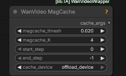

# Out Of Memory And Speed Discussions

## 2025.12.26

> After any update that modifies the model code and when using torch.compile it's common to run into issues with VRAM,
> this can be caused by using older pytorch/triton version without latest compile fixes, and/or from old triton caches, mostly in Windows.
> This manifests in the issue that first run of new input size may have drastically increased memory use, which
> can clear from simply running it again, and once cached, not manifest again. Again I've only seen this happen in Windows.
> To clear your Triton cache you can delete the contents of following (default) folders:

```
C:\Users\<username>\.triton
C:\Users\<username>\AppData\Local\Temp\torchinductor_<username>
```

## 2025.12.17

> with out cache ... 92 sec; with ... 70 sec



## 2025.12.10

  
helps free up RAM

SAM3 nodes under suspicion for consuming RAM

## 2025.12.06

> fun fact, using native load video is actually worse, because it reruns the get video components node each time, which also leaks memory
> vhs at least doesn't have that problem

About notive `Upscale Image` leaking RAM (not VRAM) with pytorch 2.8:

> updating to pytorch 2.9.1+cu130 fixed [it]

Another artist:

> apparently torch 2.9.1 cu130 was the solution

No memory leak on CUDA 12.8 either

A non-Kijai method of swapping model weights between VRAM and RAM  


ComfyUI should be organising a similar swap internally; `--reserve-vram 1` or `--reserve-vram 0.5`
is one way to help CopmfyUI manage VRAM optimally. What this does is it tells ComfyUI not to
use the last 1 or 0.5Gb of VRAM leaving it for operating system and for Comfy's own emergencies
when despite its best efforts it ends up trying to allocate more VRAM than is available.

Plotting memory usage graphs for ComfyUI:


> does require launching comfy with --disable-cuda-malloc;
> on Windows can only record the python stacks