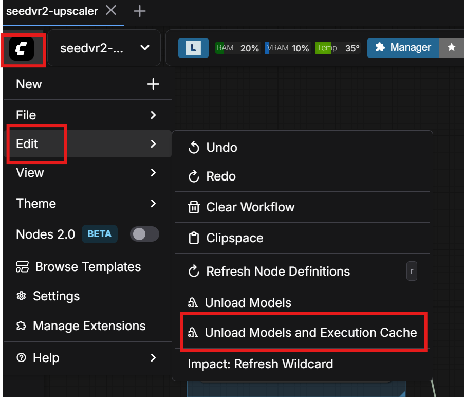
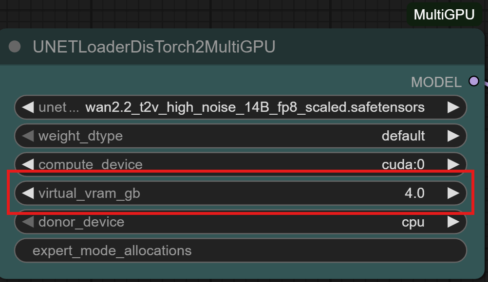
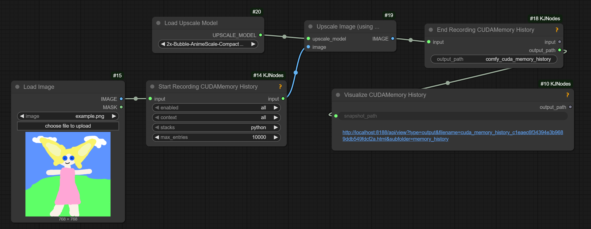

# Discussions Around Out Of Memory

2025.12.10

  
helps free up RAM

SAM3 nodes under suspicion for consuming RAM

2025.12.06

> fun fact, using native load video is actually worse, because it reruns the get video components node each time, which also leaks memory
> vhs at least doesn't have that problem

About notive `Upscale Image` leaking RAM (not VRAM) with pytorch 2.8:

> updating to pytorch 2.9.1+cu130 fixed [it]

Another artist:

> apparently torch 2.9.1 cu130 was the solution

No memory leak on CUDA 12.8 either

A non-Kijai method of swapping model weights between VRAM and RAM  

ComfyUI should be organising a similar swap internally; `--reserve-vram 1` or `--reserve-vram 0.5`
is one way to help CopmfyUI manage VRAM optimally. What this does is it tells ComfyUI not to
use the last 1 or 0.5Gb of VRAM leaving it for operating system and for Comfy's own emergencies
when despite its best efforts it ends up trying to allocate more VRAM than is available.

Plotting memory usage graphs for ComfyUI:

> does require launching comfy with --disable-cuda-malloc;
> on Windows can only record the python stacks