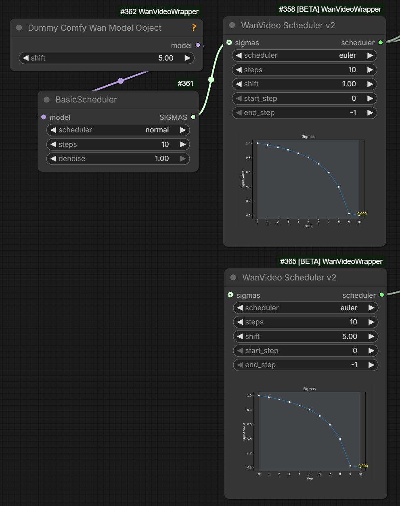

# Sigmas

## 2025.12.13

Kijai is preparing V2 series of nodes for ComfyUI. Here's a peek preview of `WanVideo Scheduler v2`:



Note that top scheduler on this image has got sigma schedule coming via `sigmas` noodle input from native nodes on the left
completely overriding the sigma schedule that `WanVideo Scheduler v2` would have computed
from its own settings.

In the image the setting match but that doesn't matter. Apparently this is a standard behavior in ComfyUI.
For exampple in ClownShark sampler sigma schedule coming via noodles overrides settings on the node in the same way.

With this knowlege one can appreciate that the image actually shows a comparison between

- the sigma schedule generated by `BasicScheduler` for "euler/normal" with 10 steps and a shift of 5.0 (top of the image, other native nodes behave the same way)
- the sigma schedule generated by `WanVideo Scheduler v2` for `euler` with 10 steps and a shift of 5.0 (bottom of the image, other Wrapper nodes behave the same way)

As you can see both are identical. `WanVideo Scheduler v2`'s ability to visualize the sigma schedule on a chart is very handy.

Comment on an intrinsic link between sampler ("euler") and schedule ("normal"):

> from an ODE solving perspective 
> separating sampler and scheduler makes no sense;
> it's like you have a very timing sensitive algorithm
> And then you separate the timing control out

What this means is that algorith and sigma schedule (sampler/scheduler) need to be always setup in a coherent manner.
Some of the nodes `WanVideo Scheduler v2` being one of them and ClownShark nodes the other
set both together, as actually does Automatic111 UI.

This even leads to a terminological mixup between these two terms with "scheduler" and "sampler" sometimes used almost interchangeably to refer to the same thing.

## Intro

[What the hell is a sigma schedule?!](https://www.youtube.com/watch?v=egn5dKPdlCk)

## Nodes For Working With Sigmas In Kijai's Wrapper

`WanVideo Sigma To Step` if you supply a floating point value like 0.9 you can plug this into `end_step` input of `WanVideo Scheduler` and it will be treated as sigma, not step.
Explanation about `WanVideo Scheduler`:

> you only need to connect the scheduler output,
> rest aren't even used but are there so you can
> connect them to the sampler to indicate those
> all are controlled by the scheduler node


```
WanVideo Sigma To Step
      |
      v
WanVideo Scheduler
      |
      v 
Preview Any
```

* `WanVideo Scheduler` outputs `end_step` as float number matching its input.  
  This is likely because you can still wire that float number in `WanVideo Sampler` start or end step and it will work correctly - so long as scheduler is in sync between `Wan Video Scheduler` and `WanVideo Sampler` - conjecture.

* `String To Float List` - facility to specify sigmas directly
* `Create CFG Schedule Float List` - not sigma but often set in the same part of workflow.
* `Preview Any` - easy to way to check output from the two above mentioned nodes

Wiring two `WanVideo Scheduler`-s into two `WanVideo Scheduler`-s for Wan 2.2:


## Native Nodes For Working With Sigmas

* Basic Scheduler
* Sigmas Split Value
* Custom Sampler Advanced

Other nodes you will likely see in the same workflow are

* ModelSamplingSD3 - change shift
* KSamplerSelect
* CFGGuider - split out inputs for Custom Sampler Advanced: model, positive, negative, cfg
* RandomNoise - noise input for 1st WAN 2.2 sampler
* DisableNoise - noise input for 2nd WAN 2.2 sampler

Note: `model` input on `Basic Scheduler` in Kijai's words
> just tells the scheduler that this is flow match model, so any wan model will do

E.g. one `Basic Scheduler`/`Sigmas Split Value` can drive two `Custom Sampler Advanced` nodes with diff models.

Can plug `Dummy Comfy Wan Model Object` -> `WanVideo Scheduler` -> `WanVideo Sampler`. Then `Dummy Comfy Wan Model Object` sets shift. One way to configure linear quadratic.

## Wan 2.2 Switchover

Advice on switching from hight noise to low noise model with WAN 2.2

| Model Type | Switchover Sigma |
| :--- | :--- |
| I2V | 0.9 |
| T2V | 0.875 |

## Alternative Tools

`Get Sigma` from [BlenderNeko/ComfyUI_Noise](https://github.com/BlenderNeko/ComfyUI_Noise)
`BetaSamplingScheduler` more control over Beta sigma schedule