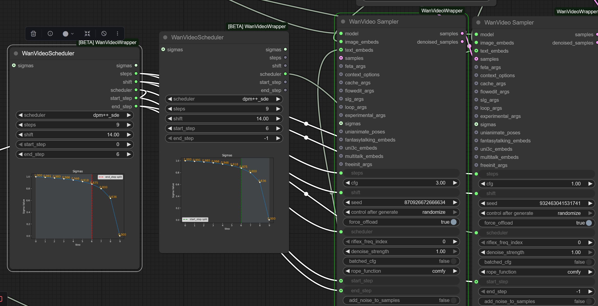

# Sigmas

## Intro

[What the hell is a sigma schedule?!](https://www.youtube.com/watch?v=egn5dKPdlCk)

## Nodes For Working With Sigmas In Kijai's Wrapper

`WanVideo Sigma To Step` if you supply a floating point value like 0.9 you can plug this into `end_step` input of `WanVideo Scheduler` and it will be treated as sigma, not step.

```
WanVideo Sigma To Step
      |
      v
WanVideo Scheduler
      |
      v 
Preview Any
```

* `WanVideo Scheduler` outputs `end_step` as float number matching its input.  
  This is likely because you can still wire that float number in `WanVideo Sampler` start or end step and it will work correctly - so long as scheduler is in sync between `Wan Video Scheduler` and `WanVideo Sampler` - conjecture.

* `String To Float List` - facility to specify sigmas directly
* `Create CFG Schedule Float List` - not sigma but often set in the same part of workflow.
* `Preview Any` - easy to way to check output from the two above mentioned nodes

Wiring two `WanVideo Scheduler`-s into two `WanVideo Scheduler`-s for Wan 2.2:


## Native Nodes For Working With Sigmas

* Basic Scheduler
* Sigmas Split Value
* Custom Sampler Advanced

Other nodes you will likely see in the same workflow are

* ModelSamplingSD3 - change shift
* KSamplerSelect
* CFGGuider - split out inputs for Custom Sampler Advanced: model, positive, negative, cfg
* RandomNoise - noise input for 1st WAN 2.2 sampler
* DisableNoise - noise input for 2nd WAN 2.2 sampler

Note: `model` input on `Basic Scheduler` in Kijai's words
> just tells the scheduler that this is flow match model, so any wan model will do

E.g. one `Basic Scheduler`/`Sigmas Split Value` can drive two `Custom Sampler Advanced` nodes with diff models.

Can plug `Dummy Comfy Wan Model Object` -> `WanVideo Scheduler` -> `WanVideo Sampler`. Then `Dummy Comfy Wan Model Object` sets shift. One way to configure linear quadratic.

## Wan 2.2 Switchover

Advice on switching from hight noise to low noise model with WAN 2.2

| Model Type | Switchover Sigma |
| :--- | :--- |
| I2V | 0.9 |
| T2V | 0.875 |

## Alternative Tools

`Get Sigma` from [BlenderNeko/ComfyUI_Noise](https://github.com/BlenderNeko/ComfyUI_Noise)