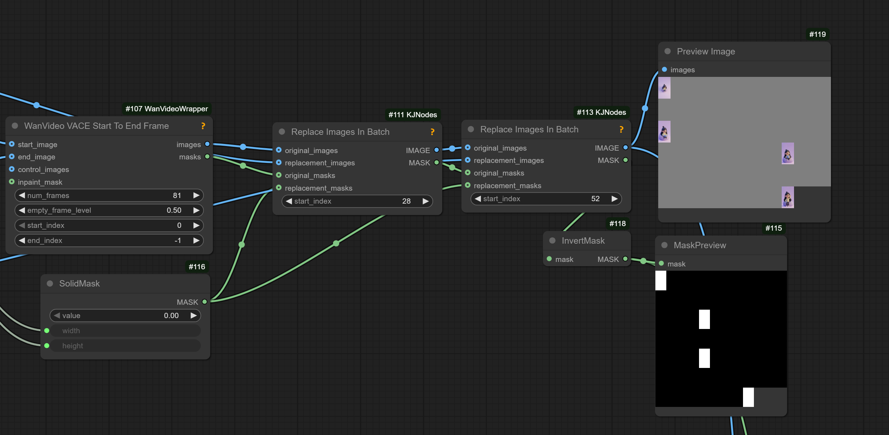

# Statements

## 2025.12.01

> for maximum speed, assuming compile works, use the 'comfy' rope function, and enable the `allow_unmerged_lora_compile` if the loras are not merged

Though `allow_unmerged_lora_compile` could be "troublesome" when enabled.

Triton caches to clean on updates:

```
C:\Users\AppData\Local\Temp\torchinductor_**\
C:\Users<usernam>.triton
```

## 2025.11.30

> disable blocks of the main model during inference?
> it's what the simple SLG does, it skips the chosen block when doing the uncond (negative) pass;
> advised against it, it's too difficult to determine any patterns in it,
> mostly just that earlier blocks have stronger effect on structure, motion etc. and latter more on details...
> but that's very crude estimation;
> SLG can be useful if you use cfg as that's more about just breaking the model in different way to boost the negative

> native doesn't even really (fully) take torch compile into account,
> there's too many dynamic things there, though it does work if you use Dynamic and the model fully fits in VRAM 

## 2025.11.16

An artist:
> I use AI Toolkit for training wan loras and they work quite good on likeness with animate and all wan models

## 2025.11.10

> I'm getting some okay results with 1030 high at 1, 1022 low at 1, cfg=2 for high and low, lcm/beta.
> this is using skimmed cfg=1 and 8 for shift. 2+2 steps

Doctor about WAN: "10 steps, 5/5 2k input, 720p output, rife 50fps"

Doctor about Qwen Image generation (?): "Res 3S also, it was a game changer, exponential samplers are less brutal in early steps"; "tweaking the denoising .1 by .1 swapping wan with krea"

> Wan2.2 lownoise might be the best refine model ever; 0.2 denoise with smartphone lora

> I switched everything from cu128 to cu130. It's way faster, but torch compile produces black/static images. Thing is, it's about as fast now on a 1st run as it used to be on a compiled second run

> good nodes like florence and qwen vl have 'keep model loaded' boolean option

## 2025.11.09

> wan 2.2 i2v seems to handle all kinds of inputs, like how it can do first to last frame and even in-between frames;
> in-between definitely works, there was also a Lora released recently that further improved that functionality some

Possibly "morphic" LoRa

> You can put a sequence, it'll work to keep motion from that sequence but unlike vace those frames won't be usable in the output,
> they are a bit glitchy, so they can't be used to crossfade with a previous clip.
> Also will introduce more color shifting but you can use the svi-film lora, technically isn't for 2.2,  to help reduce the color shifting.

> the way I did is like vace, with grey images for blank frames + matching masks;
> the masks are inverted from vace, blank image = black mask;
> svi-film lora, from what I tested it only works with hn model and strength need to be quite high to have an effect, I had it set to 3;
> it doesn't fix the distorted frames, only keep color from shifting on the rest of the generated frames

> for this to work it also had to match the 4+ rule ... actually hits last; both 28 and 59 are last images in latent



Randome unrelated: res_2s and bong tangent

## 2025.10.25

Qwen VL is capable of writing prompt for the next 5sec fragment, can give nice results paired with [SVI](svi.md)-film.

ffv1 format for storing videos - claims to be lossless and allows to store in rgb.


## 2025.10.24

> VAE encodes single image to first latent

> phantom latents are encoded 1 latent per image and tacked onto the end of the embedding;
> they are handled like single images

> VACE expects temporal latents yes, where first frame is encoded separately;
> so you can't just take last latents of previous gen because they don't have
> that single separate encoded frame

## 2025.10.23

> for some reason, when i use 15 high noise steps with no lora, and then i use 3 low noise steps with the lightx2v lora it looks better than when i use 25 low noise steps without lora ...

> light and tiny wan vae-s can be used in native by using `WanVideo Latent ReScale` node with `direction`=`wrapper_to_comfy`

> is anisora 3.2 distill that only works with cfg 1? yes; you can use cfg with it but it doesn't really impact much

> Q: does wan2.2 do nothing if clip embeds are provided in native? WanImageToVideo  
> A: out of 2.2 models, only WanAnimate uses those, otherwise does nothing

`Get Latent Range From Batch`, `Insert Latent To Index` - interesting nodes..

## 2025.10.22

> you absolutely can use Qwen VAE for Wan single image gens too, just not video

> nvtop best tool to monitor VRAM for Linux

> In general when it comes to NAG though, the NAG negative prompt should be much simpler and only have things you don't want to see, it shouldn't be the generic negative prompt word salad

> Q: is there any 'control' tech that hooks into wan i2v?   
> A: ATI is one; well its a whole model, but i2v based   
> A: unianimate can also be hooked to any I2V  
> A: also uni3c

## 2025.10.21

> If force_offload is on the memory is freed right after the sampler finishes; if it didn't work, then no 2.2 dual sampler workflow would work at all

> VAE was using a good chunk something like 10gb of VRAM;
> it's normal, it's just not used at same time as the model is;
> model offload should be automatic in native workflows
> as long as you don't run comfy with --high-vram
> which is not advisable anyway

## Kijai Quotes

> WAN 2.2 VAE is only for 5B model; Ovi is based on 5B

### AniSora

> Q: does the anisora model work with the usual lightX2v loras ?  
> A: the 3.2 is already distilled, so no need for that, the older versions do work with the loras  
> and it's better than lightx2v or lightning too for high noise  
> 8 steps  
> I also extracted it into a lora that works ok https://huggingface.co/Kijai/WanVideo_comfy/blob/main/LoRAs/AniSora/Wan2_2_I2V_AniSora_3_2_HIGH_rank_64_fp16.safetensors

### Flash Attention

> Q: In wrapper we can't use flashattn?  
> A: at least flash2, I never tried 3  
> [WanVideo Uni3C Controlnet Loader] uses it's own attention so never added [flashattn] there

### Lora Merging

> silly to merge to fp8 scaled model  
> Q: so merging the bf16 model with any loras then converting them down would be the best way  , yes ?  
> A: yeah always merge at highest precision you can and only then quant it  
> if you end up only using the quantized version it may not matter -that- much, but still as rule of thumb

## Random Claims

These claims have not been verified. Neither has the rest of this website :)

Loras trained on Wan2.1-VACE-14B-diffusers work though not perfectly with WanAnimate.

Negative prompt is ignored with CFG=1 in wrapper samplers but can be re-enabled by using `WanVideoNAG` node.

Not bad for realism: 250928 from [LoRAs/Wan22-Lightning](https://huggingface.co/lightx2v/Wan2.2-Lightning/tree/main) 0.7 strength, 1.4 CFG, 3 steps on WAN 2.2 low noise.

Tiled vae doesn't work with vace extend - makes generated part blurry and the position is slightly shifted ???
Kijai: looked at the code and since that doesn't set the tile size, it's set by dividing the width and height by half, so that probably creates badly sized tiles for some resolutions or something
I believe these are the original defaults: tile_size=(34, 34), tile_stride=(18, 16)
so 720 would be 90 in latent space, than in half you get 45 tile size
dunno why it wouldn't work really
unless it's VACE issue in general and it just doesn't like tiled encode

Apparently SDE samplers are not a good fit when distilled loras/models are in use
> DE samplers add noise they can do harm at low steps  
> If you want a general good safe sampler then UniPC is good

Re choice of attention for RTX3090: flash is deprecated, sage 3 fast but quality is bad, sdpa is the best for quality, radial is for longer gens;
radial also takes a noticable quality hit, which might not be that bad for a lot of gens;
another user: "but I noticed in, infinitetalk as an example, it really muted the expressiveness of lip syncs";
original commenter: "sage 1 is still quite good".

Take a subject and their motion and put it in a new setting/style (via img/txt);
take a subject's motion but replace the subject (via img/txt) in the same setting/style:
Wan Animate for humans, VACE for objects.

One way to "uplift" a video: normal t2v workflow, except pass input video to vae encoder, then pass to ksampler with like 0.5-0.7 denoise.

5+5 cfg  3 is nice for closeups.

Florence is too good; Used it for like 2 years at this point lol.

Wan 2.2 High with MPS Reward + Magref Low (RCM distill Lora for both strength 1) - sort of works; LayerForge node to put a character or two, the node can remove their background with Matting button, white background.

The movement tends to be better for t2v; sometimes its great to get a good base video from a good t2V and then u can paint over it.

"CFG zero star" seems to mean inputting "0*" into CFG. "was for rectified flow DiTs in general; used a heuristic which might not be good for Wan 2.2; it was an approximation".

Hunyuan video model has horrors in training data, a mild horror lora can bring them out.

nympy 1.26.4 is considered a stable version.

on tiling VAE decoder: Usually with tiling you want to actually use dimensions that are slightly larger than the exact factors of the original image so the overlap works more efficiently

> Q: to use more than one starting frame just pass them to wanvideo encode?
> A: yep
