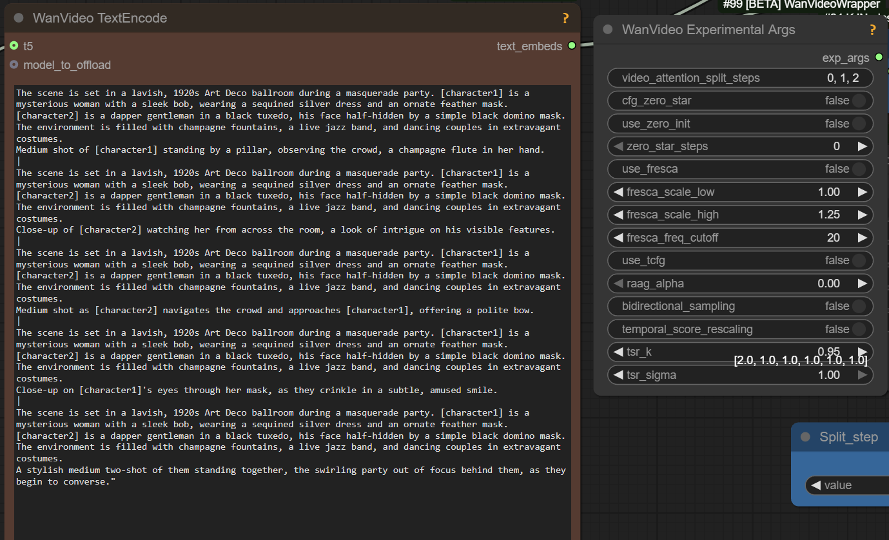

# StoryMem

## 2025.12.29

> Basic idea is pretty simple
> - MI2V LoRA is for continuing from last frame
> - MMI2V is same but from 5 last frames
> And both can use the memory images ...
> [for example] memory images could have the car from different angles

Apparently original code for StoryMem was picking memory images automatically, based on some sort of a "score".

> There was some custom node for it ... in the GitHub issue thread (?)

It is possible a new custom node will be added to Wrapper later.
Further it is entirely possible - and perhaps preferrable - to supply the memory images manually instead.

## 2025.12.26

I2V LoRA

> `WanVideoAddStoryMemLatents` is used for the extensions

> And yeah that's basically the only new thing for it: 3 more reference images;
> Or max 3, that's also hard coded max in their code;
> Their code stores more of course, but the model itself never uses more than 3 at once

> They can be used like references sort of; the position is basically random

> the first conditioning frame is the strongest, then the others are referenced later in the generation;
> and the end frame also stronger than mid frames......i think


## 2025.12.25

[StoryMem](https://kevin-thu.github.io/StoryMem/) released.
This is a LoRA very similar to Holocine in intent.

> cross_attn, self_attn and ffn layers only... don't see any new layers, so could just work?
> I2V too

From their website:

> - mi2v: Enable MI2V (memory + first-frame image conditioning) to connect adjacent shots when scene_cut is False.
> - mm2v: Enable MM2V (memory + first 5 motion frames conditioning) to connect adjacent shots when scene_cut is False.

> It was trained for 249 frames though (Wan fine tune) and specifically for [Scene] [Camera] and timestamping prompts

Original author:
> M2V serves as the basic setting, while MI2V and MM2V are only used to enable natural shot continuation without scene cuts.

Wrapper has now got `WanVideoAddStoryMemLatents` node.
Interesting discussion in issue [1822](https://github.com/kijai/ComfyUI-WanVideoWrapper/issues/1822) about an example wf.

> It actually takes up to 8 frames from the previous video, based on some automated quality checking (this will need new node).
> Using start image or motion frames doesn't need new code, the normal I2V node handles that the same.
> Only new thing needed is passing the memory latents as they are encoded separately from everything else,
> for that I have added a node.

> Whole workflow is more complicated and would benefit from helper node that does it all for sure.
> Even after the lora alpha compensation the strength should be bit higher than 1.0, at least when using lightx2v and such.

As of 2025.12.25 this is still a work in progress. [GH:aimfordeb/ComfyUI-FunPack](https://github.com/aimfordeb/ComfyUI-FunPack)
repository presumably contains some kind of a new node and an example worklflow using it.
It doesn't look like this workflow is useable yet.

Note the stories in [stroy](https://github.com/Kevin-thu/StoryMem/tree/main/story) folder on the original author's Github repository.

# Holocine

## 2025.12.07

> only T2V

Outstanding [PR](https://github.com/kijai/ComfyUI-WanVideoWrapper/pull/1615) to Kijai's WanVideo Wrapper to improve HoloCine support.

## Older

[Holo Cine](https://holo-cine.github.io/) models have been uploaded to Huggingface, Kijai's provided fp8 [conversion](https://huggingface.co/Kijai/WanVideo_comfy_fp8_scaled/tree/main/T2V/HoloCine).
[Paper](https://github.com/yihao-meng/HoloCine).

Warning: non-commercial license (though it is possible initial release was under ASF license, not certain).

Multi-scene videos generator trained on 15sec videos.

There is no special code yet in ComfyUI to use them properly even though ppl tried to drop the .safetensor files into T2V workflows to see what happens.
The hope/promise is to generate longer videos with consistent characters; in practice generated videos are still quite short but longer than 5 seconds.

One of the models in the family, 

> just using the weight at 253fr on low reso (480*480);
> disabling nag to use the | between each shot (no context windows);
> keep same formating than in paper /demo

> no idea for native [e.g. experiments are in wrapper workflows]

Apparently possible to drop .safetensors in pretty much any T2V Wan 2.2 workflow as High noise model, keeping original Wan 2.2 low noise and connect the following nodes:



Models are uploaded as "sparse" and "full", the article says:
> The sparse model is a computationally efficient approximation of the full model, maintaining
> almost the same visual and narrative quality while enabling long, coherent cinematic video generation.

30sec video on rtx 4090: swap block 40, 500 sec to generate

> believe it's just some sort of Wan T2V finetune  
> it's still based on the same Wan model, but the new tricks in their code need to be implemented for it to be able to do everything

## One More Explanation Of Prompting Holocine

```
[global caption] The scene features one character: [character1], a .... He is wearing ... The environment is ... The scene is lit by ... This scene contains 6 shots. [per shot caption] Extreme close-up of ... |
[shot cut] Medium shot of [character1] ... |
[shot cut] Extreme close-up of ... held by [character1]'s steady hand ... doing ... |
[shot cut] Close-up of [character1]'s eye... |
[shot cut] Medium close-up as he... |
[shot cut] Close-up of [character1]'s face as he...
```

## More Chat

> stronger strength of lightx high is needed, possibly 3 not 1.5

> another model using wan vae, another model with low quality outputs plagued by noise grids

Apparently HoloCine is able to generate 241 frames in ComfyUI workflows in one go. Examples seen online contain plenty of cuts.
It is not 100% clear if the model is capable of generating 241 frames straight without inserts cuts or loops.
Under this understanding the value of HoloCine is its ability to generate several scenes within 15sec limit
with considerable character consistency - rather than ability to produce uninterrupted 15sec shots.

Further full support for control over cuts requires additional code to be added to ComfyUI.
It appears uncertain how soon such support could arrive, given the busy release schedule of other competing models.

> make sure all cuts are 4t+1: 41,81,121,161,201
> orh 41,89,121,161,201

> which loras with holocine?
>s distil 0.15 T2V

> Holocine + [FFGO](wan-i2v-advanced.md#ffgo) makes it I2V

> You can use VACE w/ Holocine....and it will do up to 249 frames

> used with PUSA at 1.4 a lot (giving it help doing i2v along w/ VACE)
 