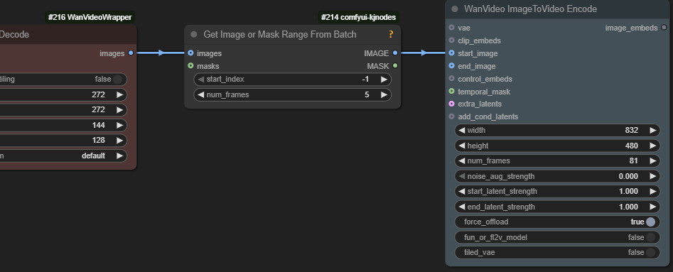
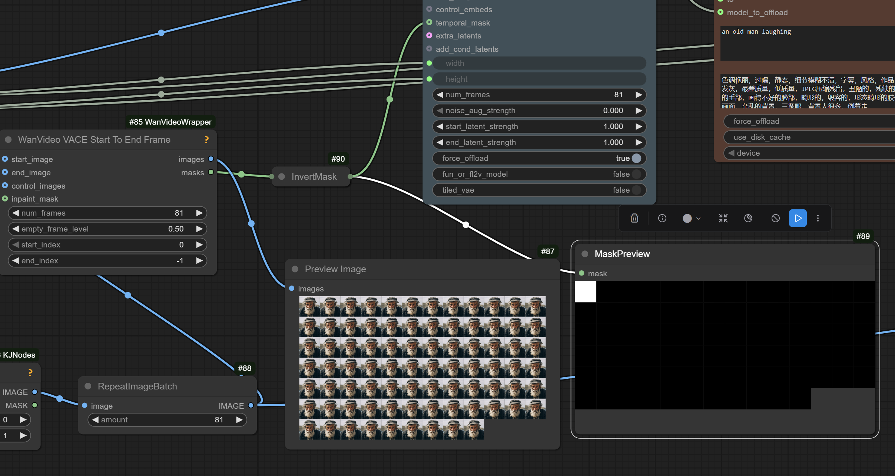

# SVI

SVI is a set of LoRas for Wan 2.1 480p I2V model
* original .safetensor-s in fp32 [HF:vita-video-gen/svi-model](https://huggingface.co/vita-video-gen/svi-model/tree/main/version-1.0),
* Kijai's conversion to fp16 [HF:Kijai/WanVideo_comfy:LoRAs/Stable-Video-Infinity](https://huggingface.co/Kijai/WanVideo_comfy/tree/main/LoRAs/Stable-Video-Infinity)
* [article](https://github.com/vita-epfl/Stable-Video-Infinity)

The intent is to generate videos longer than 81 frames with smooth transitions using I2V.
Degradation artifacts such as exposure and contrast increasing with each 81 frames step as well as loss of character consistency are rampant.

Update: there has been a claim that SVI-film lora is a placebo and simply using base I2V model with embeds prepared in the same way produces exactly the same effect.
Countered: "The degradation with svi-film is much much better than Vace or anything else when used how it was designed (with Wan 2.1 I2V without distill loras)".

> i2v model could even work with multiple frame inputs until recently, but it clearly isn't designed for that because of how fast it degrades;
> Vace would keep consistency longer

2025-Oct-24 authors uploaded slightly tweaked models to Huggingface alongside old ones. New .safetensors are supposed to be better. One of the updated model weight files is called film-opt.

Advice for developers is to generate extensions with a seed different from the one used for the original video.

## The Whole Point

> Normal I2V doesn't do well with more than one input image; VACE (T2V) works but not the base I2V;
> the "film" loras make that [5 last frames motion continuation] work,
> and the shot/talk/dance loras add something new - the ability to use reference image.

Indeed shot/talk/dance loras hold the (initial? ref?) image for the whole span of generation.
I2V only take in image as 1st frame.

> the Old Pusa Lora works with the Holocine - Holocine on High noise with 2.1 Pusa 512 with Magref as low noise model

## Discussint Workflows

Distill LoRa is applied by the authors in the article. Workflow/nodes to use are very similar to Fun InP model.

> its meant to be chained through samplers

> shot lora with 1 frame yes, film with 5

> no 2.1 lora is ever gonna work proper on 2.2 high noise, it's just too different
                                                                                  s
> this was with distill lora actually 8 steps, euler

> don't know if the unmerged lora can affect it negatively, sometimes it does on special loras like this;
> just in case run merged and fp16

## Discussion Around Feeding Inputs To SVI

This section is to be cleaned up. Right now it doesn't make much sense but it will in the future.

> Normally the I2V conditioning is added in extra channel.
> * 16 channels for noise
> * 16 for image conditioning
> * 4 for image conditioning mask
>
> The image cond channel normally is the start image + black pixels for rest.  
> The mask marks the image as 1 and the black pixels as 0.

> normally with a single image, it's the image + black pixels for the [video?] length, and the mask marks the image

> the different thing with SVI is that those black images are the original input image,
> with some of the pipelines the mask remains same - it does it like normal I2V does

> the I2V mask is just binary 1 for the images you keep, 0 for the frames you gen

> normal I2V padding is black;
> SVI-shot etc. is the original input image;
> and mask for those frames in both cases is black, zeros, 0

> Q: need to tick `fun_or_fl2v_model` in `WanVideo ImageToVideo Encode` ?  
> A: only if you use end img

> the ref is the original, the first frame is the previous last

Artist:
> and even masking the remaining frames the pixel value for those frames matters a lot;
> the best values are definitely 0.5 or close to it
> basically grey pixels seem to work the best;
> In the native WanImageToVideo node the remaining padded pixel values are set to 0.5 after the reference images

> in the original codes [diffusers?] it's -1 to 1, so middle is zero;
> in comfy it's 0-1 so middle is 0.5

Artist:
> so when they say they are padding with zeros in their code, that's the same as padding with 0.5 in comfy

> comfyui there is an inversion of the binary mask before sending it to the model - super intuitive

### SVI-Film

> in native comfyui it's black mask is unchanged;
> in native you send black masks for the overlap frames and white for the rest;
> in wrapper you send white masks for the overlap frames and black for the rest;
> but if you are just doing 5 overlap frames using svi-film you don't need to worry about masks, just send in the 5 overlap frames as the start image and that's it

### SVI-Shot

> with svi shot you need exactly 1 black mask frame and 80 white mask frames, at least in the wrapper

> the reference padding only works with the shot, talk and dance loras

### SVI-Dance

> Q: How does svi dance is  suppose to be used btw ? 
> A: with UniAnimate

## Practice

Rought sketch of a workflow: [link](workflows/wanvideo_480p_I2V_SVI-shot_test.json).

One way to replicate padding from the article:

## Additional Comments

If we build a workflow replicating what code in Github from the authors of SVI does
it will however, end up different from the image above. It will not be using `temporal_mask` input at all.

The following quote gives some info on what the code in their Github repository does and also
provides some background on what `temporal_mask` was originally created for. It basically says
that originally `temporal_mask` was created specifically for Fun InP model. It also says that `temporal_mask`
is generated automatically if the only inputs given are start/end frame.

> in example scripts, the film -pipelines use normal I2V padding with zeros;
> the shot -pipeline (and probably infinitetalk) use the padding with reference image (the input image);
> the temporal_mask in the wrapper is just custom way to do that I2V channel mask,
> as that's what the Fun InP model uses, and also start/end frame even if that's
> done automatically as well if only those inputs are given 

> even if passing multiple start frames it's not necessary to mask those - it's done automatically

Hint: SVI lora on 1st clip not needed, just freezes motion.