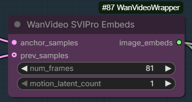
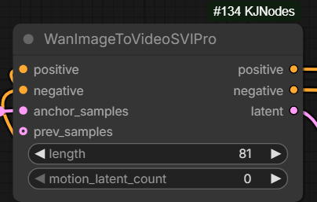

# SVI 2.0 Pro

## 2025.12.27

SVI 2.0 Pro released

- High/low LoRA-s for Wan 2.2 I2V
- Kijai adapted the weights and placed them into [HF:Kijai/WanVideo_comfy:LoRAs/Stable-Video-Infinity/v2.0](https://huggingface.co/Kijai/WanVideo_comfy/tree/main/LoRAs/Stable-Video-Infinity/v2.0)
  alongside 2.0 non-PRO
- Original weights in [HF:vita-video-gen/svi-model:version-2.0](https://huggingface.co/vita-video-gen/svi-model/tree/main/version-2.0)
- Main new nodes: `WanVideo SVIPro Embeds` in Wrapper, `WanImageToVideoSVIPro` for native    
  
  
- Wiring [example](screenshots/WanVideo-SVIPro-Embeds-wiring.png) for the new node
- NATIVE wf for SVI 2.0 Pro: [wan22_SVI_Pro_native_example_KJ](workflows/svi/kj-wan22_SVI_Pro_native_example_KJ.json)
- Looped version of the above NATIVE wf from `QualityControl`: [SVI-Pro-KJ-Example-looped](workflows/svi/qc-SVI-Pro-KJ-Example-looped.json)
- Wrapper WF from DawnII: [Wan2_2_LongFLF_SVI2_Pro_DawnII](workflows/svi/dawn-Wan2_2_LongFLF_SVI2_Pro_DawnII.json)
- Native WF from Verole super long: [video_wan2_2_14B_i2v_SVIPRO_bano](workflows/svi/verole-video_wan2_2_14B_i2v_SVIPRO_bano.json)
- Article/details: [GH:vita-epfl/Stable-Video-Infinity:svi_wan22/docs/svi/svi_2.0_pro.md](https://github.com/vita-epfl/Stable-Video-Infinity/blob/svi_wan22/docs/svi/svi_2.0_pro.md)

> SVI Pro does have hard time following simple prompts at least

> testing svi pro is also an instance where I would get some flashing between gens with sageattention but switching back to sdpa fixed it

> the overlap is the 4 frames from last latent + 1, so 5

> it uses the previous gen latent instead of frames, so no decoding/encoding between gens
> which means the last 4 frames essentially

> seems svi hard fixes the camera

> can move the camera but lightx2v always make it worse

> with 1030 lightx got [video all gray], works better with the 1022

> for 1030 I set strength to 0.6 and it was fine

> for me working great 1030

`motion_latents` probably should be 1

One idea is to use `latent_strength` bellow `1` on `WanVace Encode` node while preparing the "anchor sample" to reduce its impact on the generated video
and avoid locking the camera too strongly, etc.

> much better motion without lightx2v lora on High noise model;
> 10 steps cfg 3.5 for high-noise and 4 for low-noise(with lightx2v)

DawnII has discovered that character sheets work to an extent as the "anchor" frame for SVI 2.0 Pro.
Increasing latent strength say via `WanVideo Encode` is recommended.

If you do not connect `prev_samples` and supply a new `anchor_image` to the generation
SVI 2.0 Pro becomes one more way to supply a reference image to the generation.

# SVI 2.0

## 2025.12.04

Version 2 of SVI lora for WAN 2.1 and 2.2 released:
- Kijai's repackaging: [HF:Kijai/WanVideo_comfy:LoRAs/Stable-Video-Infinity/v2.0](https://huggingface.co/Kijai/WanVideo_comfy/tree/main/LoRAs/Stable-Video-Infinity/v2.0)
- [original](https://huggingface.co/vita-video-gen/svi-model/tree/main/version-2.0) (not usable in ComfyUI)

Wan 2.1 version of this LoRa combines SVI-shot and SVI-film functionality:
- runs with I2V model
- of the 36 input channels which I2V models take input data in
  - 16 are as usual input noisy latents
  - 16 extra image channels: 5 initial frames + duplicates of the single reference image until the end
  - 4 extra mask channels: mask only initial 1 frame - which is very surprising 

Wan 2.2 version 2 of SVI lora is the new incarnation of SVI-shot: it supports 1 motion frame only.
Motion frame = overlap with previous clip.
At the same time [Drozbay](hidden-knowledge.md#drozbay) reported success with 3 motion frames and artifacts above that with SVI 2.0.

> testing out this svi/2.2 stuff having a hard time getting the camera to move, track the person, etc;
> quick 2 cents on svi.. meh.. for static shots it might work well

[Explanation](https://github.com/kijai/ComfyUI-WanVideoWrapper/issues/1718#issuecomment-3620023495) from the makers of SVI 2.0.

ComfyUI testing ongoing.

[Drozbay](hidden-knowledge.md#drozbay) has shared a humongous workflow which allowed generation of a 29sec long video with consistent character, no burn-out and smooth motion.
The workflow is combining SVI 2.0 with hard-cut LoRA and in the demo case did not require any editing outside of Comfy:
[drozbay_svi20_wan22](workflows/drozbay_svi20_wan22.png). "Magical" control over reference strength for SVI: [drozbay_svi_ref_strength.webp](screenshots/drozbay_svi_ref_strength.webp).

> 3 overlap frames seems to be the highest I can go with no artifacts ... could probably use SVI 2.0 for Wan 2.1 for Wan 2.2 LN

Simpler work-in-progress WF with SVI 2.0 for Wan 2.2 High Noise LoRA at 0.5 strength: [h_svi2_wan22_HasRnD.json](workflows/h_svi2_wan22_HasRnD.json).
> WF uses 5 start frames but the correct way apparently is to use 1 start frame... so feel free to experiment

# SVI 1.0

SVI is a set of LoRas for Wan 2.1 480p I2V model
* original .safetensor-s in fp32 [HF:vita-video-gen/svi-model](https://huggingface.co/vita-video-gen/svi-model/tree/main/version-1.0),
* Kijai's conversion to fp16 [HF:Kijai/WanVideo_comfy:LoRAs/Stable-Video-Infinity](https://huggingface.co/Kijai/WanVideo_comfy/tree/main/LoRAs/Stable-Video-Infinity)
* [article](https://github.com/vita-epfl/Stable-Video-Infinity)

The intent is to generate videos longer than 81 frames with smooth transitions using I2V.
Degradation artifacts such as exposure and contrast increasing with each 81 frames step as well as loss of character consistency are rampant.

Update: there has been a claim that SVI-film lora is a placebo and simply using base I2V model with embeds prepared in the same way produces exactly the same effect.
Countered: "The degradation with svi-film is much much better than Vace or anything else when used how it was designed (with Wan 2.1 I2V without distill loras)".

> i2v model could even work with multiple frame inputs until recently, but it clearly isn't designed for that because of how fast it degrades;
> Vace would keep consistency longer

2025-Oct-24 authors uploaded slightly tweaked models to Huggingface alongside old ones. New .safetensors are supposed to be better. One of the updated model weight files is called film-opt.

Advice for developers is to generate extensions with a seed different from the one used for the original video.

SVI stands for "Stable Video Infinity".

## The Whole Point

> Normal I2V doesn't do well with more than one input image; VACE (T2V) works but not the base I2V;
> the "film" loras make that [5 last frames motion continuation] work,
> and the shot/talk/dance loras add something new - the ability to use reference image.

Indeed shot/talk/dance loras hold the (initial? ref?) image for the whole span of generation.
I2V only take in image as 1st frame.

> the Old Pusa Lora works with the Holocine - Holocine on High noise with 2.1 Pusa 512 with Magref as low noise model

## Discussint Workflows

Distill LoRa is applied by the authors in the article. Workflow/nodes to use are very similar to Fun InP model.

> its meant to be chained through samplers

> shot lora with 1 frame yes, film with 5

> no 2.1 lora is ever gonna work proper on 2.2 high noise, it's just too different
                                                                                  s
> this was with distill lora actually 8 steps, euler

> don't know if the unmerged lora can affect it negatively, sometimes it does on special loras like this;
> just in case run merged and fp16

## Discussion Around Feeding Inputs To SVI

This section is to be cleaned up. Right now it doesn't make much sense but it will in the future.

> Normally the I2V conditioning is added in extra channel.
> * 16 channels for noise
> * 16 for image conditioning
> * 4 for image conditioning mask
>
> The image cond channel normally is the start image + black pixels for rest.  
> The mask marks the image as 1 and the black pixels as 0.

> normally with a single image, it's the image + black pixels for the [video?] length, and the mask marks the image

> the different thing with SVI is that those black images are the original input image,
> with some of the pipelines the mask remains same - it does it like normal I2V does

> the I2V mask is just binary 1 for the images you keep, 0 for the frames you gen

> normal I2V padding is black;
> SVI-shot etc. is the original input image;
> and mask for those frames in both cases is black, zeros, 0

> Q: need to tick `fun_or_fl2v_model` in `WanVideo ImageToVideo Encode` ?  
> A: only if you use end img

> the ref is the original, the first frame is the previous last

Artist:
> and even masking the remaining frames the pixel value for those frames matters a lot;
> the best values are definitely 0.5 or close to it
> basically grey pixels seem to work the best;
> In the native WanImageToVideo node the remaining padded pixel values are set to 0.5 after the reference images

> in the original codes [diffusers?] it's -1 to 1, so middle is zero;
> in comfy it's 0-1 so middle is 0.5

Artist:
> so when they say they are padding with zeros in their code, that's the same as padding with 0.5 in comfy

> comfyui there is an inversion of the binary mask before sending it to the model - super intuitive

### SVI-Film

`WanImageToVideo` node happens to construct the masks and latents properly for SVI-Film, no custom nodes are necessary.

> in native comfyui it's black mask is unchanged;
> in native you send black masks for the overlap frames and white for the rest;
> in wrapper you send white masks for the overlap frames and black for the rest;
> but if you are just doing 5 overlap frames using svi-film you don't need to worry about masks, just send in the 5 overlap frames as the start image and that's it

### SVI-Shot

SVI-Shot allows us to supply an additional reference image to an AI video sampling using I2V models.
One way to format [conditioning](conditioning.md) accordingly is to use `WanEx I2VCustomEmbeds` node
from [GH:drozbay/WanExperiments](https://github.com/drozbay/WanExperiments) code repository.

[HuMO](humo.md) section contains a workflow which [drozbay](hidden-knowledge.md#drozbay),
the node's author, has shared for HuMO. Please refer to this workflow as a general instruction
on how to use `WanEx I2VCustomEmbeds` node with `SVI-Shot` LoRa.

> with svi shot you need exactly 1 black mask frame and 80 white mask frames, at least in the wrapper

> the reference padding only works with the shot, talk and dance loras

### SVI-Dance

> Q: How does svi dance is  suppose to be used btw ? 
> A: with UniAnimate

> Q: svi-dance is an addition to unianimate and not a replacement?
> A: it just makes the extension [unianimate] better

## Practice

Rought sketch of a workflow: [link](workflows/wanvideo_480p_I2V_SVI-shot_test.json).

One way to replicate padding from the article:

## Additional Comments

If we build a workflow replicating what code in Github from the authors of SVI does
it will however, end up different from the image above. It will not be using `temporal_mask` input at all.

The following quote gives some info on what the code in their Github repository does and also
provides some background on what `temporal_mask` was originally created for. It basically says
that originally `temporal_mask` was created specifically for Fun InP model. It also says that `temporal_mask`
is generated automatically if the only inputs given are start/end frame.

> in example scripts, the film -pipelines use normal I2V padding with zeros;
> the shot -pipeline (and probably infinitetalk) use the padding with reference image (the input image);
> the temporal_mask in the wrapper is just custom way to do that I2V channel mask,
> as that's what the Fun InP model uses, and also start/end frame even if that's
> done automatically as well if only those inputs are given 

> even if passing multiple start frames it's not necessary to mask those - it's done automatically

Hint: SVI lora on 1st clip not needed, just freezes motion.

> when svi film is used with fun inp, it's vanilla fun inp workflow with svi lora? yes

> shot lora allows infinite gens with no degradation, film lora allows for motion continuation of generation, so combined would allow infinite continuation
