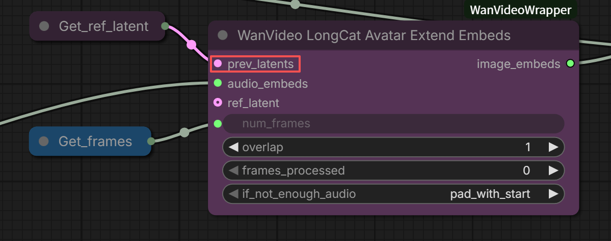
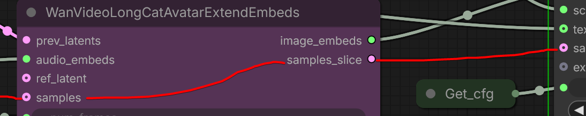

# LongCat Avatar

Following in the trail after Infinite Talk, Humo and Wan S2V we now have `LongCat Avatar`.
`LongCat Avatar` seems to be based on [LongCat](../longcat.md),
and able to use same LoRA-s, at least to an extent.

The purpose of `LongCat Avatar` appears remarkably similar to 

As of 2025.12.20 the code supporting `LongCat Avatar` in `ComfyUI` is [longcat_avatar](https://github.com/kijai/ComfyUI-WanVideoWrapper/tree/longcat_avatar)
branch in Kijai's [Wrapper](https://github.com/kijai/ComfyUI-WanVideoWrapper) repository on Github. One of the relevant nodes:

> `prev_latents` is where it continues from, the overlap amount of frames are taken from it,
> `ref_latent` is used to insert that latent in the sequence at the `ref_frame_index` position (latent space),
> which is how it keeps the reference consistency in longer extensions

Model and LoRA-s: [HF:Kijai/LongCat-Video_comfy](https://huggingface.co/Kijai/LongCat-Video_comfy/tree/main).

Reportedly around 10 steps is necessary

> The LongCat dev said they are working on 24fps version though, as there are lipsync issues with this 16 fps setup.
> It feels like you get diminishing returns pretty early when increasing step count.
> For short clips at least seems fine to use less, maybe the extension quality will suffer on long runs.
> But this reference method always has the initial frame to use, so it still should not burn.

> The audio_cfg makes it twice as slow, you can try without it but usually the lipsync suffers a lot

> 1 minute without degradation, using the old distill lora (at 0.8 str), audio_cfg 3.0, text cfg 1.0, 12 steps with the longcat distil schedule

> you can do v2v already;
> this helps to slice the correct part of the input video for each window

> at the moment there is only the bf16 model for longcat_avatar;
> for the normal longact video there is a fp8 version;
> You can run a bf16 at fp8 though

> are you using the chinese-wav2vec?
> the chinese model is the only one that works ... because it's trained with this one

`wav2vec-chenese-base_fp16.safetensors` `bf16`