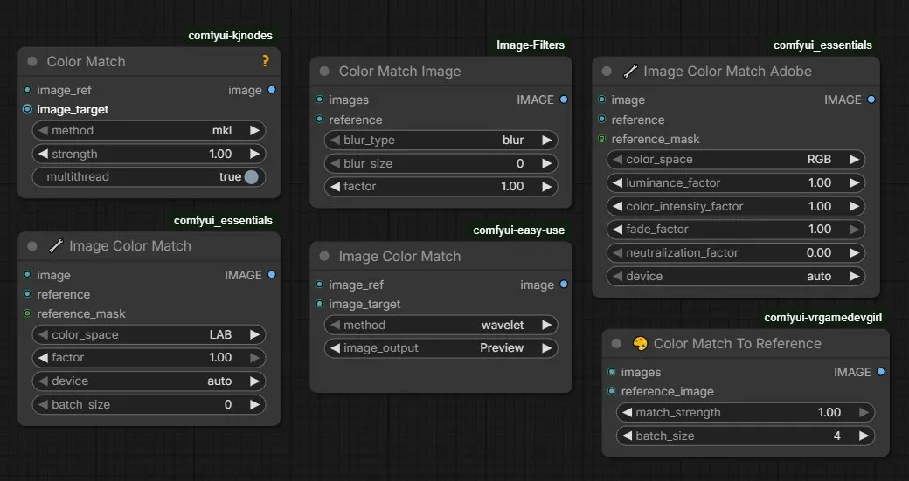
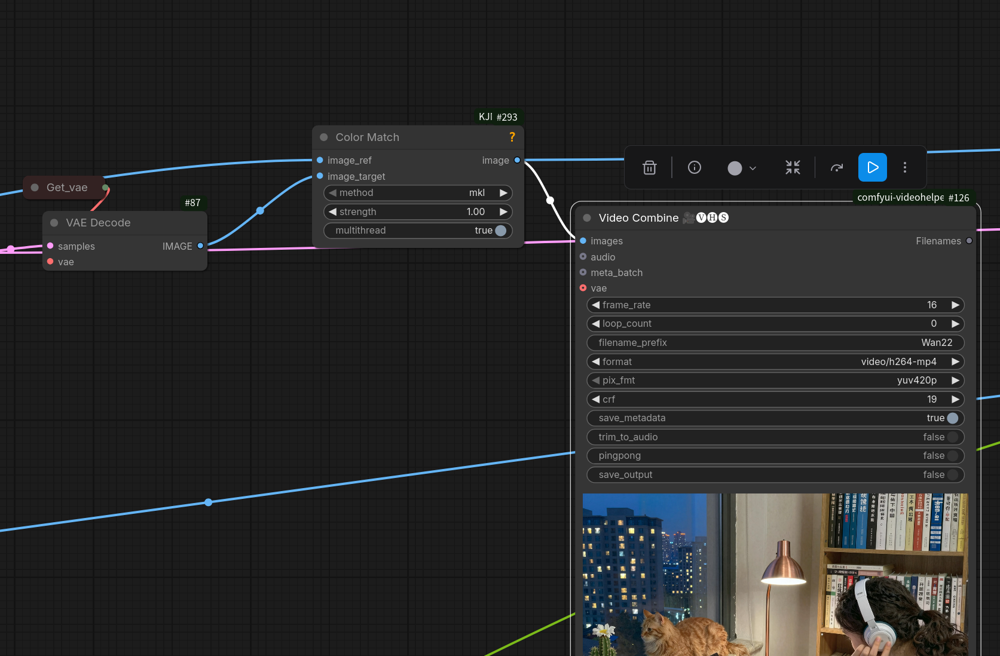
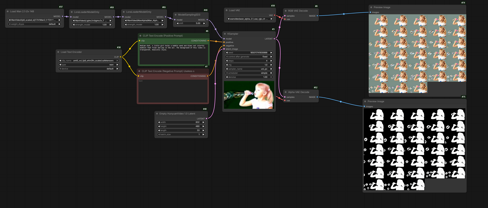
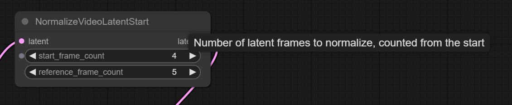
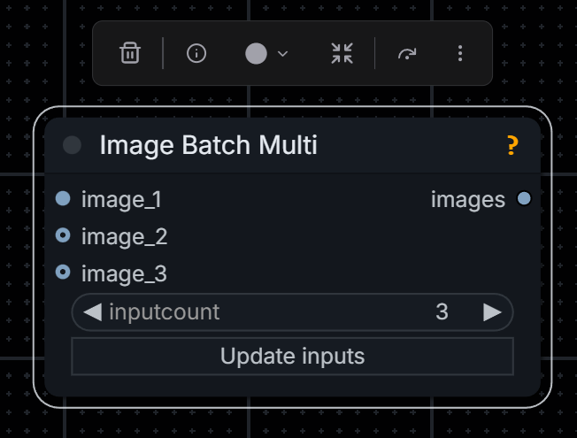
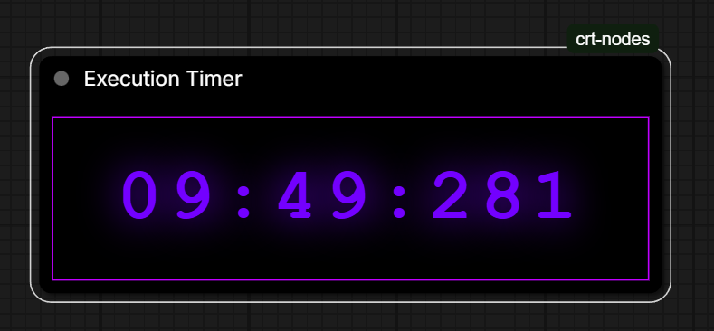
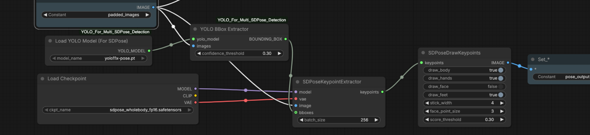
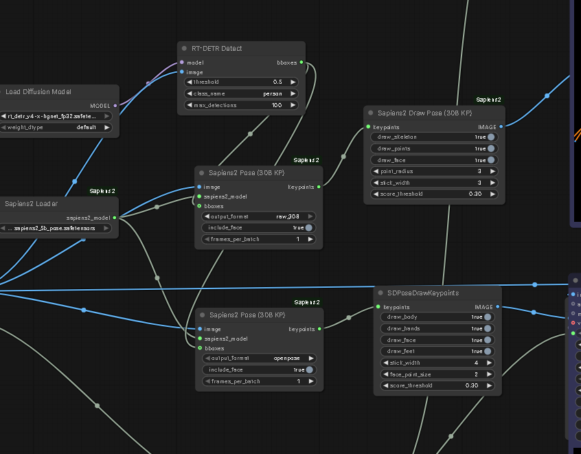

# Color Matching

[GH:kijai/ComfyUI-VideoColorGrading](https://github.com/kijai/ComfyUI-VideoColorGrading)

# 2.5D Tools

* [GH:PozzettiAndrea/ComfyUI-Sharp](https://github.com/PozzettiAndrea/ComfyUI-Sharp) quick Gaussian splot from image by Apple
* [kijai/ComfyUI-MoGe](https://github.com/kijai/ComfyUI-MoGe), [GH:microsoft/MoGe](https://github.com/microsoft/MoGe)

# Wan Alpha

Kijai has adapted Wan Alpha "DoRA": [HF:Kijai/WanVideo_comfy:LoRAs/WanAlpha](https://huggingface.co/Kijai/WanVideo_comfy/tree/main/LoRAs/WanAlpha)

Decoder needeed for WanAlpha: `decoder.bin` in the following locations (files have different hashes but same size..)
- [HF:htdong/Wan-Alpha](https://huggingface.co/htdong/Wan-Alpha/tree/main) version 1.0
- [HF:htdong/Wan-Alpha-v2.0](https://huggingface.co/htdong/Wan-Alpha-v2.0/tree/main)

> I did not know they originally had 1 file but split it for comfy to 2;
> ah it's just the fgr (foreground?) and pha (alpha?) split into two files

Test workflow:

[wan-alpha](workflows/kj-wan-alpha.png)

# Loops

> so if anyone want to use the loop for nodes, do not disable comfyui cache like i do, wasted 30mn figuring those nodes need the cache

[GH:yolain/ComfyUI-Easy-Use](https://github.com/yolain/ComfyUI-Easy-Use)

Drozbay:

> Loops are possible with the current execution flow but are still somewhat fragile and they don't allow for starting/stopping partial executions.
> You can't stop half way through a set of loops, change something for the next iteration, and continue. Indexing with lists is also
> not super reliable right now. Overall it's often times easier and more stable to just lean into the practically infinite canvas and just make gigantic workflows.
> They are large but to me they are simpler to understand than having everything hidden in loops or layers of subgraphs.

# Resolution Master

[GH:Azornes/Comfyui-Resolution-Master](https://github.com/Azornes/Comfyui-Resolution-Master)

# NAG

* [GH:scottmudge/ComfyUI-NAG](https://github.com/scottmudge/ComfyUI-NAG) ComfyUI NAG that supports Z-Image-Turbo as well as well as other new models as of Dec 2025
* [GH:scottmudge/ComfyUI-NAG:lumina2_support](https://github.com/scottmudge/ComfyUI-NAG/tree/lumina2_support) fork of the above adding Z-Image-Turbo support, outstanding [PR](https://github.com/ChenDarYen/ComfyUI-NAG/pull/64)

Hmm.. what is `NAGGuider` from `NAG`?..

# Combating Video Contrast Drift

## NormalizeVideoLatentStart

ComfyUI native now has `NormalizeVideoLatentStart` node which has been lifted out of [Kandinsky-5](k5.md) original implementation.
The node apparently homogenizes contrast and color balance inside the video.

> mean/std  normalization applied when using I2V

### WASWanExposureStabilizer

[GH:WASasquatch/WAS_Extras](https://github.com/WASasquatch/WAS_Extras) contains among other useful nodes `WASWanExposureStabilizer` intended for a similar purpose

## Pose Retargeter

[GH:AIWarper/ComfyUI-WarperNodes](https://github.com/AIWarper/ComfyUI-WarperNodes)

## Video Blending From Fragments

[kijai/ComfyUI-KJNodes](https://github.com/kijai/ComfyUI-KJNodes) contains `Image Batch Extend With Overlap`
which can be used to merge together original video with its extension done using I2V or VACE mask extension techniques.
Example of it being used in a LongCat wf: [extend-with-overlap](screenshots/extend-with-overlap.png).

`WanVideoBlender` from [GH:banodoco/steerable-motion](https://github.com/banodoco/steerable-motion) is an alternative.

See also the next section on `Trent Nodes`

# Trent Nodes

[TrentHunter82/TrentNodes](https://github.com/TrentHunter82/TrentNodes/tree/main) contains `Cross Dissolve with Overlap` node
as well as `WanVace Keyframe Builder` and other nodes for examining videos, taking last N frames, creating latent masks and VACE keyframing.
See also: [Qwen Edit - VACE](wan-t2v-advanced.md#vace-with-qwen-image-edit).

## Hunyuan Video Foley

[github.com/phazei/ComfyUI-HunyuanVideo-Foley](https://github.com/phazei/ComfyUI-HunyuanVideo-Foley)

| HF Space | safetensors |
| --- | --- |
| ComfyUI-HunyuanVideo-Foley | hunyuanvideo_foley_xl |
| ComfyUI-HunyuanVideo-Foley | synchformer_state_dict_fp16 |
| ComfyUI-HunyuanVideo-Foley | vae_128d_48k_fp16 |

# More Foley-s

- Woosh - superios to LTX 2.3 but tries to generate sound as ppl move spead; N0NSens put together a masking wf to solve this: [N0NSens-Woosh-SFX.json](workflows/N0NSens-Woosh-SFX.json)
- [kijai/ComfyUI-MMAudio](https://github.com/kijai/ComfyUI-MMAudio)
- ACE Foley Generator
- ACE Step

> Inside of Comfy you could Use Stable Audio or ACE... but tbh both are not that good

# Hiding In Plain Sight

- `Resize Image v2` from [kijai/ComfyUI-WanVideoWrapper](https://github.com/kijai/ComfyUI-WanVideoWrapper) new mode is `total_pixels` copies what `WanVideo Image Resize To Closest` from [kijai/ComfyUI-WanVideoWrapper](https://github.com/kijai/ComfyUI-WanVideoWrapper) does which is original Wan logic
- `Image Batch Extend With Overlap`from [kijai/ComfyUI-KJNodes](https://github.com/kijai/ComfyUI-KJNodes) to compose extensions created with VACE extend techniques
- `Video Info` from [Kosinkadink/ComfyUI-VideoHelperSuite](https://github.com/Kosinkadink/ComfyUI-VideoHelperSuite) + `Preview Any` to debug dimension errors in ComfyUI etc

# Ckinpdx

[Ckinpdx](https://github.com/ckinpdx) a passionate AI artist has shared [GH:ckinpdx/ComfyUI-WanKeyframeBuilder](https://github.com/ckinpdx/ComfyUI-WanKeyframeBuilder) repository.

### Ckinpdx Wan Keyframe Builder (Continuation)

which provides `Wan Keyframe Builder (Continuation)` node.
This node was originally intended to prepare images and masks for VACE workflows.
When [SVI 2.0](svi.md#2025.12.04) was released the node was updated to facilitate workflows combining VACE keyframing, extensions and SVI references.
The node has two distinct modes of operation: when `images` output is used and when `svi_reference_only` output is used.
The modes are toggled by a boolean switch on the node.

Sample [wf](screenshots/ck-magic-workflow.png).

## Ckinpdx Load Audtio And Split

Use this node to split audio between generation runs which produce various parts of the video with HuMo.
Use `Trim Audio Duration` as shown to remove duplicate part of audio before re-assembling the video.

## Other Repositories by Ckinpdx

- [GH:ckinpdx/ComfyUI-WanSoundTrajectory](https://github.com/ckinpdx/ComfyUI-WanSoundTrajectory) build paths to feed into [Wan-Move](wan-move.md) based on music beats
- [GH:/ckinpdx/ComfyUI-SCAIL-AudioReactive](https://github.com/ckinpdx/ComfyUI-SCAIL-AudioReactive) generate audio-reactive SCAIL pose sequences for character animation without requiring input video tracking

# Assemble/Disassemble

Assemble separate images into a sequence

Disasseble equence into separate images

# Execution Timer

from [GH:PGCRT/CRT-Nodes](https://github.com/PGCRT/CRT-Nodes):

# Unilumos

UniLumos is an AI model for relighting a video. Workflows:

- [Kijai's example](https://github.com/kijai/ComfyUI-WanVideoWrapper/blob/main/example_workflows/wanvideo_1_3B_UniLumos_relight_example_01.json)
- [Change-Background-Wan-UniLumos](workflows/Change-Background-Wan-UniLumos.json)

# Sound Tools

- Qwen-TTS
- MOSS TTS
- IndexTTS2: "I had Chatterbox, IndexTTS, another IndexTTS node, Chatterboxt5, VibeVoice ... IndexTTS seems a lot better"
- VibeVoice TTS

# Misc

- [GH:MSXYZ-GenAI/comfyui-msxyz](https://github.com/MSXYZ-GenAI/comfyui-msxyz) anti-alising nodes for video
- [GH:silveroxides/ComfyUI_SamplingUtils](https://github.com/silveroxides/ComfyUI_SamplingUtils) useful nodes including "BonusPromptPresets" which help convert images from anime to realism using Flux.2 [Klein]
- [GH:siraxe/ComfyUI-SA-Nodes-QQ](https://github.com/siraxe/ComfyUI-SA-Nodes-QQ) additional nodes for using part of source video, ehanced spline editor etc "Do not under any circumstances install ... it straight up hijacks your ability to load workflows"
- [GH:filliptm/ComfyUI_Fill-ChatterBox](https://github.com/filliptm/ComfyUI_Fill-ChatterBox) Nodes for ResembleAI's Chatterbox models: voice cloning, multilingual synthesis, voice conversion.
- [GH:diodiogod/TTS-Audio-Suite](https://github.com/diodiogod/TTS-Audio-Suite): [tts-text](screenshots/tts-text.png), [prepare wf](workflows/gl_tts_voice_prepare.json), [wf](workflows/gl_tts_voice_prepare.json)  
  "done a lot of ... vibevoice ... problems ... tts 2 now ... much happier"
- [GH:BlenderNeko/ComfyUI_Noise](https://github.com/BlenderNeko/ComfyUI_Noise) tools for working with noise including "unsampling"
- [GH:MoonHugo/ComfyUI-FFmpeg](https://github.com/MoonHugo/ComfyUI-FFmpeg/blob/main/README_EN.md) nodes for concatenating, converting between png and mp4, splitting/adding audio, vert/horiz stiching of videos
- `SuperPrompt` node from [kijai/ComfyUI-KJNodes](https://github.com/kijai/ComfyUI-KJNodes).
- `Merge Images` node from VideoHelperSuite (so called VHS)
- [GH:stavsap/comfyui-ollama](https://github.com/stavsap/comfyui-ollama) ComfyUI nodes to connect to local-running KoboldCpp executing Qwen3-VL on the CPU in order to tranlate images to descriptions.
- [Urabewe/OllamaVision](https://github.com/Urabewe/OllamaVision) a SwarmUI extension to generate prompts.
- [GH:chflame163/ComfyUI_LayerStyle](https://github.com/chflame163/ComfyUI_LayerStyle) can add film grain to images.
- [GH:CoreyCorza/ComfyUI-CRZnodes](https://github.com/CoreyCorza/ComfyUI-CRZnodes) CRZ Crop/Draw Mask
- [GH:elgalardi/comfyui-clip-prompt-splitter](https://github.com/elgalardi/comfyui-clip-prompt-splitter) quickly coded node for splitting the prompt by line into multiple conditioning noodles - useful for multistage wf-s

# Frame Interpolation

Moved [here](vfi.md).

# Pose Detection

`vitpose` can do animals as well as humans.

`dwpose`

`sd-pose`

workordie:
> SD pose is great it's just slow in my experience

> Q: sd-pose ... taking a long time  
> [djbfilmz] A: your SD pose is probably not optimzied, also there is DW Pose (Tensor ver) which is really fast. I switch between .. I'm on a 5000s series card tho
>   
>   
> [GH:judian17/ComfyUI-SDPose-OOD](https://github.com/judian17/ComfyUI-SDPose-OOD)

Kijai:  
[!kj-sdpose](screenshots/nodes/kj-sdpose.webp)  
> if you have a ton of VRAM you can use very high batch size to make it faster, but you can't do that with cropping since cropping has to be frame by frame

## Sapiens2

[GH:facebookresearch/sapiens2](https://github.com/facebookresearch/sapiens2)

> the cropping/bbox is only really necessary if your subject is super small on the frame, or if you want to detect multiple people

> sapiens2 0.4B twice as fast as SDPose ... they also have 0.8B and 5B models, and one 4k model

> Q: How big is the vid, res wise?  
> A: 512x1024, the model does 768x1024 only anyway

> sam3d-body [rainbow shapes???] is on another level

> the 1b is a lot better than the 0.4, which totally failed this test

> 4k model is only 1b

Experimental implementation for ComfyUI: [GH:kijai/ComfyUI-Sapiens2](https://github.com/kijai/ComfyUI-Sapiens2)

> Q: DWpose ... deprecated now, considering we have Sapiens2?
> A: I'd keep it around. Sapiens looks really good tho
