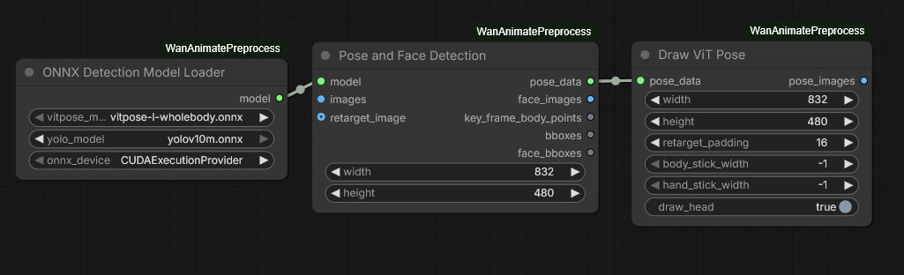
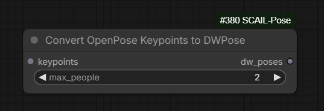
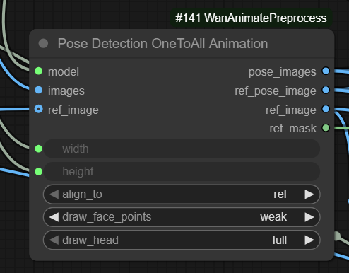

# Wan Animate And MoCha

Wan Animate and MoCha serve similar goals.

## SCAIL

Official git [repo](https://github.com/zai-org/SCAIL) - pls. put starts to make it easier for the team to obtain more resources for future training!

### SCAIL 2015.12.17

SCAIL generations are known to come up super dark if pose video hasn't been converted to exactly 1/2 of resolution of the video being generated

Multi-people [workflow](workflows/scail/slmonker-scail-multipeople.png) by Slmonker.

Using Uni3C *may* help avoid background issues in Context Windows generations with SCAIL. Can be sufficient to use only for initial 1-2 steps of sampling.

Hybrid workflow from Juan Gea: human_video -> SCAIL -> WanAnimate; helps if character proportions very different from original video; the idea is
SCAIL workflow can be better at retargetting motion from human to character and WanAnimate is better than SCAIL at keeping a consistent background;
"can add Uni3C to the mix, to be sure that the camera is stable and the character won't slide, for that you use the original human video".

SCAIL relies heavily on prompting. Good idea to separate prompts with \| on wrapper when using [Context Windows](what-plugs-where/context-windows.md) to apply different prompts to different windows.

As of now SCAIL is not supported on native.

> Q: are we at a place where we can two subjects?
> A: you can but you have to switch to using the dwpose node instead of vitpose if you want faces, as vitpose does only one person at a time

Good starting picture, possibly built from 1st frame of a human video using depth controlnet for Z-Image can help.

> The background generally only shifts if the camera moves away from the original background

> Q: for SCAIL embeds, is the end percent of 0.5 in the example workflow for speed or because control on all steps looks bad?
> A: speed and that it has no big effect after that

Using vitpose



> dwpose is just worse than vitpose-H (the huge one), but vitpose also only does one person while dwpose can do more



Note: vitpose `.onnx` and `.bin` files go into `ComfyUI/models/detection` folder, "same with Yolo actually".

> SCAIL-Pose does both NLF and dwpose to add hands/face

### SCAIL 2025.12.15

> - NLF input only = no retargeting
> - no face or hands NLF input + dw_pose = no retargeting
> - hands/face optionalNLF input + dw_pose + ref_dw_pose = retarget, hands/face optional

`NLF Predict` node now has `per_batch` setting which runs pose estimation in batches reducing overall resource requirements.

> 1080 looks way better [than 720, this was a vertical video so this is the longer vertical dimension]

> disconnect the ref_dw_pose when doing multiple people ...
> vitpose even [does not] return multiple people now?

> Q: how would the other skeletons be colored in cases past 2?
> A: we just have 2 colors, but we do like 1-2-1-2-1-... manner from left to right

[Pose Retargeter](tools-list.md#pose-retargeter)

### SCAIL 2025.12.14

> it's I2V model basically, but input channels are 20

When using `uni3c` with SCAIL we may need 4 more frames in `Uni3C` guidance because "scail ref takes one latent".

> 4 more frames at the very beginning right? yes;
> 4 more empty frames? 4 more anything

After latest updates SCAIL is working with [Uni3C](control.md#uni3c).

Single-person pose detection working. Add [kijai/ComfyUI-SCAIL-Pose](https://github.com/kijai/ComfyUI-SCAIL-Pose) code repository, [workflow](workflows/scail/single-person-pose-detection.webp), [workflow again](workflows/scail/SCAIL_test_wf_02.json).

Work ongoing on multi-character pose detection.

> the pose input need to be half the resolution of the main input;
> the whole thing is in same input sequence, [ref, noise, poses]
> that's why it's downscaled too, to halve that impact

Working resolutions: 896x512, 576x1024(?), 1280x704 and same resolutions with W/H swapped.

> resolutions needs to be divisable by 32

> diffusers and native comfyui do padding [when resolution does not match]
> wrapper just errors

### SCAIL Summary

SCAIL is a new model similar to WanAnimate but able of handling two characters at once.
It has been intgrated into the [Wrapper](https://github.com/kijai/ComfyUI-WanVideoWrapper).

> the pose predictor uses 3D and stuff, probably will have to be separate repo,
> though it's just pyrender and that's not too bad;
> it uses "warm" on right side and "cool" on left side, which seems important

Model [weights](https://huggingface.co/Kijai/WanVideo_comfy_fp8_scaled/tree/main/SCAIL).

> [pose] doesn't need to be retargeted as badly as other models

> by default the pose is downsampled to half the size, as it's heavy otherwise, and the default res is 895x512;
> because the model has separate patch embed for pose, it doesn't have to match in resolution, but in the code currently either full or half size only are supported 

> for SCAIL the lightx2v 2.1 I2V

Official SCAIL code is relying on [Neural Localizer Fields](https://github.com/isarandi/nlf) model to derive human pose from existing videos.
That is the part that is not yet implemented in Comfy. `.pt` file for the model available from [GH:isarandi/nlf/releases](https://github.com/isarandi/nlf/releases).

> NLF model license ... means you can't use it ... in commercial capacity ... research only license

## One To All Animation

### 2025.12.09

Extended length generations implemented, implementation in Kijai's wrapper complete and merged to master.

> 613 frames with One-to-all, sadly it does still burn, at least with lightx2v;
> though it also seems you can just stop the pose control after few steps and then it keeps the ref better;
> with lower lightx2v strength, lower shift, ending pose control early the burnin is not as bad, but do lose some quality otherwise

### Earlier

Experimentation started with [One-to-All-Animation](https://github.com/ssj9596/One-to-All-Animation).
Goals similar to WanAnimate.

> it's T2V based; pose is via controlnet

> for reference it uses concat to front, reference attention and token replacement;
> probably the most complicated ... after S2V

> the image cond encoder is hunyuan VAE;
> the controlnet is Wan forward block;
> ref extractor is basically mini wan of 7 blocks

> token replacement [means] set timestep of next 2 frames after the reference frame to 0 to avoid them changing too much from the init;
> token replace is only used when continuing from previous frames

- Kijai's adaptations: [FP16](https://huggingface.co/Kijai/WanVideo_comfy/tree/main/OneToAllAnimation) 38Gb, [FP8](https://huggingface.co/Kijai/WanVideo_comfy_fp8_scaled/tree/main/OneToAllAnimation)
- Sample [WF](https://github.com/kijai/ComfyUI-WanVideoWrapper/blob/main/example_workflows/Wan21_OneToAllAnimation_example_01.json), (original [test](workflows/kj_WanToAllAnimation_test.json) wf)
- You may also need nodes from [kijai/ComfyUI-WanAnimatePreprocess](https://github.com/kijai/ComfyUI-WanAnimatePreprocess)

> 2 modes, either it aligns the input pose to reference, or reference to input pose

Long generations not yet implemented as of 2025.12.08 but once they are the model
could become a lot better than WanAnimate: "WanAnimate degrades over time".

Makes of the model are using 576x1024 resolution in the examples.

> shift 7 with euler; when using lightx2v none of that really matters, just have to test and see what works

> ~15 mins on 4090 at 576x1024; with lightx2v 2 mins; tried 50 steps now but didn't really improve

> the reference adherance suffers greatly from misaligned pose, and also some from lightx2v

## Wan Animate

### 2025.12.08

`Pose Detection OneToAll Animation` node can be used with WanAnimate too if face points are disabled  


One possible set of LoRA-s: [jf-wan-animate-loras](screenshots/jf-wan-animate-loras.webp).

### Summary

Two example workflows given in [Github:kijai/ComfyUI-WanVideoWrapper:example_workflows](https://github.com/kijai/ComfyUI-WanVideoWrapper/tree/main/example_workflows).
Example workflows differ in pose detection tech they provide.
[Github:kijai/ComfyUI-WanAnimatePreprocess](https://github.com/kijai/ComfyUI-WanAnimatePreprocess) github repo was used to work newer pose detection tech for WanAnimate.
Not clear if that repository is still relevant.
As of now this `example_workflow` [folder](https://github.com/kijai/ComfyUI-WanAnimatePreprocess/tree/main/example_workflows) in that repository only contains a native workflow
- which may still be of interest.

```bash
hf download Kijai/sam2-safetensors sam2.1_hiera_base_plus.safetensors # models/sam2
hf download Kijai/WanVideo_comfy_fp8_scaled Wan2_2-Animate-14B_fp8_e4m3fn_scaled_KJ.safetensors # models/diffusion_models
hf download Kijai/WanVideo_comfy LoRAs/Wan22_relight/WanAnimate_relight_lora_fp16.safetensors # models/diffusion_models
```

Important:

* either have both BG and mask connected (background from driving video)
* or have both BG and mask disconnected (background from reference image)

There are two ways to produce longer videos in a batched manner: with and without [Context Windows](what-plugs-where/context-windows.md):

|Option|`WanVideo Animate Embeds`|`WanVideo Context Options`|
|:---|:---|:---|
|A|set `frame_window_size` to you batch size, say 77<br>set `num_frames` to the length of the video you want to generate|not used, looping is done "internally" by WanAnimate code|
|B|set both `frame_window_size` and `num_frames` to the length of the video you want to generate|set `context_frames` to your batch size, say 77 or 81<br>4 is possibly correct value for `stride` effectively setting it to 'disabled'|

Pro-s and cons:

- A, looping done "internally": "won't shift so much or nothing at all, but from 3 extensions it will begin to degrade considerably, getting a final video with way less quality than the starting part"
- B, looping done via [Context Windows](what-plugs-where/context-windows.md): "won't degrade over time, but has the same problem as always, shift of scene/background and even character"

> The looping is done automatically in the wrapper even without context options when using the WanAnimate node;
> context options is alternative long gen method, it's biggest benefit is that it doesn't deteriorate longer it goes,
> and downside is speed and window continuation especially on backgrounds

Note: an hybrid workflow has been demonstrated to work obtaining the best of both words:

- video generated via WanAnimte unsing "internal looping", it does burn but keeps background and character clearly visible
- generated video is used to produce a depth map
- final video is produced using VACE with [Context Windows](what-plugs-where/context-windows.md)

The hybrid did achieve no visible burning while driving both the character and background nicely.

With Kijai's nodes face video can be simply disconnected. In native nodes one may need to connect a black image/video.
Yes, the mask has to be blocky. Sometimes increasing blocks size can make things better.
Blocky mask bleeding into produced video might get fixed if face is connected.

Kijai on WanAnimate with Uni3C:
> I've had it work before, so it definitely can work

Untested but it is possible `WanAnimate` can take up to 4 reference images.

Apparently can be used with [Lynx](lynx.md).

Advice on how to stop WanAnimate adding a face to a character which doesn't have one:
> When im doing non human character dance or whatever, I always put in negative prompt - human;  
> yeah, i have that, in-fact i've translated that word into Chinese and using that

Experienced user:
> I never use positive prompt, leave it empty, only when gen video with cat then I dont know
> why but wanimate likes if you put cat in positive prompt but for everything else leave it empty

The only model with Wan 2.2 in the name to use Clip Embeds (possibly because it's truly Wan 2.1 not 2.2).

> you can adjust the audio scaling down or lock a pose with unianimate

Kijai's retargeting pose node places the stick figure in the centre of frame.
The position of the character in the reference frame (in screen space) dictates the starting position of the ViT pose (in screen space).

### WanAnimate V2 .safetensors File

Kijai:

> I named the fixed scaled fp8 model v2, which in hindsight was a mistake as people are taking it too literally  
> it's a bugfix for native workflows since there was pretty drastic noise issue in the initial fp8 scaled in native  
> [original version, so called v1 is] very slightly better in the wrapper as the face encoder layers are in bf16  

> [so-called V3 from Eddy1111111] is probably just Lora merge or something

### What Plugs Where Wan Animate

| Pre Embeds Node| Pre Embeds Inputs -> Output | Embeds Node | Input from Pre / Embeds Inputs -> Output | Model | WanVideo Sampler Input |
| :-- | :-- | :-- | :-- | :-- | :-- |
| `WanVideo ClipVision Encode` | `clip_vision`, `image_1`, `image_2`<br>-> `image_embeds`  | `Wan VideoAnimate Embeds` | `clip_embeds` / `ref_images`, `pose_images`, `face_images`, `bg_images`, `mask` | Wan 2.1 I2V family | `image_embeds` |

### Sample WF

[GT.WanAnimateLongCartoonCharacterInReal](workflows/GT.WanAnimateLongCartoonCharacterInReal.json) by Gleb.

## MoCha

Slightly newer and simpler to use than Wan Animate. Serves one function only - replace a human character for a human character in a video. Excels in applying correct lighting to the character.
Only supported in wrapper, not supported in native ComfyUI.

Based on Wan 2.1 T2V 14B. Inputs:

* source video
* one or two reference images of the replacement (one of them recommended to be a face close-up)
* a mask covering the character being replaced *in the 1st frame only* (major difference from Wan Animate which requires mask to be masking the character in all frames)

Links:

* Kijai's [conversion](https://huggingface.co/Kijai/WanVideo_comfy_fp8_scaled/tree/main/MoCha) to fp8 e4m3
* [Article](https://orange-3dv-team.github.io/MoCha/)
* only [ckpt](https://huggingface.co/Orange-3DV-Team/MoCha/tree/main/preview) file available from the authors which is believed to be bf16
* Kijai's 1st sample workflow: [wanvideo_mocha_replacement_original_01](https://github.com/kijai/ComfyUI-WanVideoWrapper/blob/main/example_workflows/wanvideo_mocha_replacement_original_01.json)
* Kijai's 2nd sample workflow: [wanvideo_MoCha_replace_subject_KJ_02](https://github.com/kijai/ComfyUI-WanVideoWrapper/blob/main/example_workflows/wanvideo_MoCha_replace_subject_KJ_02.json)

> Identity preserved not as strongly as VACE 2.1 / Wan Animate but the lighting is super impressive

2024.10.21 a node has been added to code has been added to latest version of [kijai/ComfyUI-WanVideoWrapper](https://github.com/kijai/ComfyUI-WanVideoWrapper)
to support generating videos with MoCha. Code has been added as well to support [Context Windows](what-plugs-where/context-windows.md) with MoCha.

> a big downside of MoCha it's basically double compute; the original frames are concatenated along temporal dimension;
> the frame count is basically doubled; so memory use for 81 frames would be similar to 161 frames

> Mocha does better with prompt; you can get by with generic, but the more detailed the better, particularly with character likeness

## Steady Dancer

Nov-2025 single .safetensors model derived from Wan family of video generation models.
Does not work with other Wan models, not a LoRa.
Performs functions roughly similar to WanAnimate.
Works with context windows.
Support has been integrated into ComfyUI native, likely to the wrapper as well.

- fp8 .safetensors: [HF:Kijai/WanVideo_comfy_fp8_scaled:SteadyDancer](https://huggingface.co/Kijai/WanVideo_comfy_fp8_scaled/tree/main/SteadyDancer)
- fp16 .safetensors: [HF:Kijai/WanVideo_comfy:SteadyDancer](https://huggingface.co/Kijai/WanVideo_comfy/tree/main/SteadyDancer)
- original article: [GH:MCG-NJU/SteadyDancer](https://github.com/MCG-NJU/SteadyDancer) 

> UniAnimate delivers similar results if not better

> used it with lightx2v and it works

## Crop Uncrop

The following workflows shared by UFF relate to face cropping out the face repacing it and stitching it back in

- [Sam3_Sec4_segmentation_selection](workflows/crop-uncrop/Sam3_Sec4_segmentation_selection.json)
- [Wan2.2-Native_crop-uncrop](workflows/crop-uncrop/Wan2.2-Native_crop-uncrop.json)
- [Wan2.2-Native_face_crop_stitch](workflows/crop-uncrop/Wan2.2-Native_face_crop_stitch.json)