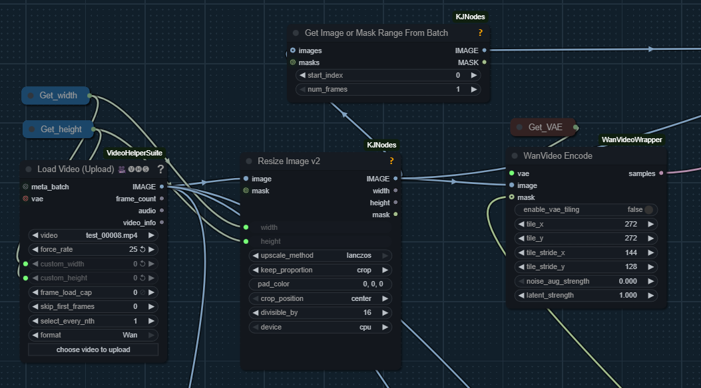

# Wan I2V Tricks

In Nov 2025 community started exploring hidden potential behind Wan 2.2 I2V models.
This page collects insights into non-obvious workflows.

## HuMo I2V and SVI-shot

Since HuMo is an I2V member of Wan family of models, the [work](humo.md#drozbay) done by Drozbay to enable [SVI-shot](svi.md#svi-shot)-powered HuMo extensions clearly is a new Wan I2V trick.

The node and workflow discussed in the referenced page faciliate using [SVI-shot](svi.md#svi-shot) LoRa to provide an additional reference to I2V generations.
This counters visual degradation that commonly happens in extension workflows.
Sadly this approach does not facilitate continuity of motion.

Happily this can be applied in normal I2V workflows unrelated to HuMo.

## I2V Video Inpainting

Apparently it has long been possible to use masks when doing V2V processing via I2V models. As of now this website doesn't contain a complete workflow, however here is a hint into how to setup such workflow:

## TimeToMove

Insipired by [time-to-move/TTM](https://github.com/time-to-move/TTM), a promising body of code for converting rough mock-ups into smooth AI videos
which re-juvenates an old approach which existed as early as CogVideoX days Kijai added 
`WanVideo Add TTMLatents` node now in [kijai/ComfyUI-WanVideoWrapper](https://github.com/kijai/ComfyUI-WanVideoWrapper)
and provided an [example wf](https://github.com/kijai/ComfyUI-WanVideoWrapper/blob/main/example_workflows/wanvideo2_2_I2V_A14B_TimeToMove_example.json)
  
The workflows are not very easy to use and require a fair bit of trial and error. [Official tool](https://github.com/time-to-move/TTM/tree/main/GUIs) is used to generate driving video.
Mockups use character pictures with a white outline around them.

### TimeToMove Workflow Setup Details

Low noise step is somehow more problematic.
Removing Lightx2V on low seems to help a bit.

General advice is to only use [1030](loras/part-01.md) lightx2v LoRa on high - or no LoRa at all.
People have been trying setups both with and without a speed LoRa on low.
Apparently if using a speed LoRa on low then accurate prompt becomes very important.

One no-LoRa setup shared:
> 50 steps, 25/25 split, 3.5 cfg, 8 shift and 3 start and 7 end step

`unipc` may be a good scheduler to use. In order to use `dpm++` it is advisable to
> stop the reference one step before the last step of high noise

### TimeToMove Masks

The process requires that a mask is supplied.

- One approach is to take the "control" (e.g. rouch mockup video which is already being fed into the process) and pass it via `Convert Image To Mask` and then connect to `mask` input. It's possible to take on one of RGB channels
- Alternatively success has been reported with supplying a solid black mask

### TimeToMove Ideas

Half-cooked 3d can be supplied. One way to produce:
> blender, put the image on a subdivided plane and use the depth map to displace the geometry, then animating the camera

DepthAnything 3 can be useful generating .glb. Possibly MoGe. Possilby https://huggingface.co/spaces/facebook/vggt

> Try reducing the end step on the LTT node, you might get more motion, so wan is a bit more free earlier during sampling to generate motion since it won't stick as close the reference

It has been hypothesised that having the moving character both as part of the initial image and as part of the control video increases the chances of creating an unwanted 2nd copy of the character.

## PainterI2V

`princepainter/PainterI2V` node attracted attention and sparked research. It exists into two versions
- [Native](https://github.com/princepainter/ComfyUI-PainterI2V)
- [Wrapper](https://github.com/princepainter/ComfyUI-PainterI2VforKJ)

The node was created to inject more motion into I2V generations with speed LoRa-s.
It works by preparing noise latents in a special manner.

Here are some quotes about it: "It's pre-scaling the input latents"; "it tries to balance out the brightness increase you normally get when scaling the input like that"; "basically adding some of the input image to what's normally gray in I2V input"; "I think the logic behind using the reference partially in those frames is to keep the color from changing"; "this is what it does to input image: invert and blend to gray" (input latents); "definitely changes something" - "thing is it's randomness, if you added noise controllably then you could also make a slider that changes the output"

Apparently the node subtracts the initial image from initial noise on all frames.
While this does change the end result of generation the change can be both positive and negative.

## PainterLongVideo

[princepainter/ComfyUI-PainterLongVideo](https://github.com/princepainter/ComfyUI-PainterLongVideo) from that same authrow is being played with.
Expert conclusion however is that the node is either simply an automation I2V extension via last frame
or possibly also [PainterI2V](wan-i2v-tricks.md#painter2iv) on top of it.
