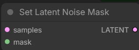
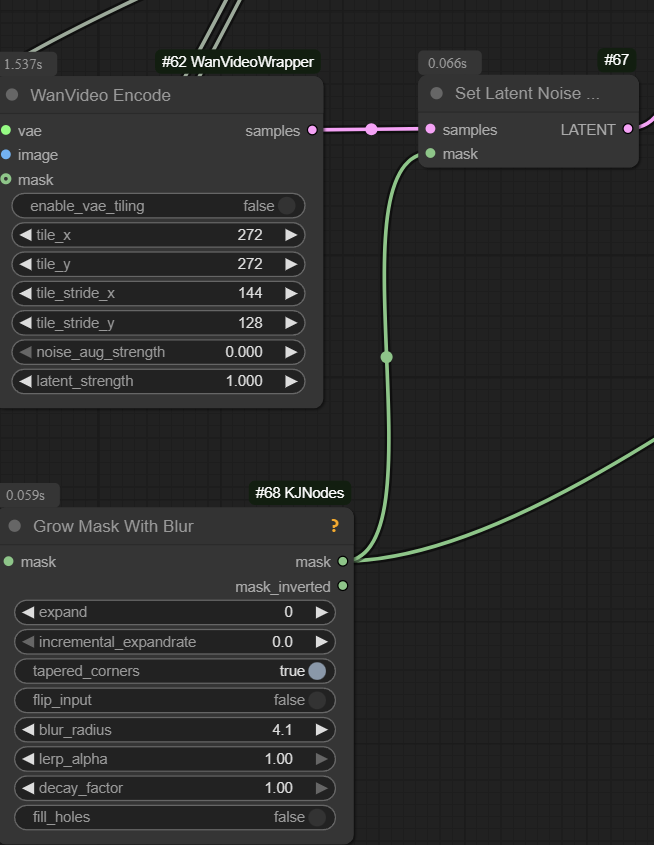
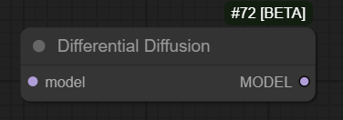
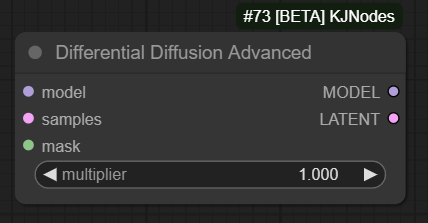

# Wan Masking

Along with [Context Windows](what-plugs-where/context-windows.md) masking in Wan can be confusing.
There are two types of masks that are relevant for generating video videos with AI models

- latent masks
- "model" masks

## Latent Masks

Latent masks are used by samplers during image generation process.
Latent masks are not "visible" to AI models.
Samplers such as `KSampler`, `WanVideo Sampler` etc directly use masks during image generation process.

Latent noise masks designate those frames and parts of frames that are updated from those which stay unchanged.
Latent noise masks therefore need to be in agreement with data supplied in noisy latents into the generation process.

In ComfyUI latent masks are "supplied" to samplers along with noisy latents on the same "noodle".
`Set Latent Noise Mask` node can be used to add latent masks to noisy latents.

Latent masks can be "feathered" e.g. have gradations of gray in addition to strating white and black.
Inside the sampler feathered areas are still translated to full white/black.
Threshold for switching changes depending on generation step thus enabling "feathering".

Latent masks are applicable for image generation as well.

## "Model" Masks

Masks which this document refers to as "model" masks to differentiate them from latent masks
are masks that are visible to the model. They form part of the data a particular model was trained on.
"Model" masks are part of [conditioning](conditioning.md).

Different models may need "model masks" supplied and populated differently.
Well known models that use "model masks" are VACE and Wan I2V.

ComfyUI nodes which generate embeds for these models accept "model masks" as an input.
It is sometimes called `temporal_masks`.

"Model" masks typically are fully black or white, nothing in between.

## Differential Diffusion

Differential diffusion is a particular way to use latent masks in the sampling process.

In wrapper (as of 2025.08.21) `differential diffusion` is enabled by default and is the only way to do latent masking.

> you just add the mask and it's enabled

In native `differential diffusion` is enabled in one of two ways

- either by supplying `latent masks` "normally" and applying `Differential Diffusion` "model patch" node 
- or by using combined `Differential Diffusion Advanced` node from [ComfyUI-KJNodes](https://github.com/kijai/ComfyUI-KJNodes) 

## Misc

[Sample T2V Latent Mask Workflow](screenshots/kj-sample-t2v-latent-mask-wf.webp)

Note: latent masks are separate from VACE masks. Latent masks can and should be blurry. VACE masks possibly need to be binary black/white. Both can be used at the same time in VACE workflows.

In Wrapper if a single frame of latent mask is supplied it is automatically duplicated to match `num_frames` in the video.

One way to create latent masks using [WanEx](https://github.com/drozbay/WanExperiments):
[droz-latent-masks](screenshots/droz-latent-masks.png)
