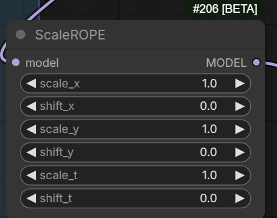
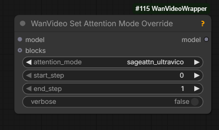
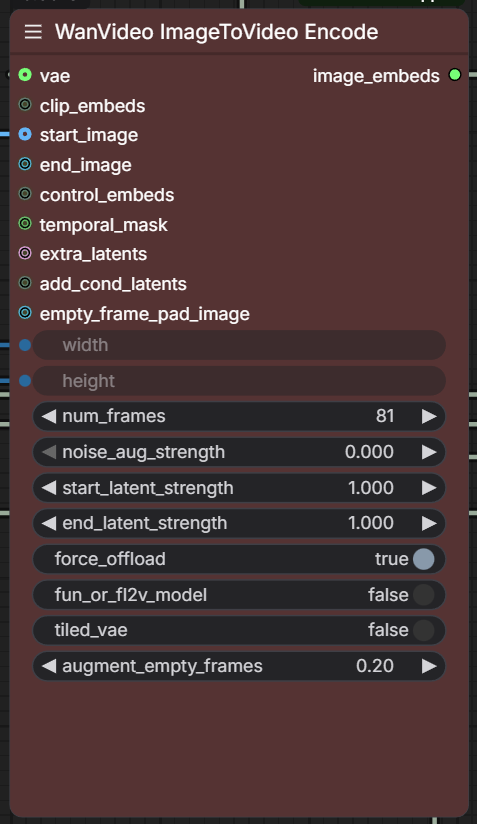

# Wan Motion Tricks

## Scale Rope

`Scale Rope` ComfyUI native node provides access to several parameters of "ROPE function".
Tweaking these will change "the motion" in the generated video. 

This is a preferred alternative to `WanMotionScale` community mode trending recently (Dec 2025).
Scale parameters are useful to experiment with.

> [shift parameters] not that useful ... just messe up the relation of frames to rope positional ids

> for spatial dimensions it's the only way to break the repetition when going past certain point, which is the main reason the node exists;
> riflex also did something similar for temporal btw

See the next section [UltraVico](#ultravico) for an alternative.

## UltraVico

`UltraVico` is the modern implementation of [RifleX](https://github.com/thu-ml/DiT-Extrapolation)
method for generating longer videos which was discussed on Reddit around summer of 2025.
It is a way to "convince" Wan 14B models to generate videos longer that 81 frames without looping.

`sageattn_ultravico` is an `attention_mode` which can be chosen on `WanVideoModelLoader` in [Wrapper](https://github.com/kijai/ComfyUI-WanVideoWrapper).
It does seem that activating it may require having a working installation of SageAttention, probably one of 2.x ones.

Success has been demonstrated both on [Kandinsky-5](k5.md) and on Wan 2.2, high noise.

> you can now also set it for specific steps with this;
> first step most important of course

> intended for t2v; harder to use with I2V;
> it decays the part of the sequence that has the image conditioning, so you lose that...
> unless you use higher alpha and don't allow as much decay, but then it can't really
> get away from the start image, creating same initial issue of long I2V: it just loops;
> it doesn't loop as badly, but still does ... the old man never jumps to the water until alpha is 0.91 or so

Only tested on high noise.
`UltraVico` is an alternative to [Scale Rope](#scale-rope) discussed above.

### UltraVico Obscure Conversations

During the testing of `UltraVico` different implementation was tried.
The alternative implementation provided ability to tweak parameters which were there called "alpha, beta, gamma".
These parameters are not exposed by the main implementation in Wrapper. Just documenting what was found

> 0.95 alpha, 0.3 beta, 4 gamma  
> 0.95 alpha for ultravico doesn't really allow the subject to leave the frame :/

## Painter I2V

### 2025.12.04

`augment_empty_frames` parameter added to `WanVideo ImageToVideo Encode` node in [Wrapper](https://github.com/kijai/ComfyUI-WanVideoWrapper)
implementing the experimental latent noise manipulation technique pioneered by `Painter I2V` node.
Where applicable this is the preferred replacement for `Painter I2V`

[GH:drozbay/WanExperiments](https://github.com/drozbay/WanExperiments) now contains
`WanEx_PainterMotionAmplitude` which allows to do `Painter I2V`-style
trick in regular workflows, e.g. it makes `Painter I2V` approach modular.
The node generates positive/negative conditioning that can be connected to sampler nodes using I2V family
of Wan video generation models. It appears like this should work with native `KSampler` and possibly with `ClowShark` one, not with Wrapper.

It seems `noise_aug_strength` setting in `WanVideo Encode` might be there to achieve the same effect.

### Painter I2V Summary

`princepainter/PainterI2V` node attracted attention and sparked research. It exists into two versions
- [Native](https://github.com/princepainter/ComfyUI-PainterI2V)
- [Wrapper](https://github.com/princepainter/ComfyUI-PainterI2VforKJ)

The node was created to inject more motion into I2V generations with speed LoRa-s.
It works by preparing noise latents in a special manner.

Here are some quotes about it: "It's pre-scaling the input latents"; "it tries to balance out the brightness increase you normally get when scaling the input like that"; "basically adding some of the input image to what's normally gray in I2V input"; "I think the logic behind using the reference partially in those frames is to keep the color from changing"; "this is what it does to input image: invert and blend to gray" (input latents); "definitely changes something" - "thing is it's randomness, if you added noise controllably then you could also make a slider that changes the output"

Apparently the node subtracts the initial image from initial noise on all frames.
While this does change the end result of generation the change can be both positive and negative.

### Painter FLF2V

Same GitHub account, now an FLF node: [link](https://github.com/princepainter/Comfyui-PainterFLF2V)

### PainterLongVideo

[GH:princepainter/ComfyUI-PainterLongVideo](https://github.com/princepainter/ComfyUI-PainterLongVideo) from that same authrow is being played with.
Expert conclusion however is that the node is either simply an automation I2V extension via last frame
or possibly also [Painter I2V](#painter-i2v) on top of it.

> looking closer at PainterLongVideo and the code just ...
> only one part that attempts to use multiple frames from the previous video, and it feeds that into
> a conditioning parameter called "reference_motion", which is ... only ever used by the Wan S2V model;
> other than that it appears to be just standard last frame to first frame continuation with the PainterI2V motion amplitude added in

### PainterI2Vadvanced

[GH:princepainter/ComfyUI-PainterI2Vadvanced](https://github.com/princepainter/ComfyUI-PainterI2Vadvanced) is making bold claims about color correction, but this node prepares inputs for sampling so it cannot possibly be fixing outputs