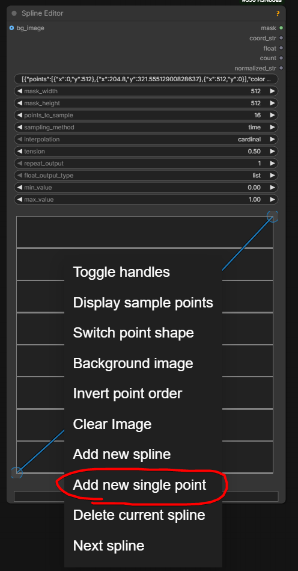
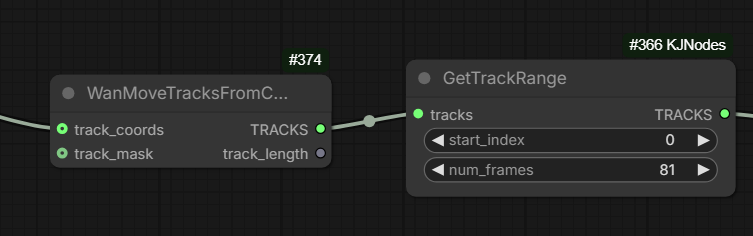
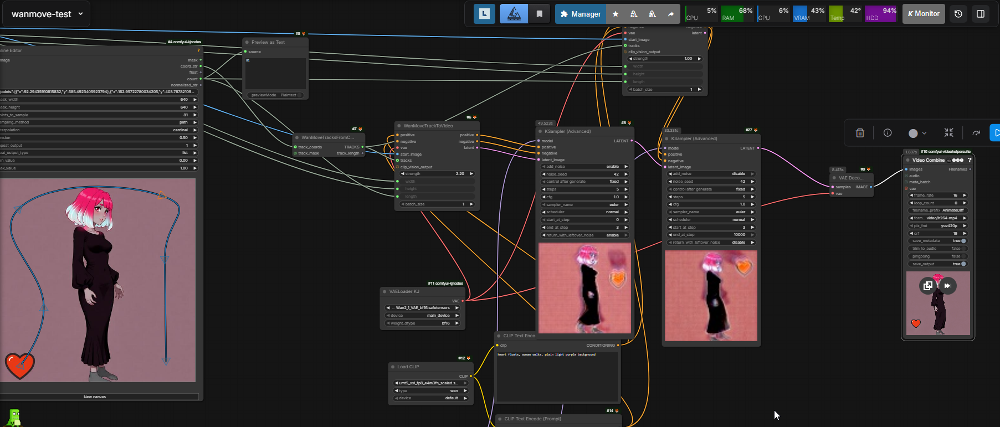

# Wan-Move

Wan-Move support has been added to native ComfyUI. New nodes:

- `WanMoveTracksFromCoords`
- `WanMoveTracksToVideo` (note: mask is "for optional mask if you want parts of the track to not affect the output")

> If you want the points to start at any given frame, give the points a mask yes;
> it's binary only;
> point is either visible or not;
> if no mask is provided when creating points, it's all ones

To add a stationary point:

Splitting splines between generations to facilitate continuations: `GetTracksRange` node from `KJNodes`:

Idea: use [SVI-film](svi.md#svi-film) with it? The one with 5 frames overlap, Not SVI 2.0.

Works with [Context Windows](what-plugs-where/context-windows.md).

## Summary

[HF:Ruihang/Wan-Move-14B-480P](https://huggingface.co/Ruihang/Wan-Move-14B-480P) features all-new and shiny Wan-Move model.
The model provides abilities reminiscent of ATI and VACE. In essence the motion is taken from driving video and applied to a starting image.
Driving motion can be supplied as a simple moving dot.

The model bears official Wan logo suggesting a link with the makers of the original AI video models.
Based on Wan 2.1 I2V.

The model already has some support in [kijai/ComfyUI-WanVideoWrapper](https://github.com/kijai/ComfyUI-WanVideoWrapper)

- `WanVideo Add WanMove Tracks`, `WanVideo Draw WanMove Tracks`
- model weights, 16Gb: [HF:Kijai/WanVideo_comfy_fp8_scaled:WanMove](https://huggingface.co/Kijai/WanVideo_comfy_fp8_scaled/tree/main/WanMove)
- [example workflow](https://github.com/kijai/ComfyUI-WanVideoWrapper/blob/main/example_workflows/wanvideo_WanMove_I2V_example_01.json)
- [GH:filliptm/ComfyUI_FL-Path-Animator](https://github.com/filliptm/ComfyUI_FL-Path-Animator) can be used to build paths

> T2V LoRA worked

> WanMove is technically identical to Wan 2.1 I2V

## As a LoRA

Gleb reported being able to make Wan Move work as LoRA:

[wanmove-lora-test.json](workflows/wan-move/wanmove-lora-test.json)

He reported not being able to make it work with Wan 2.1 but working with 2.2
