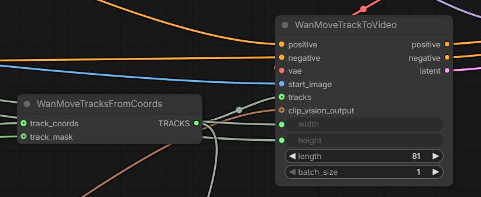
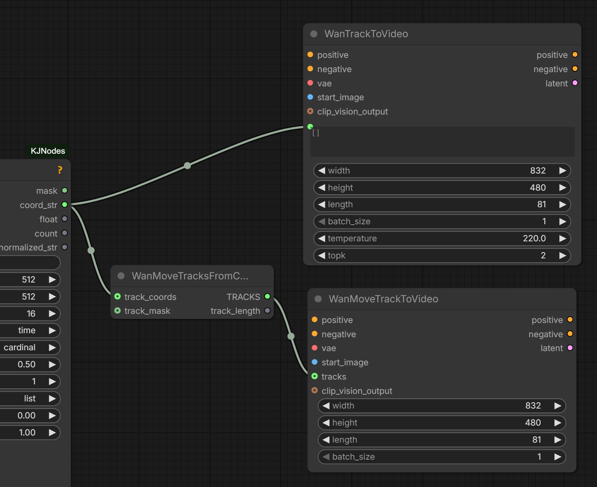
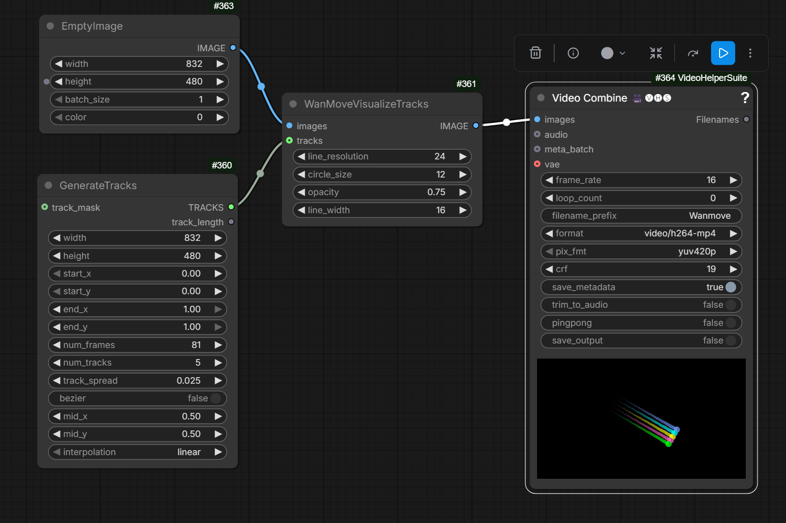

# Wan-Move

Wan-Move support has been added to native ComfyUI. New nodes:

- `WanMoveTracksFromCoords`
- `WanMoveTracksToVideo`

## Summary

[HF:Ruihang/Wan-Move-14B-480P](https://huggingface.co/Ruihang/Wan-Move-14B-480P) features all-new and shiny Wan-Move model.
The model provides abilities reminiscent of ATI and VACE. In essence the motion is taken from driving video and applied to a starting image.
Driving motion can be supplied as a simple moving dot.

The model bears official Wan logo suggesting a link with the makers of the original AI video models.
Based on Wan 2.1 I2V.

The model already has some support in [kijai/ComfyUI-WanVideoWrapper](https://github.com/kijai/ComfyUI-WanVideoWrapper)

- `WanVideo Add WanMove Tracks`, `WanVideo Draw WanMove Tracks`
- model weights, 16Gb: [HF:Kijai/WanVideo_comfy_fp8_scaled:WanMove](https://huggingface.co/Kijai/WanVideo_comfy_fp8_scaled/tree/main/WanMove)
- [example workflow](https://github.com/kijai/ComfyUI-WanVideoWrapper/blob/main/example_workflows/wanvideo_WanMove_I2V_example_01.json)
- [GH:filliptm/ComfyUI_FL-Path-Animator](https://github.com/filliptm/ComfyUI_FL-Path-Animator) can be used to build paths

> T2V LoRA worked

