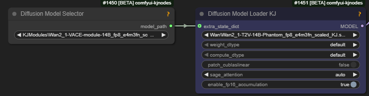

# Wan T2V Advanced

Note: [Wan Wiring](wan-wiring.md) page contains initial information on constructing Wan VACE workflows, both native and wrapper.
This page contains additional/advanced examples.

[drozbay](hidden-knowledge.md#drozbay) has shared the following advanced VACE workflows relying on his
[ComfyUI-WanVaceAdvanced](https://github.com/drozbay/ComfyUI-WanVaceAdvanced) node pack, with ClownShark and VACE:

- [Dancer](screenshots/drozbay_vacedancer_v1.png) - `DWPose Estimator` and `Depth Anything V2` as 2 separate VACE control videos
- [Falling Into The Water](workflows/droz_vace_reference_and_canny_v1.png) - `Canny Edge` limited by depth masking: "keep the outlines, ... don't ... details inside the objects"

Note: `WanVacePhantomDualV2` from `WanVaceAdvanced` is compatible with Phantom but not linked to it otherwise.
`vace_reference` and `phantom_images` on this node are fundamentally different: "they go to different model layers and they are treated differently".

> vace is still pretty iffy when trying to use the reference input for style
> it's not a style-transfer model, even if it occasionally does work
> the reference is really for either background, setting, or subject(s)

> it will not be great for character unless your character reference is pretty much exactly where the character will be in the first frame. In that case I recommend you use Phantom

> and don't use the skeleton+depth mix; send in the depth and the skeleton into separate Vace control inputs;
> either chain WanVaceToVideo nodes, or use WanVacePhantomDualV2 node

> Q: load FUN VACE module for High Model first, and then VACE 2.1 for the LOW model?
> A: sometimes

> can try WAN 2.1 + [Wan 2.1 to Wan 2.2 LOW LoRA](loras/part-01.md#Special Use) + VACE 2.1 on LOW  
> original Vace was pretty weak with pose control

## Vace + Phantom on Low Noise

## Combining Latent, VACE Masks, Phantom, and Context Windows

> If you use only Vace for inpainting without a [latent noise mask](wan-masking.md), it samples the entire video, so even the "unchanged" part of the image gets degraded

[drozbay](hidden-knowledge.md#drozbay) has thoughtfully developed a WF for using VACE, latent masks, VACE, [Context Windows](what-plugs-where/context-windows.md) references together. His considerations were

- "You can't split a generation using a latent noise mask into two samplers natively. For that I modified the RES4LYF code because it already had the infrastructure to be able to add that feature. But you can do it with just one sampler just fine"
- "if you want to use Vace reference, because then you need to account for that frame's noise mask. For that I modified my WanVaceAdvanced node to handle it and I'll push that soon"
- "the comfyui built-in interpolation ... when you are taking the "average" of the masks for 4 frames ... the resulting masks really fail with fast motion ... I made a small node that I will add to WanVaceAdvanced as well to fix this issue"

WIP wf from him: [droz-dancing-man](screenshots/droz-dancing-man.png)

> My ref image was just the old man with a white background for both Vace and Phantom.
> The outpainting was handled by Vace entirely and the prompt

## VACE With Qwen Image Edit

[TrentHunter82](https://github.com/TrentHunter82) has shared a workflow that combines Qwen Image Edit with 
`Wan Vace Keyframe Builder` from his [TrentHunter82/TrentNodes](https://github.com/TrentHunter82/TrentNodes/tree/main)
node pack: [Keyframe Party-v1](workflows/fs-Keyframe Party-v1.json)

## See Also

- [Wan Masking](wan-masking.md)
- [Video Blending From Fragments](tools-list.md#video-blending-from-fragments)
- [Context Windows](what-plugs-where/context-windows.md)
- [Trent Nodes](tools-list.md#trent-nodes) for a node assisting with VACE keyframing
