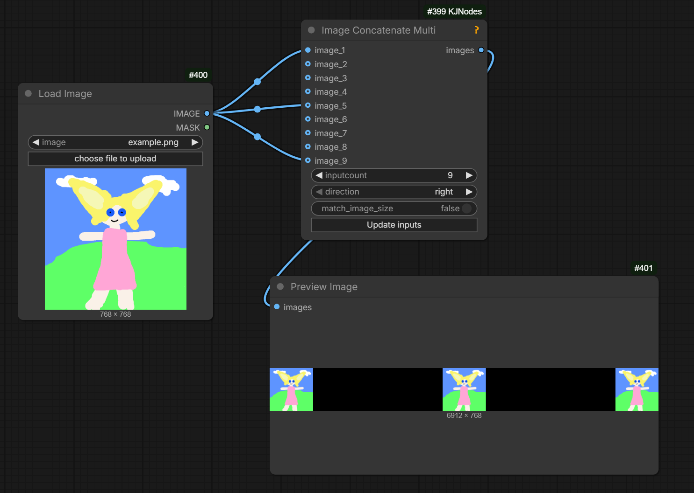
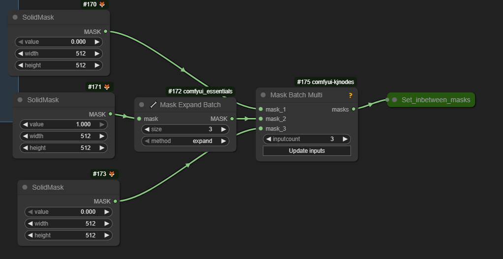
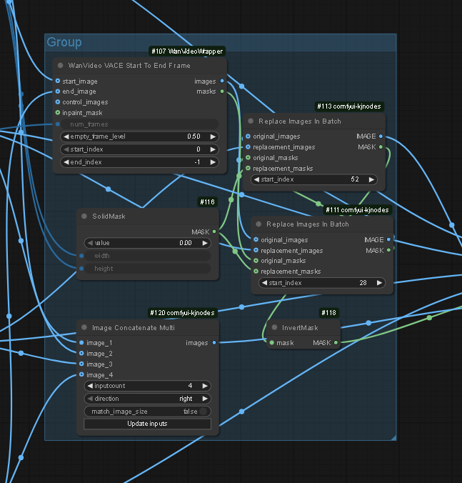

# Wan Wiring 

This page collects initial knowledge on constructing Wan workflows: mostly VACE but also I2V.

## VACE

VACE is an additional AI model that works in tandem with Wan T2V.
VACE 2.1 consists of a single `.safetensors` file.
VACE 2.2 - fully named Fun Vace 2.2 - consists of two `.safetensors` files - high and low -
which are used together with high and low Wan 2.2 T2V `.safetensor` files respectively.

> To do vace inpainting before you need masks set but also the mask reflected on the input at 127 gray

VACE accepts more than one control video. To do this chain multiple VACE embeds nodes:
[native](../screenshots/WanVaceToVideoChain.webp), [wrapper](../screenshots/WanVideoVaceEncodeChain.webp).

To give WAN more creative freedom while still using VACE set `vace_end_percent` to less than `1`.
This will allow final steps to do sampling without VACE control after VACE has established overall shape of the video.
Presently exposed on wrapper node but not on native node.

Workflows for VACE 2.1 and Wan 2.2 Fun Vace are very similar.

> using VACE with not-quite black background for Pose input seems to be a lot better than just straight black background which can cause issues
> [black squares on video] ... I have been having success with #202020 lately

VACE takes only one reference image, so if more is wanted all need to be joined together into a single image.

## Native

### VACE [kijai/ComfyUI-KJNodes](https://github.com/kijai/ComfyUI-KJNodes)

* `Diffusion Model Selector` (VACE safetensors; -> `extra_state_dict` input of `Diffusion Model Loader KJ`)
* `Diffusion Model Loader KJ` (Wan 2.2 .. T2V ..)
* `LoraLoaderModelOnly` (some speed lora; can chain after the above)

Supplementary; chain after model loader

* `TorchCompileModelWanVideo`
* `Patch Sage Attention KJ`

### Embeds In Native

| Embeds Node | Inputs | Model | Bonuses |
| :-- | :-- | :-- | :-- |
| `WanVaceToVideo` | `control_video`, `masks`, `ref_image`, `pos/neg` | VACE + Wan | `trim_latent` from `WanVaceToVideo` to `TrimLatentNode` |

This embeds node gives both `ref_image` and `control_video` the same strength; Kijai: "it's overall strength of the VACE conditioning".

Bonus nodes: `Create Video`, `Save Video`, `Points Editor`, `(Down)Load SAM2Model`, `Sam2Segmentation`, `GrowMask`, `Preview Animation`, `Empty Image` (color 8421504), `ImageComposeMask`.

Not entirely clear if inpainted area needs to be gray-ed out in `control video` input to `WanVaceToVideo`

## Wrapper

### VACE [kijai/ComfyUI-WanVideoWrapper](https://github.com/kijai/ComfyUI-WanVideoWrapper)

* `WanVideo VACE Module Select` (Wan2_2_Fun_VACE..; -> `vace_input` of `VanVideo Model Loader`)
* `WanVideo Lora Select Multi` (say lightx2v_T2V_14B_ .. v2..; -> `lora` input of `VanVideo Model Loader`)
* `WanVideo Model Loader` (Wan 2.2 .. T2V ..)

Supplementary

* `WanVideo VAE Loader`
* `WanVideo Torch Compile Settings` (-> `compile_args` input of `WanVideo Model Loader`)
* `WanVideo Set Block Swap` (chain after `WanVideo Model Loader`)
* `WanVideo Lora Block Edit` (switching off block 0 might help remove 1st frame flash)
* `WanVideo TextEncoder Cached` (avoid re-running text encoding on each execution, free up a little VRAM)
* `WanVideo RoPE Function` (check tooltip on `rope_function` in `WanVideoSampler`; see also: [RoPE](../hidden-knowledge.md#rope))

Least `WanVideo Sampler` node grows visually too tall groups of parameters have been placed into their own nodes:

* `WanVideo Context Options` -> `context_options` input; [details](context-windows.md)

### Embeds In Wrapper

| Pre Embeds Node| Pre Embeds Inputs -> Output | Embeds Node | Input from Pre / Embeds Inputs -> Output | Model | WanVideo Sampler Input |
| :-- | :-- | :-- | :-- | :-- | :-- |
| - | - | `WanVideo VACE Encode` | / `input_frames`, `input_masks`, `ref_images`<br>-> `vace_embeds` | VACE + Wan T2V family | `image_embeds` |
| - | - | `WanVideo ImageToVideo Encode` | / `start_image`, `end_image`, `control_embeds`?, `temporal_mask`?, `extra_latents`, `add_cond_latents`?<br>-> `image_embeds` | Wan I2V family | `image_embeds` |
| - | - | `Multi/Infinite Talk Wav2vec Embeds` | `wav2vec_model`, ... |  Wan 2.1 I2V family | `image_embeds` |

Note: ? denotes parts which are not clear enough.

## WanVideo VACE Start To End Frame

* inputs: `start_image`, `end_image`, `num_frames`, `control_images` (for depth, pose, combined depth/pose etc), and `inpaint_mask`
* outputs: `images`, `masks`

Can be used to prepare `input_frames` for `WanVideo VACE Encode`.
Both `start_image` and `end_image` can be sequences of say 10 nodes.

Bonus nodes:

* `Solid Mask`
* `Repeat Masks`

More bounuses:

* `Image Preview`
* `Mask Preview`

### Wiring

```
WanVideo VACE Start To End Frame --------------------> | Replace Images  |
                                                       | In Batch        | --> Preview Image,
LoadImage  ---> ResizeImage ---> RepeatImageBatch ---> |                 |     WanVideo VACE Encode --> ..
                                                       |                 |
SolidMask  ---> RepeatMask --------------------------> |                 |
```

## Video Continuation Generator

`Video Continuation Generator` from [banodoco/Steerable-Motion](https://github.com/banodoco/Steerable-Motion) can be used instead of `WanVideo Start To End Frame` to prepare input for `WanVideo VACE Encode`.

## Drozbay's WanVaceAdvanced

Drozbay's [WanVaceAdvanced](https://github.com/drozbay/ComfyUI-WanVaceAdvanced) nodes for advanced Wan + VACE generation) nodes, sample [workflow](../screenshots/drozbay_vacedancer_v1.png)

## Misc

* `Points Editor` from [kijai/ComfyUI-KJNodes](https://github.com/kijai/ComfyUI-KJNodes) used in workflows utilizing Sam2 for segmentation.
* `Rope Function Node` from [kijai/ComfyUI-WanVideoWrapper](https://github.com/kijai/ComfyUI-WanVideoWrapper) - mysterious but holds promise.
* `Get Image From Batch Indexed` from [kijai/ComfyUI-KJNodes](https://github.com/kijai/ComfyUI-KJNodes) to get several last frames from previous generation for VACE / I2V extensions
* `Image Concatenate Multi` from [kijai/ComfyUI-KJNodes](https://github.com/kijai/ComfyUI-KJNodes); 1st image might be mandatory here
  

## Masks

Here is a slightly non-traditional way to build masks. Please note that actual value 0 vs 1 may be opposite between wrapper and native workflows.



## FMML

VACE "First middle middle last" as done by [VRGameDevGirl](https://github.com/vrgamegirl19/comfyui-vrgamedevgirl)



## See Also

- [Wan Masking](wan-masking.md)
- [Context Windows](what-plugs-where/context-windows.md)
- [Wan I2V Advanced](wan-i2v-advanced.md)
- [Wan T2V Advanced](wan-t2v-advanced.md)
