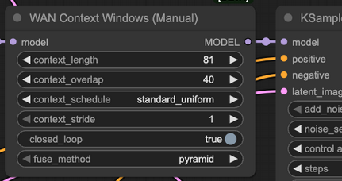

# Context Windows

## 2025.12.16

Native ComfyUI native has been updated to include a [change](https://github.com/comfyanonymous/ComfyUI/pull/11208)
from by [Drozbay](hidden-knowledge.md#drozbay) to add new Context Windows-related hooks to ComfyUI native.
This unlocks our ability to run the most advanced VACE workflows built and tested by him.
The following two additional code repositories need to be added under `custom_nodes` and `git pull`-ed to their latest state:

- [GH:drozbay/WanExperiments](https://github.com/drozbay/WanExperiments) aka `WanEx`
- [RES4LYF](https://github.com/ClownsharkBatwing/RES4LYF) aks `ClownShark` samplers

Full sample workflow from Drozbay with explanations: [link](https://github.com/drozbay/ComfyUI-WanVaceAdvanced?tab=readme-ov-file#context-windows-workflow).
The workflow demonstrates advanced use of Context Windows with VACE, driving pose video and a Phantom reference.

Note: as part of developering these workflows Drozbay has recently contributed a change
[RES4LYF](https://github.com/ClownsharkBatwing/RES4LYF)
to handle latent masking correctly with context windows. 

> substep samplers definitely don't work with context windows, that would need more work

Note: `skip_final_model_call` option needs to be set.

## 2025.12.16 Details

[HuMo](../humo.md) is also supported via ContextWindows including HuMo references.
It is hoped [MAGREF](../phantom-magref.md#magref) references might be working too (not tested).

It has generally been observed that while

- S2V
- [HunyuanVideo1.5](../hunyuan.md)
- potentially [Kandinsky-5](../k5.md)
- VACE with strong driving guidance

work well with ContextWindows in general case it is challenging to avoid background shifting between windows.

> it just generally works good if the camera doesn't move and where background is either not important or controlled by something
> the "trick" of using single frame for Uni3C for example makes it far more stable

> With Vace you can just mask the background of an existing video for inpainting for example, which prevents it from changing

Note: [Wan Animate](../wan-animates.md#wan-animate) and [Infinite Talk](../infinite-talk.md) have their own mechanisms to keep extending videos.
They are not implemented via Context Windows.

## 2025.12.07

PR [10975](https://github.com/comfyanonymous/ComfyUI/pull/10975) by Kijai has been merged into ComfyUI native.

- "Fixes channel dim cond_concat slicing" Wan I2V models and [HunyuanVideo 1.5](../hunyuan.md)
- HuMo audio conditioning correctly applied to context windows
- adds support for "freenoise" (???)

Experimental options to retain "channel cond" from 1st window and some form of prompt travel are committed but commented out for now.

## 2025.12.02

> Q: context windows in native... currently the only way to assign prompts to different window regions is to use conditioning combine right? A: yes

> The context window blends are almost invisible, especially with freenoise enabled

## Explanation

Wan video models typically cannot generate videos with more than 81 frames.
If such a generation is attempted the resulting video loops.
`Context Windows` is one of the attempts to support generating videos longer than 81 frames.
This method of generation is supported by the regular samplers such as `KSampler` for native and `WanVideo Sampler` for wrapper.
The method is enabled by plugging in a special options node into the sampler

- in [wrapper](https://github.com/kijai/ComfyUI-WanVideoWrapper) workflows `WanVideo Context Options` node is used
- in native workflows `WAN Context Windows (Manual)` node is used  
  

The way context windows generation works is that

- a buffer is allocated to hold latents (4n + 1 of them) for the whole long video
- `context_length` frames from start of the video undergo one step of sampling; this can be visualized as positioning a `window` of `context_length` frames at start of the video
- the `context_window` moves to the right by `context_length - context_overlap` frames; it is now positioned on portion of video which overlaps with the section already processed at the previous step; one run step of video sampling is done
- the `context_window` keeps moving to the right until all of the video has been covered; then generation resumes by moving the `context_window` back to the start again

The above explanation reflects the best understanding of the maintainer of this website.
It leaves a number of questions unanswered. If/when a better understanding is attained this website will be updated.

Although both nodes contain `context_stride` option it normally left set to 1.
The above explanation is only correct for a `context_stride` set to 1.
Setting `context_stride` to values above 1 makes the code run sampling steps on sequences of frames not immediately adjacent to each other, for example on even or odd frames only - at any given step.
This way of generation was useful in AnimateDiff days. Since samplers may still support AnimateDiff the option is retained.
However no good examples have been found where setting this option to values other than 1 is useful with Wan models since the result is very noisy and blurry.
The only case when it might be remotely useful is running inital high noise steps of generation, and even that is just a conjecture.

Note: actually in the wrapper node the the lowest value `context_stride` can be set to is 4.
This is normal and means working on immediatley adjacent frames as described above.
Thus the advice is to keep the value set to 4 in wrapper.

[Conditioning](../conditioning.md) presents its own challenge in relation to `Context Windows`.
Do we apply the same conditioning to all positions of the context window?
Do we partition conditioning into sections and use the matching section for each context window?
Are we handling [masking](../wan-masking.md) correctly?
How do we use a different text prompt for each section?
What happens with the initial image for I2V models?
Identity or clothing of our characters drifts throughout our long window, how do we lock it?
We are using a slightly non-usual model like [HuMo](../humo.md) which requires conditioning to be prepared in a special way, is that taken care of?
We are using VACE, is its conditioning handled correctly?
And the list goes on and on.
Implementing context windows is far from trivial and is an ongoing effort to make them useful in as many scenarios as possible.

https://github.com/drozbay/ComfyUI/tree/contextwin_vace_251208a

## Earlier

Enables batched video generation. Remain somewhat experimental.

Status of using `WanVideo Context Options` on regular Wan 2.2 workflows:
> Q: Any improvement to context windows for Wan 2.2 i2v and t2v?  
> A: They're still iffy and fragile, especially for i2v;
> sometimes ... workflows ... work great for a while, but there's a bit of voodoo with ... input image ... prompt, and what model;
> like the new LightX distills gave ... better results in a lot of ways but broke some stable context window workflows ...
> Q: Do you mean that we can provide an starting frame as input for every context window with I2V?  
> A: Yeah, the context window node was updated a few weeks ago to take latents. You can use vae to put a series of images into latents for each context window you use.

RAM requirements increase according to total video length across all batches.

`reference_latents` input on `WanVideo Context Options` is designed to work specifically for MAGREF - and possibly other I2V models but not T2V:
> it's the images used beyond the first window when using context options with I2V models

`WanVideo Encode Latent Batch` is the correct node to feed images into `reference_latents` input on `WanVideo Context Options`.

## Trying To Understand Overlap and Stride

Context Options generally have two goals:

* prevent running out of VRAM when generating longer videos
* prevent videos from looping as Wan 2.1/2.2 start generating loops if asked to work on more than 81 frames at once

Generally when working with Wan 2.2 the expectation is that `WanVideo Context Options` are plugged into both high and low noise samplers.
The rule is not absolute and it might be possible in some cases to connect to high only, especially with lots of VRAM.
It is also potentially possible to have use different `WanVideo Context Options` on high and low.

A selection of quotes about context stride and overlap:

> context options are in pixel space, so 4 is 1 latent, and overlap or stride at 4 (which is 1 latent) means it's disabled, there's no stride or ovelap, it can't be 0

> usually it's fine with something like 16 overlap, while on high noise you may need up to 48 or something;
> higher overlap = more model passes needed = slower generation, but better blending between windows

> yeah I used 10 stride 48 overlap succesfully at least [on high noise]

> stride doesn't really work with Wan, should probably remove it, context frames is the window size,
> how many frames are processed at once, and overlap is how much they overlap;
> higher overlap = smoother transitions = slower processing

This [article](https://github.com/Kosinkadink/ComfyUI-AnimateDiff-Evolved/tree/main/documentation/nodes#context-optionsstandard-uniform)
documents context windows how they were implemented for AnimateDiff. Interestingly the explanation stays relevant for Wan.
Note that using stride to cause non-adjacent frames to be processed was a lot more relevant to AnimateDiff than it is to Wan.

> stride is that spread out overlap thing it does as you can see in the animation;
> it's not very good with Wan model because context windows work with the latents, and every latent has 4 images;
> so stride will make it very stuttery, only time it's been useful is with 2.2 when used on the high noise only,
> and disabled for the low noise.. so it smooths it out, that works very well even

Disabled means set to 4.

## Alteranative Workflow

An interesting workflow idea has been tried: 3 `WanVideo Sampler`-s, initial one running Wan 2.2 high noise has got `WanVideo Context Options` connected, running 2 steps,
followed by another `WanVideo Sampler` without `WanVideo Context Options` also running high noise followed by another sampler without running low noise. The last two
samplers in the chain thus run with a number of frames much higher than would have been normally possible but because 1st one is batched the motion does not loop.
Incidentally dmp++_sde was used.

> context windows will just not work well with I2V models, no proper way around it 
> the reference image to context windows is workaround to allow using different images for different windows
